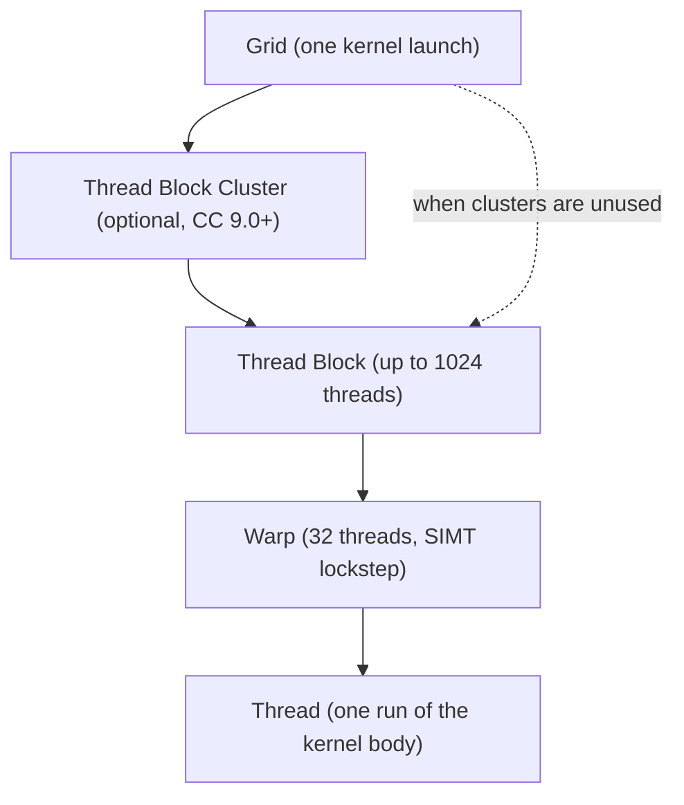
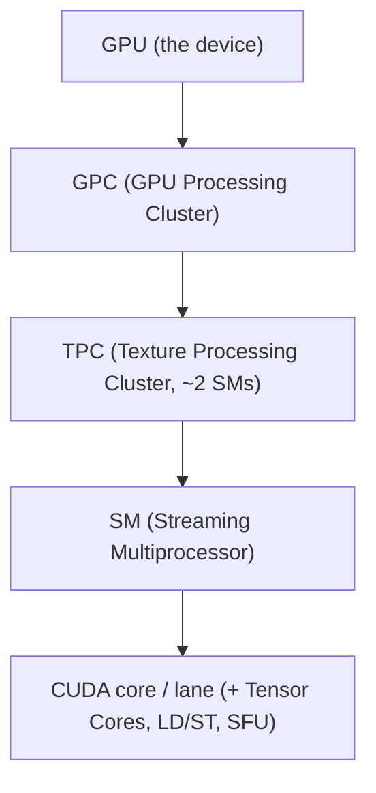
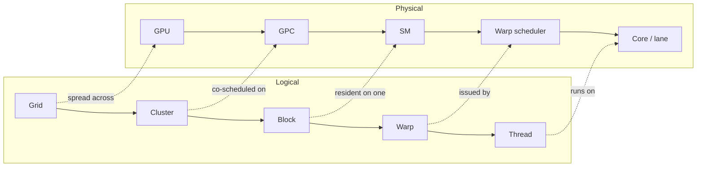

# CUDA Model

CUDA stacks three hierarchies that line up level for level:

- the **logical** hierarchy you program against (threads, blocks, grids),
- the **physical** hierarchy it executes on (cores, SMs, GPUs), and
- the **memory** scopes that pair with each level.

The whole trick is that the logical hierarchy is portable: the runtime maps it
onto whatever physical hierarchy a given GPU happens to have.

## Logical hierarchy (what you write)

- **Thread**: one execution of the kernel body, with its own registers and its
  own `threadIdx`. The grain you write code for.
- **Warp**: 32 threads the hardware runs together in lockstep (SIMT). You never
  name it in source, but it is the true unit of scheduling, and threads in a
  warp that take different branches serialize (warp divergence). `warpSize` is
  32 on all shipping NVIDIA hardware.
- **Thread Block**: up to 1024 threads that share on-chip shared memory and can
  synchronize with `__syncthreads()`. Carries `blockIdx`. A block runs start to
  finish on one SM.
- **Thread Block Cluster**: optional, Compute Capability 9.0 (Hopper) and newer.
  A small set of blocks co-scheduled together that can read each other's shared
  memory (distributed shared memory) and synchronize with `cluster.sync()`.
- **Grid**: every block (or cluster) from one kernel launch. The unit the host
  dispatches with `<<<grid, block>>>`.

## Physical hierarchy (what runs it)

- **CUDA core / lane**: executes one thread's arithmetic. An SM also carries
  Tensor Cores, load/store units, and special-function units.
- **SM (Streaming Multiprocessor)**: the workhorse. Owns the register file,
  shared memory / L1, and the warp schedulers. It hosts whole blocks, often
  several at once.
- **TPC / GPC**: SMs are grouped into Texture Processing Clusters and then GPU
  Processing Clusters, each with some fixed-function hardware. A thread block
  cluster maps to one GPC.
- **GPU**: all the GPCs, plus the shared L2 cache, the memory controllers, and
  DRAM (global memory).

Counts (cores per SM, SMs per GPC, GPCs per GPU) vary by architecture; only
`warpSize` (32) and the 1024-threads-per-block ceiling are fixed.

## How the logical maps onto the physical

Rules this encodes:

- A **block** is assigned to exactly **one SM** and is never split across SMs.
  An SM holds as many resident blocks as its registers, shared memory, and warp
  slots allow; that ratio is **occupancy**.
- A **warp** is what a warp scheduler actually issues each cycle.
- A **cluster** lands entirely within **one GPC**, which is what makes
  distributed shared memory possible.
- A **grid** is scattered across the whole GPU; blocks are handed to SMs as they
  free up, in no guaranteed order. That is why blocks cannot assume anything
  about each other.

## Memory scopes (the third hierarchy)

Each execution level has a matching memory scope, and they get larger and slower
as you climb:

| Execution level    | Memory                     | Lives in                          | Speed    | Lifetime       |
| ------------------ | -------------------------- | --------------------------------- | -------- | -------------- |
| Thread             | registers (local spills)   | SM register file (spills to DRAM) | fastest  | the thread     |
| Block              | shared memory / L1         | on the SM                         | fast     | the block      |
| Cluster (CC 9.0+)  | distributed shared memory  | across SMs in one GPC             | fast-ish | the cluster    |
| Grid / device      | global, constant, texture  | DRAM, cached in L2                | slow     | the allocation |

Global memory is the only level the host can touch (through `cudaMemcpy` /
`cuda_ptr`), and it is the one your bandwidth numbers are about. Constant and
texture memory are read-only views of DRAM with their own caches.

## The three hierarchies, aligned

| Logical | Runs on                    | Memory scope               | Synchronize within the level                       |
| ------- | -------------------------- | -------------------------- | -------------------------------------------------- |
| Thread  | core / lane                | registers                  | (single thread)                                    |
| Warp    | warp scheduler (32 lanes)  | registers + warp shuffle   | lockstep, `__syncwarp()`                           |
| Block   | one SM                     | shared memory              | `__syncthreads()`                                  |
| Cluster | one GPC                    | distributed shared memory  | `cluster.sync()` (CC 9.0+)                          |
| Grid    | the whole GPU              | global memory              | kernel boundary (or `grid.sync()`, cooperative)    |

The index math in the kernel, `blockIdx.x * blockDim.x + threadIdx.x`, is just
walking down the left column: pick the block within the grid, then the thread
within the block, to land on one global element.
