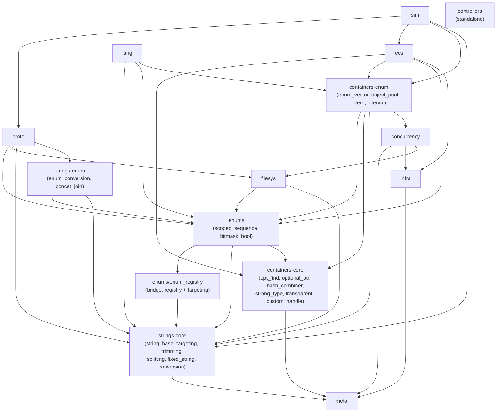

# Corvid dependency roadmap

Status and plan for the cross-subsystem dependency structure. Each top-level
directory under `corvid/` is a module in the informal sense (a cohesive group
of headers), not a C++20 module. This document maps how those modules depend
on each other today, names the tangles, proposes a target layering, and lists
the action items to get there.

## Method

Edges below are derived from `#include` directives. Two include shapes matter:

- `"../<folder>/<file>.h"` -- a narrow edge onto one header.
- `"../<folder>.h"` -- an umbrella edge onto the whole subsystem. These are the
  amplifiers: a single umbrella include turns a one-symbol need into a
  module-wide dependency and is the main reason the folder-level graph looks
  more tangled than the file-level graph.

Critical finding up front: at *file* granularity the entire library is a DAG.
Nothing actually compiles in a cycle (as expected, since it compiles at all).
Every "cycle" below exists only at *folder* granularity, because a folder is
treated as one node when in reality its headers sit at several different
levels. The fix is therefore not to "break a circular dependency" (there is
none) but to make the folder boundaries honest about the layering that the
files already obey.

## Current cross-folder edges

Counts are the number of include lines, not symbols. `proto -> misc` is
internal (`corvid/proto/misc/`), not a real cross-folder edge, and is omitted.

```
concurrency  -> containers, filesys, infra, meta
containers   -> concurrency, enums, infra, meta, strings
ecs          -> containers, enums, infra, meta
enums        -> containers, strings
filesys      -> enums, strings
lang         -> containers, enums, strings
proto        -> enums, filesys, meta, strings
sim          -> containers, ecs, proto, strings
strings      -> enums, meta
controllers  -> (none)
infra        -> meta
meta         -> (none)
```

Three pairs point both ways (the folder-level cycles):

- `strings <-> enums`
- `containers <-> enums`
- `concurrency <-> containers`

## 1. High-level modules (depend heavily, depended on little)

- **proto** (43 headers): HTTP/QUIC stack. Pulls enums, filesys, strings, meta.
  The largest consumer. Nothing depends on it except `sim`.
- **sim** (6): pulls proto, ecs, containers, strings. Top of the stack.
- **ecs** (14): pulls containers, enums, infra, meta. Only `sim` depends on it.
- **lang** (1, `ast_pred.h`): pulls strings, containers, enums. Leaf consumer.
- **controllers** (2, `pid_controller.h`, `sopdt_plant.h`): standalone, zero
  cross-folder dependencies. A high-level leaf that happens to be self-
  contained; it sits off to the side of the tree.

These are unambiguous and not a source of trouble: they only consume.

## 2. Low-level modules (foundational, depend on little)

- **meta** (11): depends on nothing cross-folder (std + internal only).
  `meta_shared.h` and `forwarding_address.h` are pure leaves. This is the
  bedrock; everything is allowed to depend on it.
- **infra** (5): depends only on meta (`scope_exit.h -> meta/maybe.h`).
  `relaxed_atomic.h` is a leaf. Clean second layer.

These two are clean and need no work beyond staying clean.

## 3. The messes

### strings <-> enums (the headline tangle)

The diagnosis is exactly right: part of strings is *below* enums and part is
*above* it. The file-level order is a clean DAG that interleaves the two
folders:

```
strings/targeting.h, strings/trimming.h        (strings, low)
   -> enums/enum_registry.h                     (enums, low; needs targeting)
      -> strings/conversion.h                   (strings, mid; dispatches enum
                                                 append through the registry at
                                                 conversion.h:240)
         -> enums/scoped_enum.h                 (enums, mid; needs conversion)
            -> enums/sequence_enum.h,
               enums/bitmask_enum.h             (enums, high; also pull the
                                                 strings/lite.h umbrella)
               -> strings/enum_conversion.h     (strings, high; parses the
                                                 "a + b + c" bitmask combo)
```

Two pivot points create the apparent cycle:

- `strings/conversion.h` reaches *up* to `enums/enum_registry.h` so the generic
  converter can append any registered enum. `enum_registry.h` is deliberately
  the lightweight bridge: it depends only on `strings/targeting.h`, so this is
  a short, intentional edge.
- `strings/enum_conversion.h` reaches further up to the full sequence/bitmask
  adapters so the reverse path can split `"a + b + c"` and OR the pieces. This
  is the heavy edge and the one the enums roadmap (item 2) already targets.

Additional amplifier: `strings/concat_join.h` includes the whole `../enums.h`
umbrella, and `enums/{sequence,bitmask}_enum.h` include the whole
`strings/lite.h` umbrella. `bitmask_enum.h` genuinely uses `fixed_string`,
`fixed_split`, `trim`, `append_num`, etc., so its strings dependency is real
and substantial, not spurious, but it does not need the entire umbrella.

### containers <-> enums

- Up edges (containers built on enums, genuinely higher level):
  `containers/enum_vector.h -> enums/sequence_enum.h`,
  `containers/object_pool.h -> enums/bool_enums.h`,
  `containers/intern.h` and `containers/interval.h -> ../enums.h` (umbrella).
  These are enum-parameterized containers; they belong *above* enums.
- Down edge (enums reaching into containers): `enums/bitmask_enum.h ->
  containers/opt_find.h`. `opt_find` is a generic lookup helper that is lower-
  level than most of containers; enums pulling it is the awkward part.

So "containers" is not one layer. It holds foundational utilities
(`opt_find`, `optional_ptr`, `hash_combiner`, `strong_type`, `transparent`,
`custom_handle`) sitting near meta, and high-level enum/string-parameterized
containers (`enum_vector`, `object_pool`, `intern`, `interval`) sitting above
enums and strings.

### concurrency <-> containers (mostly spurious)

- `concurrency/sync_lock.h` and `concurrency/notifiable.h` include
  `containers/containers_shared.h`.
- `containers/intern.h` includes `concurrency/sync_lock.h`.

`containers_shared.h` is just `../meta.h` plus a batch of std container
includes. `sync_lock.h` uses **nothing** from it (only `std::mutex`,
`std::atomic`, `assert`); the include looks vestigial. Drop the two includes
from `sync_lock.h`/`notifiable.h` and the concurrency->containers direction
disappears, leaving the single honest edge `intern -> sync_lock`. This cycle
is the cheapest to retire.

## 4. Proposed dependency tree

Target layering. Arrows point from a module to what it depends on. The proposal
splits the two genuinely multi-level folders (strings, containers) into a low
band and a high band, and treats the enum<->string bridge header as a shared
contract that both sides rest on.



These bands are made physical: the low band becomes `strings/core` and
`containers/core`, the enum-aware band becomes `strings/utils` and
`containers/utils` (settled; see section 6). The directory boundary makes a
layer violation legible, and an external lint (not preprocessor tricks) makes
it fail the build.

Layer summary:

```
L0  meta
L1  infra, strings-core, containers-core
L2  enums (on enum_registry + strings-core + containers-core/opt_find)
L3  strings-enum, containers-enum, concurrency, filesys
L4  ecs, proto, lang
L5  sim
--  controllers (independent leaf, parallel to the tree)
```

## 5. Action items

Ordered cheapest-and-safest first. Each is independently shippable.

1. **Cut the concurrency->containers edge (spurious).** Remove
   `#include "../containers/containers_shared.h"` from
   `concurrency/sync_lock.h` and `concurrency/notifiable.h`; replace with the
   specific std headers they actually use (`<mutex>`, `<atomic>` are already
   present in sync_lock). Verify `notifiable.h` similarly. Retires cycle 3.

2. **De-umbrella library headers.** Replace whole-subsystem umbrella includes
   inside library headers with the specific headers needed. Offenders:
   `strings/concat_join.h -> ../enums.h`, `containers/interval.h ->
   ../strings.h, ../enums.h`, `containers/intern.h -> ../enums.h`. Keep
   `corvid/<folder>.h` umbrellas for consumers (tests, apps), not for internal
   headers. This is what shrinks the fat folder edges back to the narrow file
   edges. (`strings_shared.h -> ../meta.h` and `containers_shared.h ->
   ../meta.h` are fine: meta is the foundation and an umbrella onto it is
   cheap; narrow later only if compile time argues for it.)

3. **Finish enums roadmap item 2 (self-contained bitmask lookup).** Move the
   `"a + b + c"` combination parsing out of `strings/enum_conversion.h` into the
   bitmask spec's `lookup`. Afterward `strings/enum_conversion.h` no longer
   needs `sequence_enum.h`/`bitmask_enum.h`, and strings depends on enums only
   through `enum_registry.h`. This collapses the heavy half of cycle 1.

4. **Narrow the enums->strings includes.** `enums/{sequence,bitmask}_enum.h`
   pull `strings/lite.h` (the full umbrella) but use only `fixed_string`,
   splitting, trimming, and `append_num`. Replace `lite.h` with the specific
   strings headers. Leaves the strings<->enums relationship as a thin, honest
   DAG: `enum_registry -> conversion`, then `enums -> strings-core`.

5. **Relocate `opt_find` (and assess the core/hi split in containers).**
   `enums/bitmask_enum.h -> containers/opt_find.h` is the only enums->containers
   down edge. `opt_find` is a foundational lookup helper; treat it (with
   `optional_ptr`, `hash_combiner`, `strong_type`, `transparent`,
   `custom_handle`) as containers-core at L1, and treat `enum_vector`,
   `object_pool`, `intern`, `interval` as the enum/string-aware band at L3.
   Decide whether to enforce this by include discipline only, or by an eventual
   directory split. Retires cycle 2 by making both directions land in
   different bands.

6. **Adopt enum_registry as the named bridge.** Document `enums/enum_registry.h`
   as the deliberate contract layer that both strings and enums sit on
   (`enum_registry -> strings/targeting` down, `strings/conversion ->
   enum_registry` up). After items 3 and 4 this is the *only* place the two
   subsystems meet, which is the point: one small, intentional seam instead of
   a tangle.

After items 1-5 the folder-level graph is acyclic and matches the proposed
tree; item 6 is documentation that locks in the seam so it does not regrow.
None of this requires going full Lakos: no .cpp extraction, no link-time
decomposition, just include hygiene plus one already-planned code move.

## 6. Settled reorganization plan

The mechanism agreed for breaking the loops permanently: split the two
multi-level folders into a `core` subfolder (enum-free, low) and a `utils`
subfolder (enum-aware, high), under the existing namespace, and enforce the
direction with an external lint. This is the principled version of section 5:
the loops stop existing because no header is simultaneously above and below
enums, and the boundary is physical rather than a matter of vigilance.

### Cut line

The dividing question is exactly one thing: **does this header know about
enums?** (For containers, enums or strings.) Classification follows includes,
not names: `containers/enum_variant.h` only pulls `meta/concepts.h`, so despite
the name it is core.

Only the enum boundary is load-bearing for the DAG. A header may be high-level
yet enum-free (e.g. `strings/token_parser.h`); those default to `core` here and
can be reconsidered in the later misc pass (section 5, item via the
reverse-dependency list). Do not let the misc/aesthetic axis stall the
loop-breaking split.

### Per-header assignment

`strings/utils` (enum-aware; everything else under `strings/` is `strings/core`):

- `enum_conversion.h` -- the reverse path (`extract_enum`/`parse_enum`).
- `concat_join.h` -- generic part dispatcher branches on `ScopedEnum`
  ([concat_join.h:214](strings/concat_join.h#L214)) and defines/registers its
  own `join_opt`.
- the lifted `cvt_enum` block (see keystone below).

`containers/utils` (enum/string-aware; everything else under `containers/` is
`containers/core`):

- `enum_vector.h` (-> `enums/sequence_enum.h`)
- `object_pool.h` (-> `enums/bool_enums.h`)
- `intern.h` (-> `../enums.h`, `concurrency/sync_lock.h`)
- `interval.h` (-> `../strings.h`, `../enums.h`)

Note `containers/core/opt_find.h` stays core on purpose: `enums/bitmask_enum.h`
depends down onto it, which is legal because enums sits above `containers/core`.

### Keystone: lift `cvt_enum` out of conversion.h

`strings/conversion.h` is the single header that straddles the cut today. Its
forward enum path is a self-contained block, [conversion.h:235-251](strings/conversion.h#L235-L251):
`append_enum`, `enum_as_string`, plus the `ScopedEnum operator<<` at
[conversion.h:310](strings/conversion.h#L310). Nothing inside `conversion.h`
calls them (the only generic dispatcher that does is `concat_join.h`, already
utils). The reverse path was already split out for this same reason (see the
note at [conversion.h:251](strings/conversion.h#L251)).

Move that block into `strings/utils` (alongside `enum_conversion.h`, which
already references `enum_as_string`). Then `conversion.h` drops
`#include "../enums/enum_registry.h"` and `strings/core` is enum-free. This one
move is what converts the strings<->enums SCC into a DAG; the folder split is
the scaffolding that keeps it that way.

### Namespaces

`core` and `utils` are injected as **inline** namespaces under
`corvid::strings` and `corvid::containers`. Inline keeps the public API flat:
`corvid::strings::append_num` resolves regardless of band, so the move breaks no
call sites; the band qualifier (`corvid::strings::core::append_num`) is optional
documentation, never required. This matches the existing house style of
per-group inline namespaces (`cvt_enum`, `cvt_float`, `sync_lock`).

Two checks when implementing, both load-bearing rather than blocking:

- ADL for `corvid_enum_spec` must still resolve through the added inline level.
  Inline-namespace members participate in ADL as if in the enclosing namespace,
  so this should hold, but it underpins the whole enum system, so confirm it
  deliberately.
- Enforcement keys off the **folder path**, not the namespace (inline
  namespaces are transparent and not greppable for direction). Folder = enforced
  layer; inline namespace = matching documentation. Keep them aligned.

### Enforcement: external lint, not `#ifdef`

A preprocessor poison-pill (`enum_registry.h` `#define`s a symbol, core headers
`#error` on it) is not just crude, it is incorrect. With `#pragma once`, a
TU-global macro observes whole-TU include *order*, not the include *edge* we
care about. It yields false positives (an innocent core header included after
an enum header in the same TU fires the `#error`) and false negatives (a core
header that genuinely includes enums slips through in any TU where the enum
header was pulled in first, because the second visit is `#pragma once`-elided).
It also forces a fixed include order, which breaks the "reorder freely, trust
`#pragma once` + IWYU" invariant. Macros cannot see the include graph.

The lint reads source text per header, so it is order-independent and
IWYU-friendly. Direct edges suffice: the in-band property is transitive, so if
no `core` header *names* an out-of-band header, its transitive closure stays in
band. No compiler needed.

`scripts/check_layering.sh` (called from `cleanbuild.sh` and CI): for each
header, resolve its `#include "..."` directives to a band and fail if the
target band is not in the source band's allow-list. Allow-list (lower bands are
the load-bearing, verified rows; apex rows may include any lower band):

```
meta             -> (std only)
infra            -> meta
strings/core     -> meta
containers/core  -> meta, infra
enums            -> meta, strings/core, containers/core
strings/utils    -> meta, strings/core, enums
filesys          -> meta, strings/core, strings/utils, enums
concurrency      -> meta, infra, filesys
containers/utils -> meta, infra, strings/core, strings/utils, enums,
                    containers/core, concurrency
ecs              -> (any lower band)
proto            -> (any lower band)
lang             -> (any lower band)
sim              -> (any lower band)
controllers      -> (std only)
```

Sketch:

```sh
# For each header, for each local include, map both to a band via path
# prefix, and assert dst-band is allowed for src-band. Crude on purpose:
# checks direct edges only (sufficient by transitivity) and treats apex
# bands as permissive. Umbrella includes ("../enums.h") map to the whole
# subsystem and so are rejected from any non-apex band, which also catches
# the de-umbrella work in section 5 item 2.
band_of()    { case "$1" in corvid/strings/core/*) echo strings/core;; ... esac; }
allowed()    { case "$1=>$2" in strings/core=>meta) true;; ... esac; }
```

### Sequencing

The settled split refines section 5; do it in this order:

1. Section 5 item 1 (cut the spurious `sync_lock` -> `containers_shared` edge).
2. Section 5 item 2 (de-umbrella; required before the lint can pass).
3. Keystone lift of `cvt_enum` (this section) = section 5 items 3 and 4 made
   concrete.
4. Create `core`/`utils` subfolders, move headers per the assignment above, add
   the inline namespaces, repoint the `corvid/strings.h` and
   `corvid/containers.h` umbrellas to aggregate both bands.
5. Add `scripts/check_layering.sh` and wire it into `cleanbuild.sh`.
6. Only then, the optional misc pass: quarantine headers with no dependents
   outside their own folder into `*/misc`, driven by the reverse-dependency
   list, keeping them shipped (no deletions). This is the orthogonal
   clutter axis, not part of loop-breaking.
