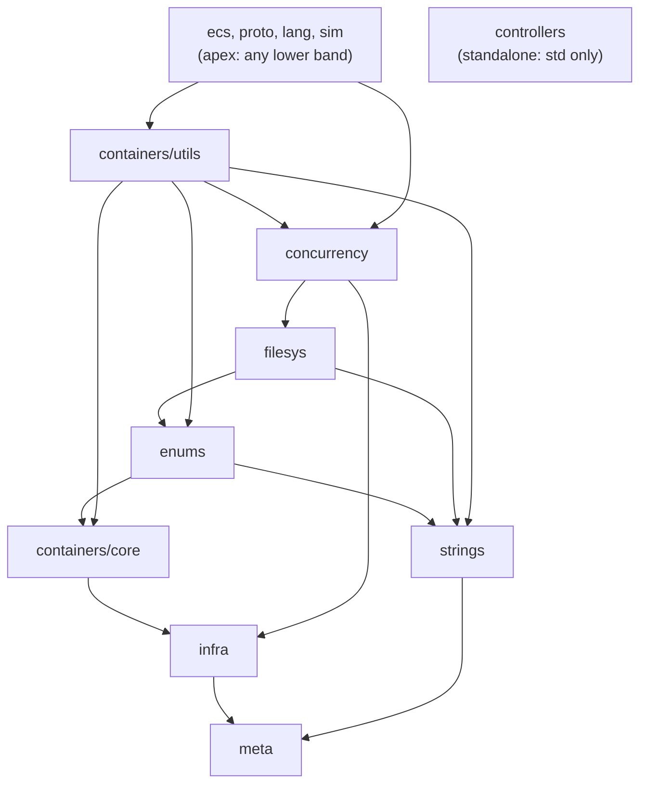

# Corvid dependency structure

This records how Corvid's header modules are layered and how that layering is
enforced. Each top-level directory under `corvid/`, plus the `core`/`utils`
subdivision of `containers`, is a *band*: a cohesive group of headers that sits
at one level of the dependency graph. The bands form a DAG, enforced by
`scripts/check_layering.sh`.

At file granularity the library is a DAG (it compiles). The bands exist to make
the *folder* boundaries honest about that layering, so a layer violation becomes
a folder-path question a lint can answer rather than a judgment call.

## Bands

Listed foundation-first. A band may include its own siblings and anything it
points to below.

```text
L0  meta              corvid/meta/, corvid/meta.h    Foundation: std + internal only.
    math              corvid/math/, corvid/math.h    Foundation: abstract math, std only.
L1  infra             corvid/infra/                  scope_exit, relaxed_atomic, firewalls.
    strings           corvid/strings/                Enum-free string utilities.
    containers/core   corvid/containers/core/        Enum-free container utilities.
L2  enums             corvid/enums/                  scoped/sequence/bitmask/bool, registry, enum<->string + formatter.
L3  filesys           corvid/filesys/                os_file, event_fd, epoll glue.
    concurrency       corvid/concurrency/            locks, timers, dispatch, atomics.
    containers/utils  corvid/containers/utils/       Enum/string-aware containers.
L4  ecs, proto, lang  corvid/{ecs,proto,lang}/       Apex consumers.
L5  sim               corvid/sim/                    Apex consumer.
--  controllers       corvid/controllers/            Standalone leaf: std only.
```

The `L3` row is not flat: `filesys` rests on `enums` and `strings`;
`concurrency` rests on `filesys`; `containers/utils` rests on `concurrency`. The
allow-list below captures that order precisely.

The apex bands (`ecs`, `proto`, `lang`, `sim`) may depend on any lower band.
`controllers` is a leaf parallel to the tree: it has no cross-folder edges.

`math` is a second std-only foundation alongside `meta`. Because it includes
nothing from corvid, it can never form a cycle, so any band may depend on it
(it is universally dependable, like `meta`).

## The core/utils split

`containers` is split into two bands by exactly one question: does the header
know about enums or strings? Enum-free headers are `core` (L1, below enums);
enum-aware headers are `utils` (L3, above enums). Classification follows
includes, not names: `containers/core/enum_variant.h` only pulls
`meta/concepts.h`, so despite the name it is `core`.

`strings` is not split. The whole folder is enum-free (L1, below enums). The
enum-aware string code that used to force a split now lives in the `enums` band,
with the enum types it serves:

- `enums/enum_conversion.h`: enum<->string conversion. Forward path
  (`append_enum`, `enum_as_string`, the scoped-enum `operator<<`) and reverse
  path (`extract_enum`, `parse_enum`) together.
- `enums/enum_formatter.h`: the `std::format` specialization for scoped enums. A
  formatter that rides along with the type it formats lives with that type (the
  `string_view_wrapper` formatter sits at the bottom of its own `strings`
  header); the enum formatter follows the same rule by living in `enums`.

`containers/utils` (everything else under `containers/` is `containers/core`):

- `enum_vector.h`, `object_pool.h`, `intern.h`, `interval.h`.

The split is physical (folders). The public API stays flat: symbols keep their
existing namespaces, so e.g. `corvid::strings::append_num` and
`corvid::strings::append_enum` both resolve, even though the latter now lives in
a header under `enums/`. Enforcement keys off the folder path, not the
namespace.

## The strings <-> enums seam

This was the original tangle. It is now a clean one-way edge: `enums` depends on
`strings`, and nothing under `strings` depends on `enums`.

- `strings` is entirely enum-free. `strings/conversion.h` handles numeric and
  related conversions; it knows nothing about enums.
- The enum<->string code (`enums/enum_conversion.h`, `enums/enum_formatter.h`)
  lives in the `enums` band and dispatches through `enums/enum_registry.h`,
  which exposes `enum_spec_v`. The registry depends down on `strings`
  (`targeting.h`); it is where `enums` reaches into `strings`.
- The `"a + b + c"` bitmask-combination parsing lives in the bitmask spec's
  `lookup` (`corvid/enums/bitmask_enum.h`), so `enum_conversion.h` needs no
  sequence/bitmask adapter, only the registry.
- The enum headers include specific `strings` headers, never the `strings`
  umbrella.

Net: the only cross-folder edge between the two is `enums -> strings`. No
folder-level cycle, and no separate band needed to break one.

## Cross-band edges

Derived from `#include` directives. `meta`, `math`, and `controllers` have no
outgoing cross-band edges.

```text
infra            -> meta
strings          -> meta
containers/core  -> meta, infra, math
enums            -> meta, strings, containers/core
filesys          -> strings, enums
concurrency      -> meta, infra, filesys
containers/utils -> infra, containers/core, strings, enums, concurrency
ecs              -> meta, infra, enums, containers/core, containers/utils
proto            -> meta, infra, filesys, concurrency, strings, enums,
                    containers/core, containers/utils
lang             -> enums, containers/core, corvid/strings.h (umbrella)
sim              -> strings, enums, containers/core, proto,
                    corvid/ecs.h + corvid/proto.h (umbrellas)
```

The spine, with transitively-implied edges omitted for readability:



## De-umbrella discipline

Two include shapes matter:

- `"../folder/file.h"`: a narrow edge onto one header.
- `"../folder.h"`: an umbrella edge onto a whole subsystem. A single umbrella
  turns a one-symbol need into a module-wide dependency.

Internal (non-apex) headers use narrow includes. The `corvid/<folder>.h`
umbrellas exist for consumers (tests, apps) and for the apex bands, which is why
`lang` and `sim` show umbrella edges above. The `corvid/meta.h` and
`corvid/infra.h` umbrellas are the exception: they aggregate the foundation and
are cheap to depend on. The lint rejects every other subsystem umbrella from a
non-apex band.

## Enforcement: scripts/check_layering.sh

For each header under `corvid/`, the script resolves each local `#include` to a
target, maps source and target to a band by folder path, and checks the edge
against the allow-list. It is wired into `cleanbuild.sh` (it runs first, before
any build, since it is static and build-independent) and is runnable on its own
for CI.

Allow-list (a band may always include its own siblings; `meta` and `math` are
universal foundations; apex bands may include any lower band; `controllers`
includes std only):

```text
meta             -> (std only)
math             -> (std only)
infra            -> meta
strings          -> meta
containers/core  -> meta, infra, math
enums            -> meta, strings, containers/core
filesys          -> meta, strings, enums
concurrency      -> meta, infra, filesys
containers/utils -> meta, infra, strings, enums, containers/core, concurrency
ecs, proto, lang, sim -> (any lower band, plus consumer umbrellas)
controllers      -> (std only)
```

The check is deliberately crude: it inspects direct edges only, which is
sufficient because the in-band property is transitive (if no `core` header names
an out-of-band header, its transitive closure stays in band).

It is an external text lint rather than a preprocessor poison-pill on purpose. A
TU-global macro (`enum_registry.h` `#define`s a symbol, core headers `#error` on
it) observes whole-TU include *order*, not the include *edge*: it yields false
positives (an innocent core header included after an enum header in the same TU
fires) and false negatives (a core header that genuinely includes enums slips
through in any TU where the enum header was pulled in first, since the second
visit is `#pragma once`-elided). It also forces a fixed include order. Reading
source text per header is order-independent and IWYU-friendly.
