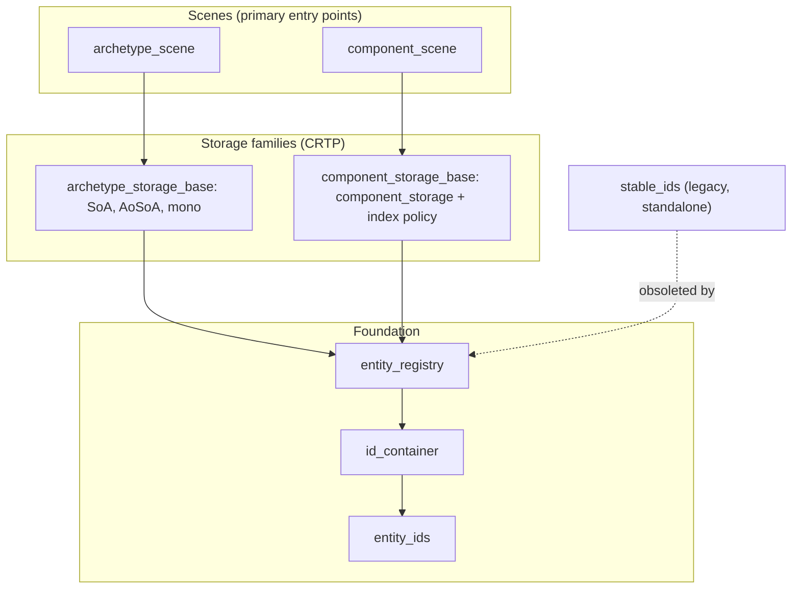
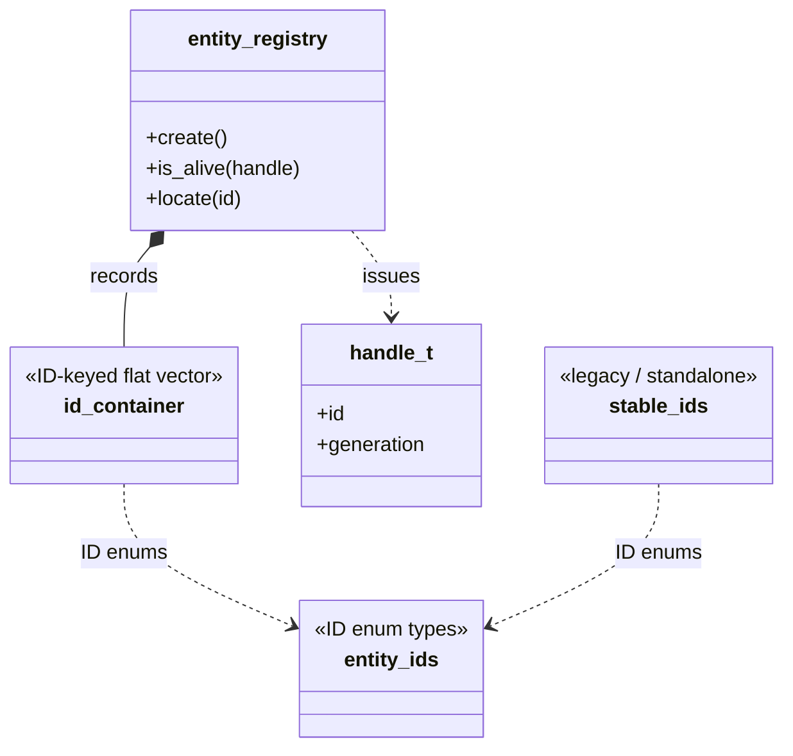
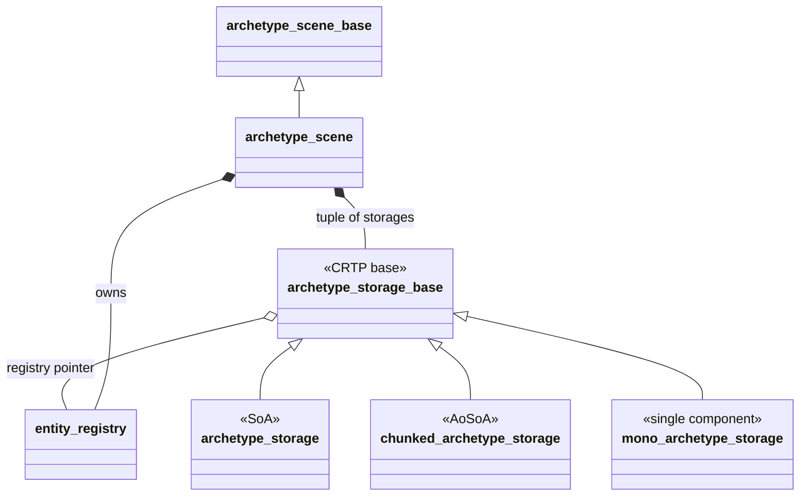
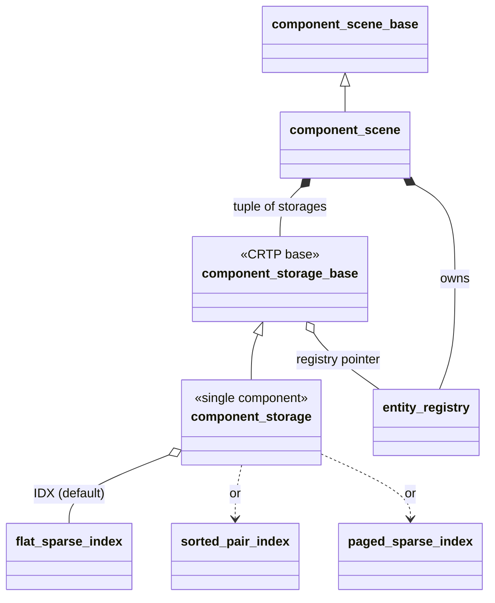
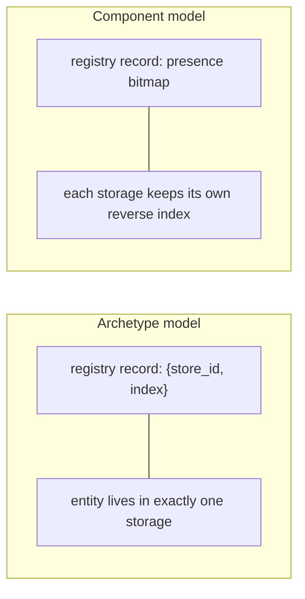

# ECS class relationships

A map of the classes in `corvid/ecs/` and how they fit together. For the design
narrative and feature rationale see [overview.md](overview.md) and
[roadmap.md](roadmap.md); this file is about the static structure (who owns
what, who inherits what, and which pieces sit outside the core system).

## The shape of the system

The ECS is built around **one foundation and two parallel models**:

- **`entity_registry`** is the foundation of both models: a flat array of
  records (one per entity ID) tracking each entity's location, an optional
  generation counter, and optional metadata. It is backed by an `id_container`.
- **Archetype model** (an entity lives in exactly one storage; component set
  fixed by which storage it occupies) and **component model** (an entity can
  occupy any number of storages; components added/removed at runtime). The two
  cannot be mixed in one scene.
- Each model has a **CRTP storage family** (a `*_storage_base` with concrete
  leaves) and a **scene** type that aggregates a registry plus a heterogeneous
  tuple of storages. The scene is the primary entry point.

Two files sit **outside** that system: `stable_ids.h` is a legacy standalone
sparse-set that predates the registry (kept for compatibility, obsoleted by
`entity_registry` + `mono_archetype_storage`), and `ecs_meta.h` is a header of
compile-time utilities the scenes use internally rather than a class.

## Foundation: registry and IDs

The registry composes an `id_container` (an ID-keyed flat vector) as its record
store and issues `handle_t` values that snapshot a generation counter for
stale-handle detection.

`stable_ids` is drawn here only because it shares the `entity_ids` enums; it has
no other tie to the system (nothing in the core includes it).

## Archetype family

An entity lives in exactly one storage. All concrete storages derive from
`archetype_storage_base` via CRTP (the base names the leaf as a template
parameter); removal is swap-and-pop to stay dense. `archetype_scene` owns the
registry and a `tuple<monostate, STORES...>` (index 0 = staging).

## Component family

An entity can occupy any number of storages; the registry holds a presence
bitmap, and each storage keeps its own `entity_id` to packed-index reverse map.
The reverse-index policy is a per-storage compile-time choice.

## The classes

### Foundation

| Class | File | Relationships |
| ----- | ---- | ------------- |
| [entity_registry&lt;T, EID, SID, GEN, ...&gt;](entity_registry.h#L95) | entity_registry.h | The shared foundation of both models. Owns the per-ID records (via `id_container`), assigns `store_id`s, recycles dead IDs through a free list, and issues handles. `GEN` selects `generation_scheme::versioned` vs `unversioned`. |
| [id_container&lt;T, ID, A&gt;](id_container.h#L51) | id_container.h | ID-keyed flat vector wrapping `enum_vector` plus an exclusive ID limit. No free list or sentinel of its own; the registry composes it as its record store (`id_container_t`). Independently reusable, but here it is a building block, not an outlier. |
| [entity_ids.h](entity_ids.h) | entity_ids.h | Default ID enum types (`id_t`, `store_id_t`, ...) and their sequential-enum registrations, shared by everything. |
| `handle_t` / `id_t` | (in entity_registry / entity_ids) | A raw `id_t` is a plain integer; a `handle_t` pairs an id with a generation snapshot so `is_valid` can detect a reused ID. `generation_scheme` lives in [../enums/bool_enums.h#L34](../enums/bool_enums.h#L34). |

### Archetype family

| Class | File | Relationships |
| ----- | ---- | ------------- |
| [archetype_storage_base&lt;CHILD, REG, TUPLE&gt;](archetype_storage_base.h#L76) | archetype_storage_base.h | CRTP base for all archetype storages. Manages the entity-ID vector, registry pointer, and `store_id`; provides row wrappers (`row_lens` / `row_view`), iterators, and bulk ops. Leaves supply the component-data operations. |
| [archetype_storage&lt;REG, TUPLE&gt;](archetype_storage.h#L68) | archetype_storage.h | Inherits the base. Structure-of-Arrays: one `std::vector` per component type. |
| [chunked_archetype_storage&lt;REG, TUPLE, CHUNKSZ&gt;](chunked_archetype_storage.h#L66) | chunked_archetype_storage.h | Inherits the base. AoSoA: per-component arrays in fixed-size chunks for locality. Same public interface; `CHUNKSZ` is a tuning knob. |
| [mono_archetype_storage&lt;REG, C&gt;](mono_archetype_storage.h#L53) | mono_archetype_storage.h | Inherits the base. Single-component: one contiguous `std::vector<C>` with a contiguous iterator dereferencing to `C&`. |
| [archetype_scene&lt;REG, STORES...&gt;](archetype_scene.h#L82) | archetype_scene.h | Inherits `archetype_scene_base`. Owns the registry and `tuple<monostate, STORES...>` (slot 0 = staging). The primary archetype-mode entry point: create, assign, migrate, `for_each`. |

### Component family

| Class | File | Relationships |
| ----- | ---- | ------------- |
| [component_storage_base&lt;CHILD, REG, ...&gt;](component_storage_base.h#L69) | component_storage_base.h | CRTP base for all component storages. Like the archetype base, plus a reverse index (`entity_id` to packed index), since the component-mode registry bitmap holds no per-storage index. |
| [component_storage&lt;REG, C, TAG, IDX&gt;](component_storage.h#L58) | component_storage.h | Inherits the base. The only concrete component storage: dense `std::vector<C>`. `TAG` disambiguates same-typed storages; `IDX` selects the reverse-index policy. |
| [flat_sparse_index](component_index_policies.h#L72) / [sorted_pair_index](component_index_policies.h#L115) / [paged_sparse_index](component_index_policies.h#L187) | component_index_policies.h | The three reverse-index policies (`IDX`): dense vector (default), sorted (id, ndx) pairs, or on-demand pages. Compile-time per-storage choice. |
| [component_scene&lt;REG, STORES...&gt;](component_scene.h#L76) | component_scene.h | Inherits `component_scene_base`. Owns the registry and a tuple of component storages (no staging slot). The primary component-mode entry point: add/remove, erase-from-all, `for_each`. |

### Support

| Item | File | Role |
| ---- | ---- | ---- |
| [ecs_meta.h](ecs_meta.h) | ecs_meta.h | Compile-time utilities (`tuple_contains_v`, `has_all_components_v`, `storage_index_for_v`, ...) driving `for_each` dispatch and component-selector resolution in both scenes. A header of metafunctions, not a class. |

### Standalone / legacy

| Class | File | Status |
| ----- | ---- | ------ |
| [stable_ids&lt;T, ID, ...&gt;](stable_ids.h#L87) | stable_ids.h | **Legacy, standalone.** An indexed vector / sparse-set with stable IDs and handle-based reuse detection that predates the full ECS. Nothing in the core includes it; it shares only the `entity_ids` enums. Obsoleted by `entity_registry` + `mono_archetype_storage`; prefer the full stack for new code (per [CLAUDE.md](CLAUDE.md)). |

## How the two models differ at runtime

Same registry foundation, different location tracking, drawn side by side:

In `archetype_scene::for_each<Cs...>`, only storages whose tuple contains all
`Cs...` are visited (a compile-time filter). In `component_scene::for_each`, the
primary component's storage is walked and a bitmap subset check confirms each
entity also occupies the other requested storages before the callback fires.
