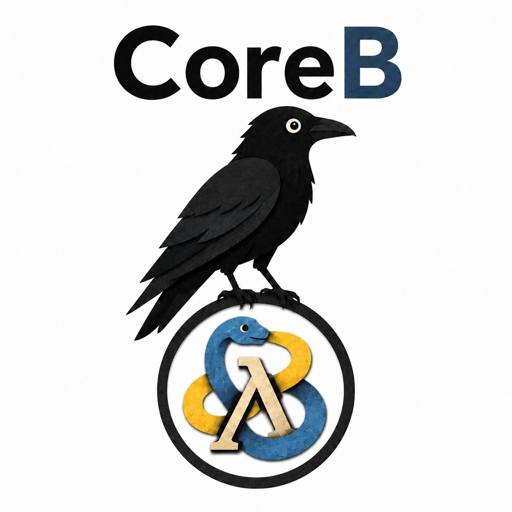

# CoreB



CoreB is yet another Lisp dialect, this time with a surface syntax closer to Python or Pascal than to parentheses, written in the spirit of Rhombus and Dylan and infected by decades of C++. It is bootstrapped by a small C++ kernel and otherwise written in itself. The name is a pun on "corbie", Scots for crow. There is no CoreA.

It exists because the only way to avoid being destroyed by [Greenspun's tenth rule](https://en.wikipedia.org/wiki/Greenspun%27s_tenth_rule) is to embrace it. Also, it seemed like a good idea at the time.

More fundamentally, this is an exercise in education. And on that note, here's a tip: if someone tells you that Lisp is pronounced "lithp", they're messing with you.

Because life isn't confusing enough, while the language as a whole is called CoreB, the s-expr syntax is called Hall and the Pythonesque syntax is called Monty.

This document is the design record and status tracker for the project. It is written for a reader who is not assumed to know Lisp internals or compiler construction; terms are explained as they are introduced, and there is a glossary at the end.


## Goals and non-goals

Goals:

- Learning. The point is to build a language from scratch and understand every part of it.
- Teaching. The code is self-explanatory to the level where reading it teaches the language.
- A Lisp-1 with full macro power, reachable through a syntax that does not repel people who dislike parentheses.
- Self-hosting: the C++ kernel stays minimal, and as much of the language as possible is written in CoreB itself.

Non-goals:

- Commercial use, popularity, or performance. No optimization work beyond what correctness requires.
- Parser generators or compiler-compilers (ANTLR, yacc, and kin). Every parser here is written by hand; that is what "from scratch" means.

One deferred goal: eventually transpile CoreB into something a real compiler can chew on. That future tool is reserved the name CoreC and is not part of the current effort beyond the occasional forward reference.

## The central design decision

Lisp's macro power comes from homoiconicity: code is represented as ordinary data (nested lists), so a macro is just a function that receives code as lists and returns new code as lists. A non-parenthesized surface syntax threatens this, because it raises the question of what data structure macros operate on.

CoreB resolves this with a two-layer design:

1. The surface syntax is a skin. A hand-written lexer and parser turn Pythonish source text into classic s-expressions. Everything downstream of the parser (the evaluator, the macro expander, the standard library, the eventual self-hosted compiler) works on s-expressions, exactly as in a traditional Lisp.
2. Sugar on top. An unparser renders s-expressions back into surface syntax. Macro-expanded code, error messages, and REPL output can therefore be shown in CoreB notation rather than parentheses. The parenthesized form remains available as an internal and debugging format, much like assembly listings from a C++ compiler. The unparser emits canonical formatting at first. Full round-tripping is a deferred goal, not a non-goal: code written in the REPL must eventually be savable to a file, which means comments (and blank lines, treatable as a degenerate comment) become part of the s-expression representation as trivia that is never executed. The mechanism is deliberately unchosen until it matters; candidates are trivia annotations that the evaluator and macro expander transparently skip, or a fidelity mode in the reader. The known tax: if comments are list elements, every list-walking transform must know to step over them.

This buys full Lisp macro power at the cost of one interesting parser, and it makes self-hosting tractable because the language underneath is a conventional Lisp.

A corollary worth stating: because the surface syntax is a skin, nothing stops CoreB from carrying several parser/unparser pairs over the same s-expression core. Syntax dialects are pluggable; the Pythonesque one is merely first.

## Locked decisions

- **Lisp-1.** Functions and variables share a single namespace. `f(x)` and `x` resolve `f` and `x` the same way. (Common Lisp is a Lisp-2, with separate namespaces; Scheme, Clojure, and CoreB are Lisp-1s.) Corollary: functions are ordinary first-class values. A `lambda` yields a value that is stored in a variable, passed, and returned like any other; a call form just evaluates the variable in call position and applies the result.
- **Macro hygiene: the Clojure-style middle.** A Lisp-1 with fully unhygienic macros invites variable capture, where a name introduced by a macro accidentally collides with a name at the use site. Scheme solves this with full hygiene, which is a research project in itself. CoreB follows Clojure instead: quasiquote support with auto-gensym, so macro authors get fresh, collision-proof names with minimal ceremony. See the glossary for `gensym`.
- **Garbage collection: simple mark-and-sweep in the kernel.** Reference counting via `shared_ptr` was rejected because Lisp programs create reference cycles casually, and refcounting leaks them. A stop-the-world mark-and-sweep collector is simple, correct, and in the spirit of the project. Long-term, this argues for an eventual transpile target that brings its own real GC.
- **Proper tail calls from day one.** A tail call is a call in final position, where the caller has nothing left to do afterward. The evaluator reuses the caller's frame for such calls, so tail recursion (including mutual recursion) runs in constant stack. This is built into the evaluator loop from the start because it is easy to design in and miserable to retrofit. Iteration constructs such as `for-each` are provided, but they are macros that expand into tail-recursive code: you write iteration, it is recursion underneath.
- **Kernel/library split.** The C++ kernel contains only what cannot be written in CoreB: the reader and printer, the value representation, the garbage collector, `eval`/`apply`, and a small set of primitive functions. Everything else, including the macro expander once it can be expressed, is written in CoreB.
- **Truthiness, Clojure-style.** `nil` and `false` are falsy; every other value is truthy, zero and the empty string included. Scheme's stricter rule (only `false` is falsy) was considered; the deciding tilt was consistency with the hygiene decision already borrowed from Clojure, reinforced by the C++ instinct that a null pointer tests false. Ruled 2026-08-02.
- **Reserved symbols: the `%` prefix belongs to the kernel.** Symbols starting with `%` are for kernel-generated and kernel-internal names: the future `%comment` nodes that make comments round-trippable data, gensym's fresh names, and whatever other plumbing follows. User-facing special forms (`quote`, `if`, `define`, `lambda`, ...) stay bare, per sixty years of Lisp practice; the list is kept tiny and famous. The reader accepts `%` symbols like any other (they must survive a print/read round trip); the evaluator polices them at `define` once it exists. Kernel's `$` sigil was considered and rejected: there it marks operatives (fexprs), a calling convention CoreB does not have, not stdlib ownership.

## Architecture

```
source text (.coreb)
      |
      v
lexer + parser (C++, hand-written; Pratt parsing for infix)
      |
      v
s-expressions  <--------> unparser (renders back to surface syntax)
      |
      v
macro expander (CoreB, eventually; kernel-assisted at first)
      |
      v
evaluator (C++: environments, closures, proper tail calls)
      |
      v
primitives (C++) + standard library (CoreB)
```

The kernel lives under "corvid/lang/coreb/" as header-only C++23, tested with Catch2, following normal repo conventions. The lexer and reader build on the existing Corvid string machinery (locators and parsers in "corvid/strings/", character classification and conversion in "cases.h" and "conversion.h") rather than reinventing it; the kernel doubles as a dogfooding exercise for the library. The existing "ast_pred.h" one directory up is an unrelated predicate-AST exercise and stays untouched.

## Leanings (recorded, not locked)

Directions the project intends to grow, noted early so later milestones can leave room for them:

- **Optional type annotations, Dylan-flavored.** Dylan lets parameters and bindings carry type constraints while remaining a dynamic Lisp underneath. CoreB leans the same way: annotations are optional, checked at runtime to start, and become fuel for CoreC later. Not deeply Lispy, deliberately so.
- **OOP as generic functions with multiple dispatch.** In the CLOS/Dylan lineage, methods are not owned by classes; a generic function holds a family of methods, each specialized on the types of its arguments, and a call dispatches to the most specific match. This fits a Lisp-1 naturally (a generic function is just a value in a variable) and matches the instinct of "macros that apply to a constrained type list" better than message-passing OOP would.

## Monty, the surface syntax

The Pythonesque surface syntax is named Monty (ruled 2026-08-07). It is not a separate language: the language is CoreB, and Monty is a skin over the same s-expressions, as in "I wrote it in Monty, and here is how it looks in s-exprs". The native s-expression syntax is named Hall (ruled 2026-08-07), completing a deliberately mixed metaphor: Monty for the Pythons, Hall for the game-show host. A design goal, adopted explicitly: Monty is total, meaning nothing expressible in CoreB may require dropping to s-expressions. Several rulings below exist to keep that promise.

An illustrative sketch:

```
fun greet(name):
  if empty?(name):
    "hello, world"
  else:
    concat("hello, ", name)
```

which the parser would desugar to the s-expression

```
(define greet
  (lambda (name)
    (if (empty? name)
        "hello, world"
        (concat "hello, " name))))
```

Block structure is decided: Python-style indentation-as-blocks, ruled 2026-08-02. The user's reasoning: C's wart is that it is not a full-blocking language (`if (p) s;` where `s` merely may be compound), and the conventional brace indentation is a cosmetic cover for that. Dylan-style `define method X`/`end method` full blocking was considered and set aside as too ceremonious; if a delimited dialect ever happens, it arrives as a second pluggable skin, not a redesign. The lexer will synthesize INDENT/DEDENT tokens, as Python's does.

### Token classes (ruled 2026-08-07)

Symbols divide into two disjoint token classes, in Monty and in native CoreB alike. The model is C++, where identifiers and operator tokens never blend, and `operator-` names a function without making `-` an identifier character.

- Word symbols: a leading letter or underscore, then letters, digits, and underscores, with `?` permitted only as the final character. Examples: `head`, `nil?`, `make_adder`, `_helper`. The trailing `?` follows the Scheme/Clojure predicate convention, marking boolean-returning functions.
- Operator symbols: exactly the spellings in the operator table, a closed set (`+ - * / = := == != < <= > >=` today; the table is the authority as it grows).

Blends such as `comb-over` are invalid: in infix-land `-` always means subtraction, so it is never an identifier character, and classic dashed Lisp names take underbars instead. `!` is reserved outright, appearing only inside `!=`; CoreB has no mutation forms, and any future ones need not adopt Scheme's `!` suffix. The `%` kernel prefix is followed by a word symbol. The reader will enforce these classes for native CoreB as part of milestone 4, retiring incidental spellings the current tokenizer accepts (such as `...`) and renaming dashed names in tests and docs.

An operator symbol is mentioned as a value by parenthesizing it: `map((-), xs)` passes the subtraction function, and `fun (-)(a, b):` rebinds it. Ruled over a `symbol("-")` spelling, which reads as manufacturing a symbol rather than referencing a binding; fitting, too, that a Lisp resolves this with parentheses. Native CoreB needs no such device, because s-exprs have no infix: `(map - xs)` already says it.

### Contextual keywords (ruled 2026-08-08)

Keywords are contextual, not reserved, as much as possible: being a keyword is a fact about a grammar position, not about a spelling. The lexer has no reserved words; fun/if/elif/else/return lex as ordinary word symbols. The statement parser recognizes `fun`, `if`, and `return` at statement-leading position, `elif` and `else` only adjacent to an `if`'s arms, and the expression parser recognizes `if` and `else` only in the ternary; wherever the grammar makes no claim, the same spellings are ordinary symbols. The definition lookahead backs the principle: a statement-leading word followed by `=` or `:=` reads as a definition before any keyword reading, so `fun = 5` binds a variable named `fun`, and `if = 5` parses identically only to die at kernel policing, the grammar reserving nothing while the semantics reserves the minimum. The claim stays positional in the other direction too: a statement otherwise led by a keyword spelling reads as the keyword form, so `fun + 1` is a malformed `fun` statement, while the bound variable reads fine from any expression position a keyword does not lead. Totality survives on the same device as operator mention: grouping parentheses strip the claim, so `(fun + 1)` is an expression statement, and every Hall form touching a keyword-named binding has a Monty spelling. The only true reservations are semantic, minimal, and shared by both syntaxes: the kernel's five special-form names and the `%` prefix cannot be bound, policed at `define`. Python hard-reserves its whole keyword list; the model here is C++'s contextual keywords (`final`, `override`), consistent with the token-classes ruling's C++ lean.

### Indentation and continuation (ruled 2026-08-07)

- The indent unit is exactly two spaces, a virtual tab. Depth is spaces divided by two; an odd count of leading spaces is an error.
- Raw tab characters are an error anywhere outside a string literal; string content spells a tab as `\t`.
- Blank lines and comment-only lines never open or close blocks; the lexer ignores their indentation. Canonical formatting indents a comment to match the line that follows it, which becomes enforceable once comments are round-trippable trivia.
- Continuation is bracket-based, as in Python: inside unclosed brackets, newlines and indentation do not matter. There is no backslash continuation.
- Comments are `#` to end of line, matching the skin; `;` remains the s-expression layer's comment character. (Ruled 2026-08-07.)
- String literals are single-line; a newline inside one is an error, not a continuation. Triple-quoted strings and docstrings: deferred, not opposed.

### Statements and expressions (ruled 2026-08-07)

Monty control forms are statement-shaped but expression-valued, in the Julia/Ruby/Rhombus tradition. A statement-form `if c:` with an indented block desugars to `(if c (begin ...) (begin ...))` and has a value like everything else; statement-ness is a fact about where a form appears, not about what it returns. Monty also has Python's ternary spelling `x if c else y` for expression positions, where no statement block can appear; the unparser picks the spelling by position. Both are the same kernel `if`, and totality requires the ternary: `(if c 1 2)` can occur in argument position.

Restricted `return`, ruled 2026-08-07: `return` exists, restricted to where a local rewrite can express it. Desugaring a body back-to-front, a `return e` in final position is just `e`, and an else-less `if` ending in `return` takes the remainder of the body as its else branch, which is the Python guard-clause idiom. A `return` anywhere deeper (inside a future loop construct, say) would need continuations or exceptions the kernel does not have, and is an error saying so. Whether more than this is ever needed is left to be proven by real Monty code.

### Function definition keyword (ruled 2026-08-08)

The function definition keyword is `fun`, not Python's `def`: `fun inc(n):` desugars to `(define inc (lambda (n) ...))`. The Python spelling was rejected because it misleads precisely here. In Python, `def` abbreviates nothing visible; in CoreB, where every dump shows the kernel `define`, it reads as short for `define` while actually naming the define-of-a-lambda combination, and plain `define` is what `a = 5` already desugars to. Monty deviates from Python where the Python spelling would misrepresent the semantics (the `?` predicate suffix, the absent `let`), and this is such a spot, cheap because it is three letters learned on day one. `fun` has ML and Kotlin precedent, and extends naturally to an anonymous-function spelling should Monty need one (totality suggests it eventually will, since Hall has bare `lambda`), where `def` could not: Python itself minted a second keyword there. With this ruling, `def` is not part of Monty at all.

### Parsing

Pratt parsing for infix, per the architecture. Chained comparisons parse as one chain: a same-operator chain desugars directly to the kernel's chaining comparison primitives (`a < b < c` becomes `(< a b c)`, which they already implement), `!=` stays binary, and mixed-operator chains such as `a < b <= c` are deferred until there is an `and` to desugar them through (each operand must still evaluate exactly once, so the naive nested-if spelling is not free). ### Precedence (ruled 2026-08-07)

Precedence is a sparse partial order, not a total table: orderings exist only where misreading is implausible, and wherever the order is undefined, the grammar demands parentheses. This promotes to syntax the discipline linters already impose on C++ (clang-tidy's parenthesize-your-arithmetic warnings motivated the ruling). Prior art: Pony ships the strict everything-needs-parens version; Carbon's design records the same partial-order rationale; Smalltalk's flat left-to-right precedence (where `2 + 3 * 4` is 20) is the cautionary corner, silently choosing against algebra rather than refusing to choose. The rules:

- Postfix (calls, and any future indexing or attribute access) binds tightest; unary minus applies to the primary it precedes.
- `{+ -}` and `{* /}` are families, each internally left-folding (`a - b + c` is fine), but crossing families requires parentheses: `a + b * c` is an error, written `a + (b * c)`.
- Arithmetic orders above comparison, so `a + b < c * d` is legal and means the only thing it could.
- Comparison chains are same-operator only, desugaring to the kernel's chaining primitives; mixed chains stay deferred as above.
- When `and`/`or`/`not` arrive, comparisons will order above them, but `and` versus `or` gets no ordering: parentheses required, retiring that classic bug family.

The ruleset is monotonically relaxable: adding an ordering later legalizes code without changing the meaning of anything that already parsed, so Monty starts sparse and earns orderings from demonstrated annoyance. Reading requires no memorized table, which suits a teaching language, and canonical unparsed output always shows its grouping.

### Definition, assignment, and equality (ruled 2026-08-07)

Three spellings settle the `=` family:

- `==` is equality, chaining like every comparison. The kernel primitive was renamed from `=` to match: its partner `!=` was already a C-family spelling rather than Lisp's `/=`, so the pair is now self-consistent, and dumped s-expressions read exactly as Monty source does at the equality operator. Precedent: the same "it's our language" grounds that retired car/cdr for head/tail.
- `=` is definition: `x = e` desugars 1:1 to `(define x e)`, creating or updating a binding in the current scope, never an enclosing one. There is no declaration marker (no `let`/`var`): the kernel has no mutation yet, so every binding is a definition and a marker would be mandatory ceremony carrying no information.
- `:=` is assignment to an existing binding, found by walking the scope chain outward, an error if the name is unbound. It will desugar to `(set!` when mutation lands; until then the lexer accepts it and the parser refuses it with a dedicated message that reserves it (the variadic-lambda precedent). False friend, noted deliberately: Python's walrus `:=` is expression assignment; Monty's `:=` is statement-only mutation from the older Pascal/Rhombus lineage, and condition-position `:=` is a clear parse error rather than a subtly different meaning.

`=` and `:=` are statement-shaped, never legal inside a condition, argument, or operand, which retires the `if (a = b)` bug family at the grammar level rather than the lint level: C needs the lint because assignment is an expression there, and Monty declines to have the problem, the same move as the and-versus-or no-ordering rule. Like all statement forms they are expression-valued, and a definition yields what `(define` yields, the defined symbol. Tail sugar making a final `a = b` yield the value was considered and rejected: a tail-position binding dies immediately, so yielding the value would make `a = b` identical to writing plain `b`, dead code dressed as purpose, and the 1:1 mapping keeps the unparser trivial. A body that wants to return a computed value ends with the bare expression on its own line.

Consequences ruled with eyes open: all bindings are mutable once `set!` exists. Rhombus-style immutable-by-default with a `mutable` marker was considered and declined (markerless `=` leaves the marker nothing to gate), and since retrofitting immutability-by-default would break existing programs, this is a commitment, not a deferral. Scoping is function-level, Python-style, and falls out of the kernel: blocks desugar to `begin` sequences in the current environment, so only functions introduce scopes. That makes `:=` Python's `nonlocal`/`global` done right, spelled at the assignment site per use: `=` can shadow an outer name but never clobber it, and `:=` reaches outward explicitly. C++'s `if (auto x = f(); ...)` init-statement exists to limit a binding's scope, and with function-level scoping there is nothing to limit; the Monty spelling is a definition on the line above the `if`. Same-scope redefinition already updates the environment entry in place (kernel `define` semantics), so `=` acts as same-scope assignment today; `:=`'s distinct powers are reaching outward and requiring existence.

### List literals (ruled 2026-08-08)

`[a, b, c]` is the list literal, building a classic cons-cell list by desugaring to `(list a b c)`, a new variadic kernel primitive; `[]` desugars to `(list)`, which yields nil. Elements are evaluated, as in Python, Rhombus, and Clojure: constructor semantics, forced by totality since a quote-shaped reading could not express `[1, x + 1]` without quasiquote machinery. The `(list ...)` spelling was chosen over emitting nested `cons` calls because dumps stay readable and the future unparser recognizes the head trivially to round-trip back to `[...]`. Like the `+` that arithmetic desugars reference, `list` is an ordinary rebindable binding; the desugars reference plain symbols uniformly.

Cons cells over Rhombus's treelist, with eyes open: Rhombus's default `List` is Racket's `treelist`, an RRB-tree persistent sequence with O(log n) indexing and update, chosen there so Pythonish `xs[i]` ergonomics do not hide linked-list walks, with cons lists surviving as `Pair`/`PairList`. CoreB stays with cons cells because performance is a stated non-goal, the kernel stays minimal (a treelist would be a new value kind, a new GC-traced type, and a new primitive family), and milestone 5's macros stay simpler when code and data share the one shape (Clojure macros must handle its vectors appearing inside syntax; CoreB declines to inherit that). This is a knowing exception to the general Rhombus lean. If a vector type ever arrives, it comes under its own spelling or constructor; retargeting `[...]` would be a breaking change and is not planned.

The bracket budget, reserved up front so nothing is spent twice: `[...]` is the sequence literal and, in postfix position, the reserved indexing syntax (as in Python; the positions cannot collide). `{...}` is held for map or set literals, unruled, and today does not even lex. `(...)` is never a data literal: grouping, calls, and operator mention only, which also forecloses Python's parenthesized tuples and their one-element ambiguity (a future tuple, if any, gets a constructor or its own spelling). Trailing commas remain rejected in call arguments and list literals alike, one shared unruled question.

### Negative literals (ruled 2026-08-09)

A unary `-` must touch its operand. Touching a number token, the sign is part of the literal, exactly as in Hall's own token grammar: `-7` is the literal negative seven, and `-9223372036854775808` is exact int64 min, which negating a parsed positive could never produce, the magnitude overflowing to double first. Touching anything else, it is negation as before: `-x` desugars to `(- x)`. The lexer still never signs numbers (`a-7` must lex as subtraction); the fold is the expression parser's, keyed on source adjacency.

A spaced `- 7` is an error ("unary '-' must touch its operand") rather than a quietly different program. The two readings genuinely differ: the literal is immune to a rebound `-`, the negation call is not, so an accidental space must not slide between them. Python folds the constant either way and never has to care; Monty's grammar refuses the confusable form instead, the same move as the family-mixing and and-versus-or rules. Negating a number on purpose is spelled by mention, `(-)(7)`, the moral equivalent of C++'s `operator-(7)`, and that is also how the unparser spells `(- 7)`, since emitting `-7` would re-read as the literal.

### Unparsing and the Hall escape (ruled 2026-08-08)

The unparser maps Hall back to Monty, emitting canonical form: two-space virtual tabs, the spelling choices the parser's desugars document, and grouping shown wherever precedence demands it. Output is canonical after one round trip, the Monty analog of the printer's fixed-point rule.

Totality gets a pressure valve: raw Hall embeds in Monty as `%(...)`, where the parens are the Hall form's own and `%` is a one-character badge. The spelling is free precisely because `%` is kernel-reserved and today may only precede a word symbol, so `%(` is invalid in both syntaxes, and it already connotes kernel-land, which is where the escape drops. The alternatives each spend something reserved: `#` is the comment character, backtick is saved for quasiquote, `{}` is held in the bracket budget. Rhombus's `#{...}` escape for raw Racket names is the precedent for the shape. Only list forms need escaping: once charset enforcement lands, the token classes are shared, so every Hall atom is already Monty.

Semantics: the escaped Hall is read, not evaluated, at parse time and spliced into the desugared output in place. It is code, not quotation; quasiquote remains milestone 5's concern. Mechanics: the lexer, on `%(`, scans to the matching close paren without parsing, aware of strings and `;` comments so a bracket inside either does not count (cheap because the escape grammar is shared), and carries the text as one token; the parser hands that subview to the Hall reader and splices the result. Because the span is a subview of the one source buffer, error positions map back by subview offset. The escape needs no statement form: `%(` collides with no word, so it flows through the expression-statement path.

The valve does not weaken the totality mandate; it aims it. An escape is never the permanently intended spelling for anything: each `%(...)` the unparser emits marks a known Monty gap (anonymous lambda is first in line), and closing a gap makes later round trips come out purer. Unparser output doubles as a gap report.

Begin blocks unparse to the syntax that made them: an `if` whose else operand is another `if` folds into an `elif` ladder, and an else operand that is a `(begin ...)` becomes the `else` block, the two being unambiguous because the desugar chains elifs directly and wraps real else bodies in `begin`. A bare `begin` in statement position splats into the enclosing sequence, observationally identical under function-level scoping (blocks introduce no scope), including tail-value and program-value behavior. A `begin` in expression position has no Monty spelling and escapes to Hall. Monty has no bare `begin` statement and, per Python's precedent, is not expected to need one; if real code ever demands it, that is a fresh ruling with actual motivation behind it.

`return` is pure sugar that unparsing normalizes away: a final `return e` desugars to bare `e` and guard clauses desugar to if/else, so unparsed output spells them as plain expressions and `else` blocks, never `return`. The round trip is semantically faithful and reaches its fixed point after one trip; the guard-clause spelling is not reconstructed, since that would mean guessing intent rather than showing structure.

Still open: how quotation and quasiquotation look in surface form (to be settled against a Rhombus/Dylan comparison; the hunch, favoring Rhombus, is recorded in the milestone 5 discussion to come, and a meta-pattern is now acknowledged: when Rhombus and Dylan disagree, rulings keep landing on Rhombus's side; the list literals ruled above are expected to cover most everyday data-quoting in the meantime).

## Roadmap

Milestones are ordered semantics-first: the pretty syntax arrives at milestone 4, not 1, so that every parser decision is tested against a working evaluator instead of guessed at.

1. **Value model, s-expr reader and printer.** [DONE] Tagged value type, interned symbols, cons cells, a classic parenthesized reader, and a printer. The parens here are scaffolding, not the product: macros and `quote` traffic in s-expressions regardless, and this gives a working input format for testing the evaluator long before the surface parser exists. Landed as "value.h" (`value` over the library's `enum_variant`, a slim pointer-identity `symbol`, and a `runtime` owning the heap and symbol table, with heap objects constructible only by the runtime) and "hall_reader.h" (originally "reader.h", renamed with the Hall naming since the reader is Hall-specific where `value` and `eval` stay syntax-neutral; recursive-descent, `value_or_error` results carrying position/line/column in `source_error`, grammar documented as EBNF), tested by "tests/portable/coreb_test.cpp". Kernel rulings made here: the halves of a cons cell are named `head` and `tail`, retiring car and cdr along with the IBM 704 registers they abbreviated; nil unifies with the empty list, printing as "nil" while the reader accepts "()" too; `nil`/`true`/`false` are reader literals, not symbols; integers are int64 with literal overflow falling back to double; the string escape set is `\"` `\\` `\n` `\t` `\r` plus `\u{hex}` denoting a byte by value, implemented by the shared escaping utilities in "corvid/strings/conversion.h" (one grammar for the printer, the reader, and the library's debug escaping, so non-printables round-trip); quote sugar `'x` reads as `(quote x)`; a lone `.` is dotted-tail punctuation only, never an atom, so outside that position it is a read error; printed output is canonical after one read/print round trip (an overflowed integer literal, for example, prints as its float approximation and re-reads to exactly that value); alongside `print` there is a structural debug form, `dump`, that turns off list abbreviation and renders every cons cell fully dotted (so `(a b)` dumps as `(a . (b . nil))`); bracket notation in the spirit of box-and-pointer diagrams was considered and set aside because the dotted form shows the same structure while remaining valid reader syntax. The printer guards head-nesting at the reader's 256-level cap, rendering anything deeper as the display form `#<too deep>` (and returning false to report the truncation) rather than overflowing the C++ stack; tail chains are iterated, so list length costs no depth in either print form.
2. **Evaluator.** [DONE] Environments, closures, special forms (`quote`, `if`, `define`, `lambda`, `begin`), with the tail-call-preserving evaluation loop built in from the start, plus the minimal REPL driver ("tests/portable/notest_coreb_repl.cpp", a `notest_` executable per repo convention). Landed as "eval.h" (an `evaluator` over the value model, reporting failure by value as `eval_error`, following the reader's precedent) with the object-model additions in "value.h": `closure` and `primitive` value kinds, and runtime-owned `environment` chains, heap objects rather than stack frames because closures capture them. The global scope is the runtime's root environment (`runtime::root_env`), created with the runtime itself; constructing an evaluator stocks it with any kernel primitives not already bound, never overwriting. Evaluators themselves are transient views, so definitions persist across them and the runtime stays reusable. Kernel rulings made here: truthiness is Clojure's (promoted to a locked decision above); the sequencing form is named `begin` rather than `do` (Scheme uses `do` for an iteration macro, and the name stays free for one) or `progn` (inexplicable outside its lineage); lambda bodies are implicit sequences, so `begin` is only needed elsewhere, and can later become a macro over an argumentless lambda call; `define` takes exactly a symbol and one expression, binds in the current scope, permits rebinding (a REPL is unusable otherwise), yields the defined symbol (re-ruled 2026-08-05 from nil: the REPL echoing the name confirms the definition, where a nil after typing in a whole lambda was a letdown), and is where reserved names are policed, both the `%` prefix and the special-form names themselves (special forms are recognized by identity in call position and are not values; conceptually `if` is `%if`, a kernel name spelled bare by sixty years of tradition); defun-style `(define (f x) ...)` sugar was considered and rejected, one canonical spelling being kinder to round-tripping, with ergonomics deferred to the surface syntax; arity is fixed for now, with the classic variadic spellings (dotted parameter tail, bare symbol) parsed and refused with a dedicated message that reserves them; arithmetic is `+ - * /` over an int64/double tower where integer overflow falls back to double exactly as oversized reader literals do; division stays exact only when it divides evenly and otherwise yields a double (ruled 2026-08-02: no ratio type, the wider Lisp numeric tower being interesting but not this project's focus), an exact zero divisor is an error, and a float zero divisor follows IEEE to an infinity or NaN; comparisons `== < <= > >=` are numeric-only and chain across adjacent pairs (equality was spelled `=` until the 2026-08-07 Monty ruling renamed the primitive to `==`, pairing it with `!=`), while `!=` takes exactly two because chained adjacent inequality is a trap; the remaining primitives are `cons`, `head`, `tail`, and `nil?`, with `set!` and all mutation deliberately absent from this milestone; function values print as "#<primitive name>" and "#<lambda (params) body...>" (re-ruled 2026-08-05 from a bare "#<lambda>": the closure's parameters and body are right there to show; the display form stays rather than the readable `(lambda ...)` spelling, which would be indistinguishable from the quoted list that is its source and would silently drop the captured environment on re-read), the stated exception to the print/read fixed point; Racket-style name imprinting, where `define` stamps the bound symbol into the closure for display, was considered and set aside (in a Lisp-1 a function value can wear any number of names or none, an imprinted one goes stale on rebinding, and a value not knowing its own name is the point), as was showing the captured environment in the display form (a values listing could not terminate on self-recursive definitions, whose environment binds the closure itself, and for a top-level lambda the "local" frame is the whole global scope; explicit introspection is deferred to a future `syntax-local-value` analog); tail calls (including mutual recursion) consume no C++ stack, while nested non-tail evaluation is depth-guarded at 256 levels so runaway recursion errors instead of crashing; the limit is sized so the guard beats genuine stack exhaustion even in unoptimized builds, whose frames run several times fatter (measured empirically: a debug build on a 1MB Windows stack dies around 600 levels), with a byte-budget stack watermark noted as the robust upgrade if the fixed count ever pinches. The reader gained an `error_cause` marking on `source_error` (errors more input could repair report as `incomplete_input`), which is how the REPL decides to keep reading a multi-line form instead of reporting.
3. **Garbage collector.** [DONE] Stop-the-world mark-and-sweep in the runtime. Roots are the root environment, every live `gc_pin` (an RAII registration that pins the embedder's own variable or span rather than a copy, so rebinding needs no re-pin), and, at safe points, the evaluator's live pair. The safe point is the outermost trampoline loop top, where the evaluator's whole live set is the expression in hand and the current environment; collection there is gated by an allocation counter crossing `runtime::gc_threshold` (10000, deliberately untuned), which is what keeps a long tail loop's frame-per-call from accumulating: constant stack now comes with bounded heap. Kernel rulings made here: explicit pinning was chosen over conservative stack scanning (precise, and the embedding surface is all our own code) and over collecting only between top-level forms (which would have left the tail-loop case unsolved); marks are generation counters, an epoch compared against the runtime's current collection number, so sweeping needs no mark-clearing pass (a mark representation, not generational collection); the five collectible types derive from a `gc_object` base that carries the mark and the shared identity semantics (runtime-constructed, never copied), justified because they genuinely are all garbage-collected objects, while runtime polymorphism was deliberately declined: tracing stays centralized in the runtime, so the base is data, not behavior; marking iterates with explicit worklists because recursion would be fatal on deep structure, and the epoch check doubles as the cycle breaker (cycles exist without any mutation primitive, since a self-recursive define's closure captures the scope that binds it); interned symbol spellings are not collected, a deliberate slow leak to revisit when auto-gensym starts manufacturing symbols in volume (candidates then: weak interning, or collectible uninterned gensyms); primitives are swept by the uniform rule and are immortal in practice through the root environment; `runtime::live_objects` reports the heap count the tests measure collection by.
4. **Surface syntax.** [IN PROGRESS] Hand-written lexer, Pratt parser for infix precedence, desugaring to s-expressions, and the unparser going the other way. The surface layer is named Monty; its rulings (token classes, indentation, statement/expression duality, operator mention, restricted `return`, sparse partial-order precedence) live in the Monty section above. The lexer landed as "monty_lexer.h" (token grammar documented there in EBNF, following the reader's precedent; two-space INDENT/DEDENT synthesis; bracket continuation; single-line strings on the kernel escape grammar), tested by "tests/portable/coreb_monty_test.cpp"; the reader and the lexer share their source-text plumbing in "corvid/lang/source_scanner.h", promoted out of the coreb directory as reusable front-end machinery: `source_error`, which both front ends report directly (per-front-end aliases for it were tried and retired as pure renaming), and the `source_scanner` cursor base, whose peek/take toolkit (newline, escape, and lookahead helpers included) keeps offset arithmetic out of the derived scanners, which treat the cursor as an opaque bookmark. The EXPRESSION parser landed as "monty_expression_parser.h" (originally "monty_parser.h", renamed once it was clear the statement parser would be its own class layered on top; grammar documented there in EBNF, following the house precedent): tokens to desugared Hall values, with the sparse partial order enforced structurally rather than by binding powers; with only three operator bands and one incomparable pair, the classic Pratt loop collapses into explicit band levels, where family mixing is an error, arithmetic sits above comparison, same-operator comparison chains build the kernel's n-ary forms, the ternary desugars to kernel `if` chaining rightward, `(op)` mentions desugar to bare symbols, and `=`/`:=` in expression position are rejected with their dedicated statement messages. The lexer's output is a `token_stream`, the tokens paired with the source text their `pos` offsets index into, carrying the consumption cursor; it is the parsers' input type, and the expression parser consumes exactly one expression's tokens, leaving the remainder in the stream for the caller to judge (the statement parser will lex a program once and hand the same stream to the expression grammar at expression positions). List literals are RULED and IMPLEMENTED 2026-08-08 (see the Monty section above: cons-cell lists over treelist, `[a, b, c]` -> `(list a b c)` via the new variadic kernel `list` primitive, bracket budget reserved). Reserved pending rulings: indexing, and trailing commas in call and list-literal element lists (currently rejected; Python allows them). The STATEMENT parser landed as "monty_statement_parser.h" (grammar documented there in EBNF): a program/statement grammar over the lexer's NEWLINE/INDENT/DEDENT structure, handing expression positions to the expression parser over the same token stream; `x = e` desugars 1:1 to `(define x e)`; `fun f(a, b):` desugars to a `define` of a `lambda` whose block splats into the implicit sequence (the keyword is RULED 2026-08-08, `fun` over Python's `def`; see the Monty section above); statement `if`/`elif`/`else` desugars to kernel `if` chains of `(begin ...)` blocks, with else-less spelling the two-argument `if`; restricted `return` is implemented as the ruled back-to-front rewrite (a final `return e` unwraps to `e`, an else-less `if` whose every arm ends in `return` takes the remainder of the body as its else branch, and any deeper `return`, or one outside `fun`, is an error saying so); `:=` in statement position is refused with its reserving message; fun/if/elif/else/return are contextual words recognized in statement-leading position, with the `=`/`:=` definition lookahead winning over the keyword reading so the keywords remain bindable (per the contextual-keywords ruling above). Entries mirror the reader: `parse` consumes one statement, `parse_all` a whole program. The UNPARSER is designed (RULED 2026-08-08; see the unparsing section above: canonical two-space emission, the `%(...)` Hall escape with read-and-splice semantics and lexer pass-through, begin-to-block mapping with statement-position splatting, no bare Monty `begin`, return-normalizing output) and IMPLEMENTED as "monty_unparser.h": `unparse` and `unparse_all` render Hall forms as canonical Monty, with strict shape matchers (a `fun` block only for a word-named define of a well-formed nonempty-body lambda, an if/elif/else ladder only when every arm is a nonempty `begin` block), minimal parentheses derived from the partial order via precedence bands, operator arities without an infix spelling emitted as mention-calls (`(+ a b c)` -> `(+)(a, b, c)`), keyword-led expression statements taking grouping parens, and everything unmatched falling to the escape; round-trip fixed points are pinned in both directions. The escape's parsing side is likewise IMPLEMENTED: the lexer produces a `hall` token (a balanced scan to the matching paren, honoring Hall strings and `;` comments, incomplete at the opener when unclosed), and the expression grammar splices it as a primary through `hall_reader::read_one`, reader errors mapping back through the token's offset. The ruled `fun (-)(a, b):` operator-name spelling is IMPLEMENTED on both sides: a `fun` name is a word or an operator mention, and an operator-named define-of-a-lambda unparses to the `fun` mention block rather than the escape. Negative literals are RULED and IMPLEMENTED 2026-08-09 (see the Monty section above): a unary `-` must touch its operand, a touching number token takes the sign as part of the literal (int64 min included), spaced `- 7` is an error, and the unparser spells negation-of-a-number as the mention-call `(-)(7)`. The `=` family is RULED (see the definition/assignment/equality section above: `==` equality with the kernel primitive renamed to match, `=` as 1:1 `define` sugar, `:=` lexed now and reserved for `set!`), which unblocks the parser. Open: reader-side charset enforcement and the dash-to-underbar sweep.
5. **Macro expander.** [NOT STARTED] Quasiquote with Clojure-style auto-gensym.
6. **Standard library in CoreB.** [NOT STARTED] Including `for-each` and other iteration forms as macros over tail recursion. Self-hosting starts being real here.
7. **CoreC.** [RESERVED] A transpiler emitting C or C++. Not designed. One known constraint: C does not guarantee tail calls, so CoreC will need a technique such as a trampoline.

## Glossary

- **s-expression:** nested lists written with parentheses, e.g. `(if (empty? name) "hello" name)`. The universal data format of Lisp; both code and data take this shape.
- **M-expression:** McCarthy's originally intended surface syntax for Lisp, writing `f[x; y]` for what the s-expression spells `(f x y)`. It was never implemented; programmers used s-expressions directly and the sugar died. Wolfram Language's `f[x, y]` is the one thriving descendant.
- **homoiconicity:** the property that a language's code is represented in the language's own basic data structures, so programs can manipulate programs.
- **Lisp-1 / Lisp-2:** whether functions and variables share one namespace (Lisp-1) or live in two (Lisp-2).
- **special form:** a construct the evaluator handles directly with its own evaluation rule, such as `if` (which must not evaluate both branches) or `quote` (which must not evaluate its argument at all). Everything that is not a special form or macro is an ordinary function call.
- **closure:** a function value bundled with the environment it was created in, so it can refer to variables from its birthplace even when called elsewhere.
- **tail call:** a call in final position; the caller has nothing left to do after it. Proper tail-call support reuses the caller's frame, so loops written as recursion run in constant stack.
- **REPL:** read-eval-print loop, the interactive prompt: read a form, evaluate it, print its value, repeat.
- **quasiquote:** a template mechanism for building code: quote a skeleton, then mark the holes to be filled in with computed values. The workhorse of macro writing.
- **interning:** canonicalizing symbols so that every occurrence of the same spelling is the same object, making symbol comparison a pointer comparison.
- **gensym:** "generated symbol", a fresh name guaranteed not to collide with any other, achieved by never entering it into the intern table. Interning maps same spelling to same symbol; gensym manufactures a symbol no spelling can ever reach. Auto-gensym generates these inside quasiquote so macro-introduced variables cannot capture user variables.
- **generic function / multiple dispatch:** a function that holds several method implementations and picks one per call based on the runtime types of the arguments (all of them, not just a privileged `this`).
- **Pratt parser:** a compact hand-written parsing technique (also called top-down operator precedence) that handles infix operators and precedence elegantly without a parser generator.
- **mark-and-sweep:** a garbage collection strategy: start from the live roots, mark everything reachable, then sweep up (free) everything unmarked. Handles cycles, which reference counting cannot.
- **trampoline:** a loop that repeatedly invokes a function which returns either a final result or the next function to call. A standard trick for getting tail-call behavior on targets (like C) that do not guarantee it.
