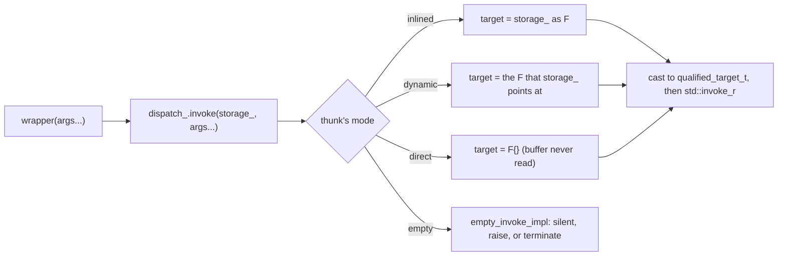
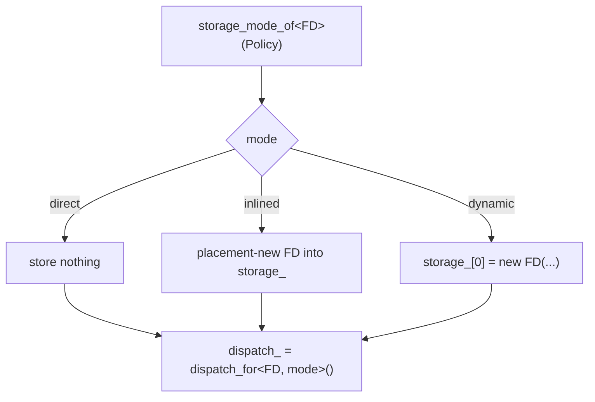
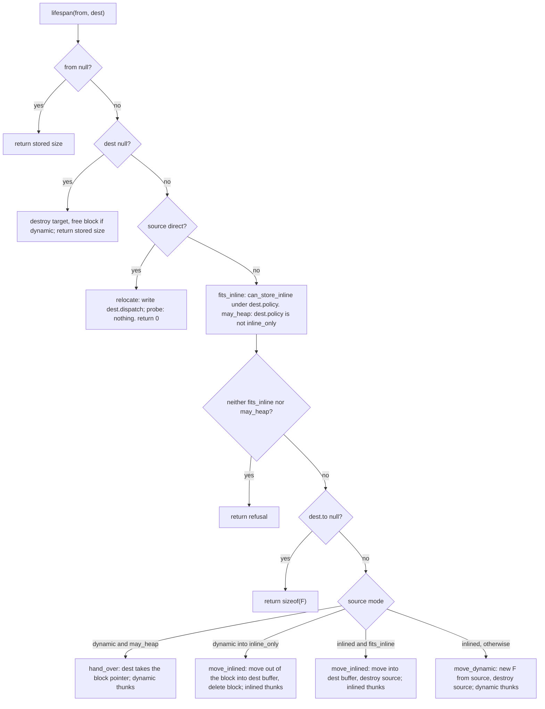

# flexi_function

[flexi_function.h](flexi_function.h) implements a move-only, type-erased
function wrapper whose storage behavior is a compile-time policy: inline,
heap, or either, with a configurable buffer size, a chosen empty-call behavior,
and full support for cv-, ref-, and `noexcept`-qualified signatures.
Wrappers that differ only in policy transplant their stored callable
between each other instead of nesting. `fixed_function<Sig, Size>` in
[fixed_function.h](fixed_function.h) is the `inline_only` special case,
sized to a total instance size.

This document is the mechanism reference: what an instance looks like in
memory, what the two thunk pointers do, how a call reaches the target, and
how a callable moves between wrappers. The header's class comment states
the contract, and every claim here is pinned by
[flexi_function_test.cpp](../../tests/portable/flexi_function_test.cpp).
The policy type is shared with `proxy` and documented in
[invocable_policy.h](invocable_policy.h). The target spellings
(`constant_fn`, `runtime_fn`) and the empty-call rules
(`empty_call_traits`), shared the same way, are in
[invocable_common.h](invocable_common.h). Planned work is in
[roadmap.md](roadmap.md).

## Contents

- [Naming map](#naming-map)
- [The shape at a glance](#the-shape-at-a-glance)
- [Memory layout](#memory-layout)
- [The thunk pair](#the-thunk-pair)
- [The call path](#the-call-path)
- [Indirection, counted](#indirection-counted)
- [Storing a callable](#storing-a-callable)
- [The lifespan protocol](#the-lifespan-protocol)
- [Relocation between siblings](#relocation-between-siblings)
- [The empty state](#the-empty-state)
- [Qualified signatures](#qualified-signatures)

## Naming map

| Term                        | Meaning                                                                                                                                        |
| --------------------------- | ---------------------------------------------------------------------------------------------------------------------------------------------- |
| wrapper                     | A `flexi_function` instance.                                                                                                                   |
| target, callable            | The thing the wrapper calls. "Target" is the stored object; "callable" is the same thing before it is stored.                                  |
| policy                      | The `invocable_policy` NTTP: buffer size and alignment, `alloc`, `empty`, and `enforcement`.                                                   |
| sibling                     | A `flexi_function` with the same signature and a different policy. Siblings are friends and can adopt from each other.                         |
| signature, `Sig`            | The `R(Args...)` type, possibly with `const`, `&`/`&&`, and `noexcept`.                                                                        |
| thunk                       | A static function generated per stored type that does one erased job: invoke, or manage lifespan.                                              |
| thunk pair, `dispatch_`     | The two thunk pointers every wrapper keeps ahead of its buffer: `invoke` and `lifespan`.                                                       |
| storage, buffer, `storage_` | The byte array after the pair. Holds the target, a pointer to it, or nothing.                                                                  |
| mode, `storage_mode`     | Where one stored target lives, and so which thunks serve it: `inlined`, `dynamic`, or `direct`. Baked into the thunks at store time.           |
| `inlined`                   | The target is constructed in the buffer.                                                                                                       |
| `dynamic`                   | The target is in a heap block, and the buffer holds the pointer to it.                                                                         |
| `direct`                    | Nothing is stored. The invoke thunk's body is the call itself. Only for a type with no data and trivial construction and destruction.          |
| empty                       | No target. `lifespan` is null, and `invoke` is the policy's empty-call thunk.                                                                  |
| adopt, transplant           | Moving the target out of a sibling into this wrapper, by asking the sibling's `lifespan` thunk to relocate it.                                 |
| box, un-box, hand over      | The three ways a relocation can change or keep a target's home: onto the heap, out of the heap into a buffer, or passing the heap block as is. |
| `refusal`                   | The `lifespan` return value for a relocation the destination cannot accept.                                                                    |
| direct-eligible             | A type that can be `direct`: `policy_details::direct_eligible<T>()`.                                                                           |
| `constant_fn<Fn>`           | A direct-eligible callable whose target is the compile-time constant `Fn`: a function, a member pointer, or a captureless lambda.              |
| `runtime_fn{p}`             | A callable holding a function or member pointer known only at runtime; a bare pointer target, made explicit. Nullable.                         |
| `policy_enforcement`        | Whether a bare pointer is accepted as a target (`lenient`) or must be spelled as `constant_fn` or `runtime_fn` (`strict`). Border only.        |

## The shape at a glance

```cpp
template<class Sig, invocable_policy Policy = invocable_policy::basic,
    class FunctionT = signature_function_t<Sig>>
class flexi_function;
```

`flexi_function<int()>` is the `std::function`-shaped default: a
two-pointer buffer with heap fallback. A policy is usually spelled
fluently from one of the three starting points in
[invocable_policy.h](invocable_policy.h), `basic`, `heap`, and `fixed`,
as `invocable_policy::heap.with(on_empty::silent)` or
`invocable_policy::fixed.with_size(64)`; `fixed_function<Sig, Size>` is the
alias for the latter, with `Size` the instance size, rounded up to the
storage alignment.

The third parameter is derived from the signature and never passed. It is
the pattern-matching hook that gives the class body `ResultT` and
`Args...` even when `Sig` is qualified, so there is one body for all
twelve qualifier combinations.

Construction paths, all landing in one of two private workers:

| Spelling                           | Goes to    | Notes                                                                                                                                                                                                                                                                                      |
| ---------------------------------- | ---------- | ------------------------------------------------------------------------------------------------------------------------------------------------------------------------------------------------------------------------------------------------------------------------------------------ |
| `fn_t f = callable;`               | `do_store` | Implicit. Any callable that the signature can invoke, except the std wrappers. A null function or member pointer, or a null `runtime_fn`, yields an empty wrapper. A function name, or a bare pointer under `policy_enforcement::strict` is a compile error (see "Indirection, counted"). |
| `fn_t f{std::function<...>{...}};` | `do_store` | Explicit. Wraps a `std::function` or `std::move_only_function`, nesting it at a cost.                                                                                                                                                                                                      |
| `fn_t f{std::move(sibling)};`      | `do_adopt` | Transplants the target across policies.                                                                                                                                                                                                                                                    |
| `fn_t f{std::move(same)};`         | `do_adopt` | Same type. Always `noexcept`.                                                                                                                                                                                                                                                              |
| `fn_t f;` or `fn_t f{nullptr};`    | neither    | Empty.                                                                                                                                                                                                                                                                                     |

Assignment mirrors construction, with `reset()` first. `swap` is three
moves.

## Memory layout

An instance is the thunk pair followed by the buffer. On a 64-bit
platform the pair is 16 bytes. The buffer's size and alignment come from
the policy, except under `heap_only`, where it shrinks to one pointer.

Default policy (`inline_size = 16`, `inline_align = 16`,
`inline_or_heap`), 32 bytes, aligned 16:

```
offset  0 +---------------------------------------------------+
          | invoke     ResultT (*)(void*, Args...)            |
offset  8 +---------------------------------------------------+
          | lifespan   size_t (*)(void*, destination_spec*)   |
offset 16 +---------------------------------------------------+
          | storage_[16]                                      |
          |   inlined:  the target itself                     |
          |   dynamic:  F* in the first 8 bytes               |
          |   direct or empty:  never read                    |
offset 32 +---------------------------------------------------+
```

`heap_only`, 24 bytes, aligned 8. The buffer is exactly one pointer, and
`capacity()` reports 0:

```
offset  0 +----------+
          | invoke   |
offset  8 +----------+
          | lifespan |
offset 16 +----------+
          | F*       |  dynamic; never read when direct or empty
offset 24 +----------+
```

`fixed_function<Sig, 64>` is `inline_only` with `inline_size = 48`, so
the whole instance is the 64 bytes its name promises:

```
offset  0 +--------------+
          | invoke       |
offset  8 +--------------+
          | lifespan     |
offset 16 +--------------+
          | storage_[48] |  inlined only; a target that does not fit is a
          |              |  compile error, or a refused adoption
offset 64 +--------------+
```

Under `inline_or_heap` the buffer does double duty, holding either the
target or the pointer to its block, which is why `inline_size` must be at
least a pointer and `inline_align` at least a pointer's alignment. Under
`inline_only` there is no such floor, so a buffer may be aligned below
`max_align_t` (the tests' `lean` policy: 16 bytes at alignment 8).

The buffer has no initializer. Occupancy is keyed by `dispatch_.lifespan`,
and zeroing the buffer on every construction would be waste.

What the two accessors report:

|         | `size()`    | `capacity()`   |
| ------- | ----------- | -------------- |
| empty   | 0           | `storage_size` |
| inlined | `sizeof(F)` | `storage_size` |
| dynamic | `sizeof(F)` | `storage_size` |
| direct  | 0           | `storage_size` |

`storage_size` is the policy's `inline_size`, or 0 under `heap_only`.

## The thunk pair

`fn_details::flexi_thunks<Sig>` generates the thunks. It is keyed by the
signature alone, not the policy, and that is what lets siblings transplant
a target: every wrapper of a signature speaks the same erased protocol.

```cpp
using invoke_fn_t = ResultT (*)(void*, Args...) noexcept(is_noexcept);
using lifespan_fn_t = size_t (*)(void*, destination_spec*);
struct thunk_pair { invoke_fn_t invoke; lifespan_fn_t lifespan; };
```

For a stored type `F` in mode `M`, `dispatch_for<F, M>()` yields the pair
`{&invoke_impl<F, M>, &lifespan_impl<F, M>}`. The mode is part of the
thunk's identity, so the thunk knows without any runtime tag whether to
look in the buffer, follow a pointer, or look nowhere.

`invoke` is called by `operator()` and does one job. `lifespan` is the
whole rest of the target's life (size, destroy, probe, relocate) through
one entry point, described under [The lifespan
protocol](#the-lifespan-protocol).

## The call path



`operator()` is one deducing-this member. `Self` carries the calling
wrapper's constness and value category, and `is_callable_through<Self>`
admits exactly what the signature permits (a `const` wrapper needs a
`const` signature, an `&&` signature refuses an lvalue wrapper, and so
on). It then passes the buffer's address, cast to non-const, to `invoke`.
That cast is sound because the thunk applies the signature's qualifiers
to the target itself: under a `const` signature the target is only ever
reached as `const F&`.

`qualified_target_t<F>` is `F cv&`, or `F cv&&` under an `&&` signature,
with `cv` from the signature. An unqualified and an `&` signature both
invoke the target as an lvalue; they differ only in which wrappers may
call, as with `std::move_only_function`.

Under `direct`, the `F target{}` the thunk names is what the object model
requires to call a member `operator()`. It has no data, and the optimizer
leaves nothing of it. The signature's qualifiers apply to it exactly as to
a stored target.

## Indirection, counted

Three things a call site can compile to, in ascending cost:

- Inlined. The callee's body is pasted in and there is no call at all.
  This needs the definition visible where the caller is compiled: the same
  TU, a header, or LTO. A lambda's `operator()` is always visible, since
  the closure type is defined in the TU that uses it.
- A direct call. `call foo`, with the target fixed in the instruction by
  the linker. No load, and nothing for the branch predictor to guess.
  (Calling into a shared library goes through the PLT, an indirect jump
  through the GOT, so that one configuration reintroduces a hop; within
  one executable, or under LTO, the call is direct.)
- An indirect call. The target is a pointer loaded at runtime, `call
*reg`.

The erased call through `invoke` is always the third kind. That is the
floor for a type-erased wrapper, and every call pays it. What follows it
inside the thunk depends on the stored type, not on the mode:

| Stored type                                              | Mode                               | The thunk body, after the erased call                                          |
| -------------------------------------------------------- | ---------------------------------- | ------------------------------------------------------------------------------ |
| function pointer (`fn_t f = &foo;`)                      | `inlined`                          | load the pointer from the buffer, indirect call through it                     |
| function pointer                                         | `dynamic` (only under `heap_only`) | load `F*` from the buffer, load the pointer from the block, indirect call      |
| functor or capturing lambda                              | `inlined`                          | direct call to `F::operator()` with the buffer as `this`, inlined when visible |
| functor or capturing lambda                              | `dynamic`                          | load `F*` from the buffer, then the same with the block as `this`              |
| direct-eligible type (captureless lambda, `std::plus<>`) | `direct`                           | direct call to `F::operator()`, inlined when visible, and no load at all       |
| `constant_fn<foo>`                                       | `direct`                           | direct call to `foo`, inlined when visible; the address is in the type         |
| `runtime_fn{p}`                                          | `inlined`                          | as a function pointer: load, indirect call                                     |

The `static_cast<F*>(storage)` in the thunk is not an instruction. It is
the compiler agreeing to treat those bytes as an `F`, and the call to
`F::operator()` is to a function it knows by name.

So the second indirection exists only for a stored function pointer,
whose value is runtime data that nothing at compile time can replace. A
functor and a `direct` target have the same call structure, one indirect
call and then an inlineable direct one. What `direct` changes is storage:
nothing is constructed, moved, or destroyed, nothing is allocated under
`heap_only`, and the buffer is never read.

Naming `foo` inside a captureless lambda, `[](int x) { return foo(x); }`,
moves the address from data into the type, where the thunk can call it
outright, and makes the wrapper `direct` as well. `constant_fn<foo>{}` is
the same thing with a name and no body to write, and it also takes a
member pointer (object as the first argument) or a captureless lambda.
Whether `foo`'s body then inlines into the thunk follows the visibility
rule above; even when it does not, the call to it is direct, not indirect.

Storing a function by name, `fn_t f = foo;`, is refused at compile time,
with a message pointing at `constant_fn`. The reference form is the one
spelling the type system can tell apart from a runtime pointer, so it is
the one place the wrapper can say "you are about to pay a second
indirection for a target you know." `&foo` is indistinguishable from any
other pointer value and is accepted as one. A function reference that
really is a runtime value (it arrived through a forwarding parameter, or a
conditional between two functions) decays to a pointer with `&`.

A policy with `enforcement = policy_enforcement::strict` closes the `&foo`
hole by refusing every bare function or member pointer at the border,
so the caller has to say which kind of target it is: `constant_fn<foo>{}`
for a compile-time one, `runtime_fn{p}` for a runtime one. The check is
only at the border (construction and assignment from a callable); a
converting move from a sibling transplants whatever it held, unchecked.
Flipping the field's default in [invocable_policy.h](invocable_policy.h)
and rebuilding is a one-edit audit of a codebase for pointer targets that
could be `constant_fn`.

## Storing a callable

`do_store<FD>(fn)` takes the decayed stored type explicitly and the
callable as a forwarding reference. It runs after the null-callable check,
on an empty instance.



`policy_details::storage_mode_of<T>(p)` is the one routing decision:
`direct` when `direct_eligible<T>()`, else `inlined` when
`can_store_inline<T>(p)` (fits the buffer's size and alignment, is
nothrow-move-constructible, and the policy is not `heap_only`), else
`dynamic`. `can_store_nothrow<T>(p)` is "not `dynamic`", and it is the
`noexcept` specification of every storing constructor and assignment.

The `static_assert`s in `do_store` rule out, with named diagnostics: a
function lvalue as the callable, a bare function or member pointer under
`policy_enforcement::strict`, an `inline_only` policy over a target that
cannot live inline, a target whose destructor may throw, and a callable
returning a prvalue under a reference-returning signature (every call
would dangle).

Nothrow-move-constructibility gates inline storage because the same-type
move (and `swap`) is unconditionally `noexcept`, and it relocates an
inline target by moving it. `noexcept` on an erased wrapper is one answer
for every target the type could hold, so it can only be promised if
nothing that can ever sit in the buffer throws on move. Converting moves
across policies are `noexcept` only when `adopt_may_throw` says nothing
can go wrong, but that does not loosen the gate: a throwing mover let in
through a throwing path would still face the destination's next
same-type move. So a throwing-move type goes to the heap, where a move is
a pointer copy, and can never be adopted into an `inline_only` wrapper.

## The lifespan protocol

One entry point per stored type and mode, `lifespan_impl<F, M>(from,
dest)` (two constrained overloads, one of them the trivial `direct` case),
serves four requests, distinguished by which arguments are null:

| `from` | `dest` | `dest->to` | Request                                            | Returns                                     |
| ------ | ------ | ---------- | -------------------------------------------------- | ------------------------------------------- |
| null   | any    |            | size query                                         | stored size: `sizeof(F)`, or 0 for `direct` |
| set    | null   |            | destroy (and free the block when `dynamic`)        | stored size                                 |
| set    | set    | null       | probe: would a relocation into `dest` be accepted? | stored size, or `refusal`                   |
| set    | set    | set        | relocate into `dest->to`, writing `dest->dispatch` | stored size, or `refusal`                   |

`destination_spec` describes the receiving wrapper: its `policy` (whose
storage members decide inline, heap, or neither), the address of its thunk
pair (`dispatch`, a passive output), and its buffer (`to`, null for a
probe).

`refusal` is `size_t(-1)`, kept off 0 so that a size of 0 remains a
legitimate answer. Only `inline_only` destinations can refuse; every other
policy has the heap to fall back on.



The destination calls the source's `lifespan` with a spec describing
itself. Only the source's thunk knows the stored type, so it does the
moving and writes the destination's pair for the mode the target landed
in. The source's own pair is the caller's business: `do_adopt` reinstalls
the source's `empty_dispatch` afterwards, since each wrapper's empty-call
behavior is baked into its type.

## Relocation between siblings

The outcome by source mode and destination policy:

| Source                          | `inline_only` dest                | `inline_or_heap` dest | `heap_only` dest |
| ------------------------------- | --------------------------------- | --------------------- | ---------------- |
| `inlined`, fits the dest buffer | stays inline                      | stays inline          | boxed            |
| `inlined`, does not fit         | refused                           | boxed                 | boxed            |
| `dynamic`                       | un-boxed if it fits, else refused | handed over           | handed over      |
| `direct`                        | pair only                         | pair only             | pair only        |

"Fits" is `can_store_inline<F>(dest.policy)`: size, alignment, and a
nothrow move. A `dynamic` source into a heap-admitting destination is
always handed over, even when it would fit inline, because the allocation
is already paid for and un-boxing would cost a move for nothing.

What can throw, and what it leaves behind:

- Boxing allocates, and the allocation can throw. The move into the block
  cannot, since an inline source is nothrow-move by the gate. The
  destination is untouched and the source intact.
- A refusal is a `std::length_error` from `do_adopt`, with both sides
  intact. The converting assignment pre-flights with `can_adopt` so it
  throws before touching either side.
- `policy_details::adopt_may_throw(to, from)` computes at compile time
  whether any of that is reachable for a pair of policies, and the
  converting constructor and assignment are `noexcept` exactly when it is
  not. `inline_fit_guaranteed(to, from)` is the inline half of that: a
  destination buffer at least as big and as aligned as the source's admits
  every inline target the source could hold.

`can_adopt(source)` is static: the answer is a property of the destination
type against the source's runtime target, so it works before any
destination exists. It is a probe, and it does not promise the allocation
a boxing adoption may need.

What a move costs, in `lifespan` calls, each an indirect call through the
thunk pointer:

| Operation                                                 | Destination's `lifespan`    | Source's `lifespan`      |
| --------------------------------------------------------- | --------------------------- | ------------------------ |
| move construction, same type or converting                | none                        | 1 (relocate)             |
| same-type move assignment                                 | 1 (destroy, when non-empty) | 1 (relocate)             |
| converting move assignment, destination not `inline_only` | 1 (destroy, when non-empty) | 1 (relocate)             |
| converting move assignment, destination `inline_only`     | 1 (destroy, when non-empty) | 2 (probe, then relocate) |
| `swap`                                                    | three moves' worth          |                          |

The extra probe is the price of leaving the destination's target intact
on a refusal: the alternative, relocating into a temporary and then
moving that in, would cost a second relocation instead of a probe, which
reads nothing. Relocation itself destroys the source's target (or hands
its block over), so there is no separate destroy call on the source;
`do_adopt` just reinstalls the source's `empty_dispatch`. These are
assignment costs; the wrapper is optimized for the call, which pays one
indirect call and nothing else.

## The empty state

```cpp
static constexpr thunk_pair empty_dispatch{
    &thunks::template empty_invoke_impl<Policy.empty>, nullptr};
```

`lifespan` null means empty, and `operator bool`, `size()`, `reset()`, the
destructor, and `do_adopt` all key on it. `invoke` is never null: calling
an empty wrapper runs the policy's `on_empty` thunk, which returns a
value-initialized result (`silent`), throws `std::bad_function_call`
(`raise`, the default, matching `std::function`), or calls
`std::terminate` (`terminate`).

The combinations refused at compile time, each with its own message:
`silent` with a result that cannot be value-initialized; `raise` under a
`noexcept` signature; and `silent` under a `noexcept` signature when the
result's value-initialization can throw. `terminate` is always valid and
must be asked for by name.

## Qualified signatures

`signature_traits<Sig>` (in [traits.h](traits.h)) decomposes a signature
into `result_t`, `args_t`, `function_t` (all qualifiers stripped), and the
three qualifier enums `const_qualifier`, `ref_qualifier`, and
`noexcept_specifier`. `flexi_thunks` turns those into:

- `qualified_target_t<F>`: how the target is invoked (`F cv&`, or
  `F cv&&` under `&&`).
- `is_invocable<F>`: the construction constraint, `is_invocable_r_v` on
  `qualified_target_t<F>`, or the nothrow variant under a `noexcept`
  signature. This is what makes the `noexcept` call operator sound: only
  nothrow-invocable callables get in.
- `is_noexcept`: whether `invoke_fn_t` and `operator()` are `noexcept`.

And `flexi_function` adds `is_callable_through<Self>`, the constraint on
the deducing-this `operator()` that selects which wrappers may call.

A wrapped `std::move_only_function` is checked the same way as any other
callable, so an unqualified signature admits a `move_only_function<int() &>`
and refuses an `int() &&` one, while an `&&` signature does the reverse.
