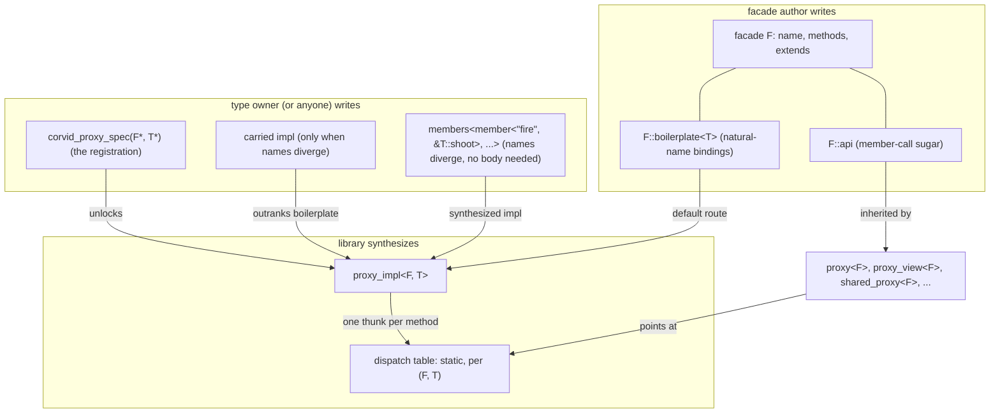
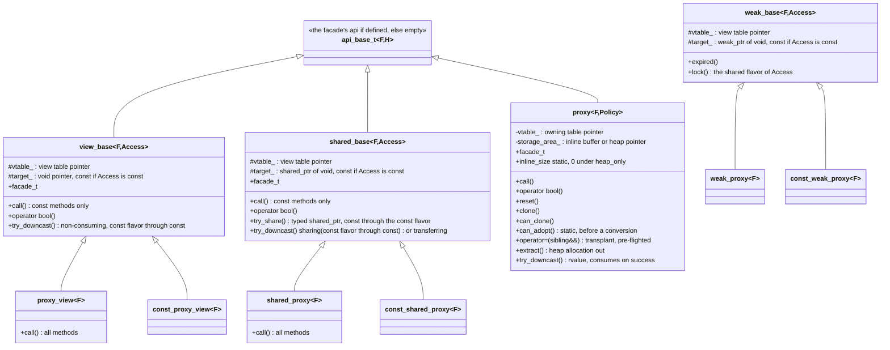
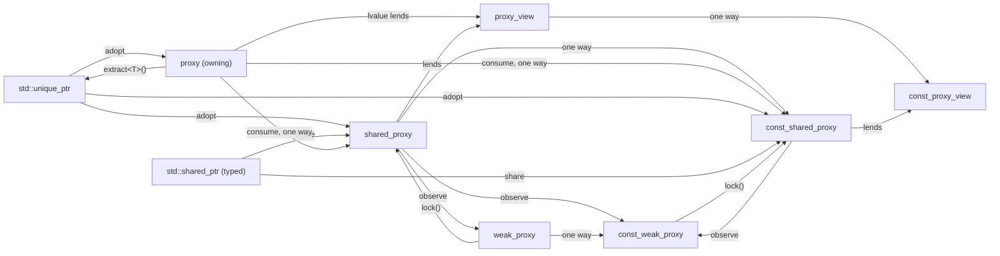
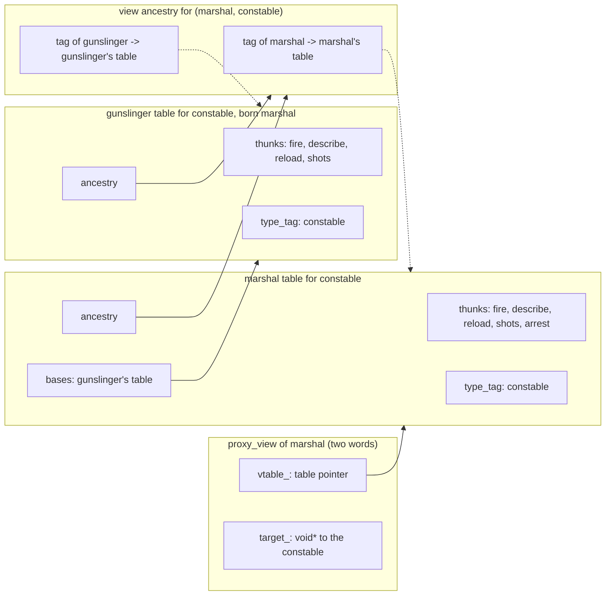
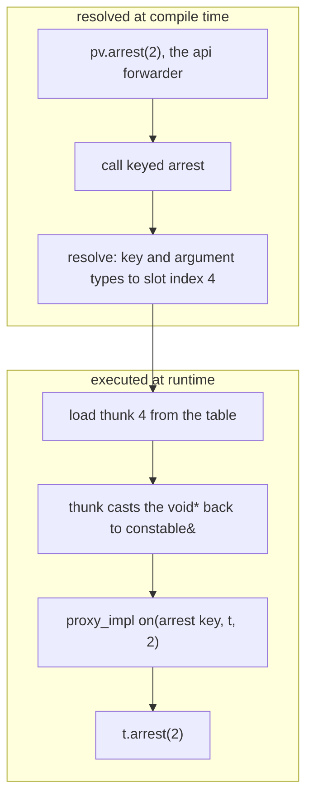
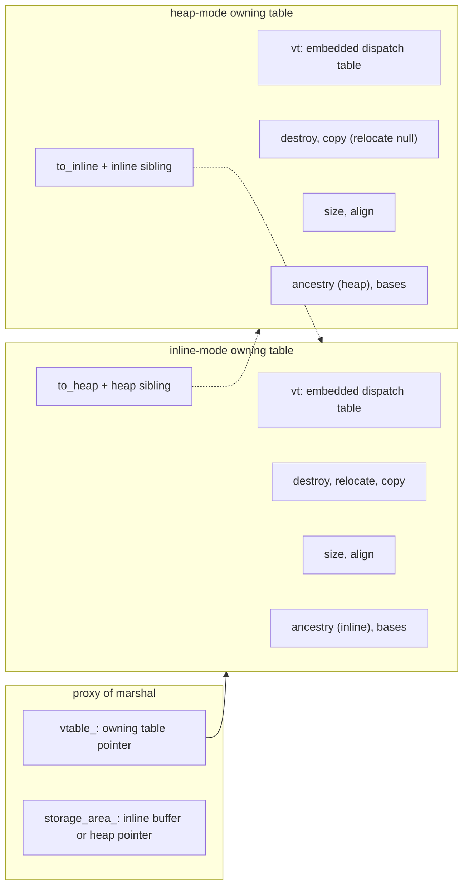
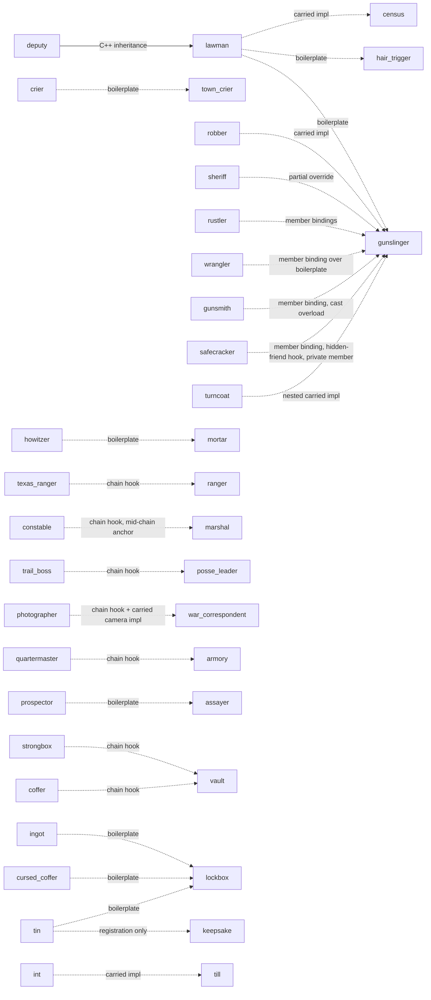

# Proxy

The proxy family ([proxy.h](proxy.h)) implements registration-based
runtime polymorphism through proxies, which are type-erased handles over
an interface definition. They work without inheritance, vtable pointers in
the target type, or macros.

The contrast with the traditional mechanism, an abstract base class with
virtual methods, is one of coupling. A virtual interface is intrusive: a
type opts in at definition time by inheriting, so it must know every
interface it will ever serve, carries a vtable pointer in every object,
and cannot be a type you do not own, a plain aggregate, or an `int`.

A facade points the other way. The interface is declared on the consumer's
side, and any type whose methods line up conforms through one
registration line, after the fact and without modification. One type can
serve any number of facades, and the dispatch machinery lives in the
handle, so targets stay plain.

Because the handles are ordinary values rather than base-class pointers,
they also offer what pointer-based polymorphism structurally cannot:
inline storage under a policy, deep const (a const handle dispatches only
const methods, which no const smart pointer propagates), and view, owning,
shared, and weak flavors with explicit conversion rules.

---

This document is the completed system's reference and retrospective. It is
a tutorial tour of the user-facing surface, the decisions made along the
way and what they cost, and the lessons from the build. Every feature is
pinned by [proxy_test.cpp](../../../tests/portable/proxy_test.cpp) (the
fixture hierarchy the tests share is diagrammed under "Test fixture map"
below).

The full feature set, as built and tested:

- facade-qualified names, sibling collisions, and diamonds
- the `api` member-call mixin, with its `validate_api` drift check
- `extends<Base>` composition, with implicit upcasting and safe explicit downcasting
- storage policies on the owning proxy
- cloning, and `std::unique_ptr` interop
- the shared/weak ownership tier, with `std::shared_ptr` interop
- method overloading, within a facade and across extends levels
- `prox::codegen`, which generates the "hand-written" artifacts

Two facts frame everything below. First, the manual duplication in
the facade's `boilerplate` and `api` classes is an artifact of C++23
lacking reflection, not of the design. Under C++26 reflection (P2996)
the `boilerplate` derives outright, the `api` derives through a
`define_aggregate` construction, and the facade itself is written as
plain member function declarations, so a facade and its sugar come from
one declaration-only struct, and a conforming type whose member names
line up binds by its registration line alone (a divergent name takes one
`member<>` or override on top); see "Reflection (C++26)". That layer
builds only on gcc 16 or newer for now, so the C++23 spellings stay the
portable route.

Second, on the portable route, `prox::codegen`
([proxy_codegen.h](proxy_codegen.h)) writes them for you. It handles all
the tricky details and edge cases: noexcept propagation, const pairs, the
using-declaration merges, and diamonds.

## Contents

- [Lineage and positioning](#lineage-and-positioning)
- [Naming map](#naming-map)
- [User-facing shape](#user-facing-shape)
  - [Partial override of the boilerplate](#partial-override-of-the-boilerplate)
  - [Member-pointer bindings (`members`)](#member-pointer-bindings-members)
  - [Member-call sugar (the `api` mixin)](#member-call-sugar-the-api-mixin)
  - [API validation (`validate_api`)](#api-validation-validate_api)
  - [Codegen (`prox::codegen`)](#codegen-proxcodegen)
  - [Composition (`extends`)](#composition-extends)
  - [Facade names and sibling collisions (`name`)](#facade-names-and-sibling-collisions-name)
  - [Per-name overload sets](#per-name-overload-sets)
- [The handle family](#the-handle-family)
- [Ownership and storage](#ownership-and-storage)
  - [Storage policies](#storage-policies)
  - [Empty handles](#empty-handles)
  - [Owning upcast](#owning-upcast)
  - [Cloning](#cloning)
  - [std smart-pointer interop](#std-smart-pointer-interop)
  - [Downcasting (vtable-carried RTTI)](#downcasting-vtable-carried-rtti)
  - [Shared and weak ownership](#shared-and-weak-ownership)
- [Mechanism](#mechanism)
- [Tables and thunks](#tables-and-thunks)
  - [The thunk](#the-thunk)
  - [The dispatch table](#the-dispatch-table)
  - [A call, step by step](#a-call-step-by-step)
  - [The owning table](#the-owning-table)
- [Alternative considered: virtual-model erasure](#alternative-considered-virtual-model-erasure)
- [Assessment](#assessment)
- [Build retrospective](#build-retrospective)
- [Placement](#placement)
- [Test fixture map](#test-fixture-map)
- [Non-goals](#non-goals)
- [Reflection (C++26)](#reflection-c26)
  - [Reflection in five ideas](#reflection-in-five-ideas)
  - [The end state](#the-end-state)
  - [Interface-first facades (`reflected_facade`)](#interface-first-facades-reflected_facade)
  - [The reflected boilerplate (`reflected_impl`)](#the-reflected-boilerplate-reflected_impl)
  - [The reflected sugar API](#the-reflected-sugar-api)
  - [What the layer asked of the portable headers](#what-the-layer-asked-of-the-portable-headers)
  - [Portability and testing](#portability-and-testing)
  - [Limits](#limits)
  - [gcc 16 notes](#gcc-16-notes)
  - [Later](#later)
- [Future work](#future-work)

## Lineage and positioning

Prior art is [ngcpp/proxy](https://github.com/ngcpp/proxy) (formerly
microsoft/proxy, on the standards track as P3086) and Rust trait objects
(`dyn Trait`).

We lean toward ngcpp naming because this is C++, but diverge on one
deliberate axis: conformance is nominal (registered), not structural
(duck-typed). ngcpp accepts any type whose members happen to match the
facade. We require an explicit registration, the same philosophy as the
Corvid registered-enum system (registration, not reflection).

Registration also dissolves ngcpp's need for macros. Their
`PRO_DEF_MEM_DISPATCH` macros exist solely to mint accessor functions with
caller-chosen names. When the user writes the binding explicitly, there is
no name to mint.

The one-method ancestor within Corvid is
[fixed_function.h](fixed_function.h). A `proxy` is a `fixed_function`
generalized from a single anonymous `operator()` to a named suite of
methods, and the owning flavor reuses the same storage ideas (inline storage
buffer plus dispatch pointer).

## Naming map

| Corvid                                    | ngcpp/proxy                        | Rust                     |
| ----------------------------------------- | ---------------------------------- | ------------------------ |
| `proxy<F>`                                | `pro::proxy<F>`                    | `Box<dyn T>`             |
| `proxy_view<F>`                           | `pro::proxy_view<F>`               | `&mut dyn T`             |
| `const_proxy_view<F>`                     | (none)                             | `&dyn T`                 |
| `facade`                                  | facade (`facade_builder`)          | `trait`                  |
| `method<"fire", void(int)>`               | dispatch + convention              | trait method             |
| `proxy_impl<F, T>`                        | (none; structural)                 | `impl Trait for Type`    |
| `corvid_proxy_spec(F*, T*)`               | (none)                             | empty `impl` block       |
| `make_proxy_spec<F, T>()`                 | (none)                             | (spec payload)           |
| `members<member<"fire", &T::shoot>, ...>` | (none)                             | (none)                   |
| `"name"_method` UDL                       | (none)                             | (none)                   |
| `Proxiable<T, F>`                         | `proxiable<P, F>`                  | `T: Trait` bound         |
| `make_proxy<F, T>(...)`                   | `make_proxy`                       | `Box::new`               |
| `make_proxy_view<F>(t)`                   | `make_proxy_view`                  | `&mut x as &mut dyn T`   |
| `make_const_proxy_view<F>(t)`             | (none)                             | `&x as &dyn T`           |
| `extends<Base>`                           | `add_facade`                       | supertrait               |
| `invocable_policy`                        | facade-level constraints           | (none)                   |
| `clone()` / `can_clone()`                 | copyability constraint             | (dyn-clone idiom)        |
| `try_downcast<D>()`                       | (none)                             | (`dyn Any` adjacent)     |
| `try_share<T>()`                          | (none)                             | (`Rc<dyn Any>` downcast) |
| `shared_proxy<F>`                         | `proxy<F>` via `make_proxy_shared` | `Rc<RefCell<dyn T>>`     |
| `weak_proxy<F>`                           | `weak_proxy`                       | `Weak<RefCell<dyn T>>`   |
| `const_shared_proxy<F>`                   | (none)                             | `Rc<dyn T>`              |
| `const_weak_proxy<F>`                     | (none)                             | `Weak<dyn T>`            |
| (internal) dispatch table                 | meta                               | vtable + drop glue       |

Naming notes:

- Concepts follow the house PascalCase convention: `Facade`, `Proxiable`,
  `ProxyRegistered`.
- `facade` over `trait`: matches ngcpp, and "trait(s)" is irreversibly
  loaded in C++ (`std::char_traits`, type traits).
- `method` collapses ngcpp's dispatch (the what) and convention (the
  signature) into one entity. A per-name overload set is spelled by listing
  each signature as a method (ngcpp instead lists several signatures in one
  convention).
- Nominal identity lives at the facade level: `proxy_impl<F, T>` is keyed on
  the pair, so declaring `method<"draw", ...>` inline in two unrelated
  facades cannot cross-contaminate. Conforming to a `weapon` facade says
  nothing about a `canvas` facade, even if both have a `"draw"`.

## User-facing shape

Using the system takes three kinds of declaration. A facade defines the
interface, along with its optional `api` sugar and `boilerplate` bindings.
A registration opts a concrete type into a facade. A handle (`proxy`,
`proxy_view`, or one of their relatives) does the calling. The pieces and
who writes them:



Conformance is tiered. First, the facade author writes a boilerplate impl.
This is a class template named `boilerplate`, nested in the facade body.
It is generic over any registered `T`, forwarding each method to the
natural member name, so it is written once per facade, not once per type.

No library machinery can produce this mapping, because C++23 has no way to
turn the declared `"fire"` string into the `.fire` in `t.fire(rounds)`.
The binding from method key to member name has to appear as literal source
code, typed by the facade author or pasted from `prox::codegen`.

The library wires the nested boilerplate up automatically. A provided
partial specialization of `proxy_impl` delegates every registered pair to
it, so the facade needs no namespace-scope impl at all, and the
boilerplate sits next to the method list and `api` it mirrors. (The
specialization repeats the primary template's own argument list, which
C++20 allows because it is more constrained.)

That is the first tier, and it serves any type whose method names line up:
conforming such a type costs one registration line. The second tier covers
types whose methods do not match what the boilerplate expects, say a
`shoot` where the facade wants `fire`. Such a type's registration carries
its own impl, which replaces the boilerplate binding for that type alone.
The example below shows both tiers, and the carried impl's mechanics
follow it.

```cpp
// The facade: the interface definition, carrying its own api and boilerplate.
// This particular facade does not happen to extend previous ones. (The
// test's `gunslinger` has two more methods; this one is trimmed to the shape.)
struct gunslinger : facade<name<"gunslinger">,
                       method<"fire", void(int)>,
                       method<"reload", bool()>> {
  // Written, or generated, once by the facade author. This member-call sugar is
  // technically optional, but is necessary for native calling conventions. It
  // consists of one deducing-this forwarder per method, inherited by every handle
  // of this facade (see "Member-call sugar").
  struct api {
    void fire(this auto&& self, int n) { self.template call<"fire">(n); }
    bool reload(this auto&& self) { return self.template call<"reload">(); }
  };
  // Written, or generated, once by the facade author. `on` is the fixed hook
  // name, overloaded on the method key; a fixed name is what keeps the mechanism
  // spellable without macros. Inheriting `proxy_impl_base` is optional sugar,
  // supplying the `method_key` alias so the bindings spell it unqualified.
  template<typename T>
  struct boilerplate : proxy_impl_base {
    static void on(method_key<"fire">, T& t, int rounds) { t.fire(rounds); }
    static bool on(method_key<"reload">, T& t) { return t.reload(); }
  };
};

// The `lawman` supports both of the functions that the facade expects, spelled
// exactly as expected. Therefore, conforming it is pure registration. The ADL
// hook mirrors `corvid_enum_spec`; declare it in the namespace of either
// the facade or the type. One or the other, never both: duplicate hooks
// make the ADL call ambiguous, and the pair then reads as unregistered.
consteval auto corvid_proxy_spec(gunslinger*, lawman*) {
  return make_proxy_spec<gunslinger, lawman>();
}

// The `robber` uses `shoot` instead of `fire` and `rearm` instead of `reload`, so
// the boilerplate would fail. Therefore, conforming it requires registration that
// carries the custom impl. Here, the impl is local to the hook itself, so the whole
// conformance is one self-contained declaration.
consteval auto corvid_proxy_spec(gunslinger*, robber*) {
  struct as_gunslinger : proxy_impl_base {
    static void on(method_key<"fire">, robber& r, int rounds) {
      r.shoot(rounds);
    }
    static bool on(method_key<"reload">, robber& r) { return r.rearm(); }
  };
  return make_proxy_spec<gunslinger, robber, as_gunslinger>();
}

proxy<gunslinger> p = make_proxy<gunslinger, lawman>(/*ctor args*/);
p.call<"fire">(3); // Core spelling: compile-time name -> slot lookup.
p.fire(3);         // Sugar spelling, through the api mixin.
```

The registration-carried impl is the spec's first knob. The three-type
`make_proxy_spec<F, T, Impl>()` returns a `proxy_spec` whose `impl_t`
names the binding class. A library partial specialization of `proxy_impl`
installs it for the pair (`SpecCarriesImpl` is the detecting concept), and
it outranks the facade's boilerplate as the closer declaration.

Registration is therefore the sole act of conformance. Every binding is
either the facade's boilerplate or a carried impl, and both are opt-in.

Two other spellings of `proxy_impl` exist at namespace scope, one
supported but not recommended, and one dropped.

The supported spelling is the namespace-scope boilerplate: a partial
specialization constrained on `ProxyRegistered`, serving every registered
type exactly as the nested form does (`lockbox` in the test). It predates
the nested form, and it still works: when a facade has both, the partial
outranks the library's delegation by partial ordering, so the two cannot
collide. It does need one extra term in its gate, `!SpecCarriesImpl<F, T>`,
to keep a carried impl winning, because raw partial ordering would prefer
the partial, while the nested boilerplate gets this arbitration from the
library. The nested form made all of this unnecessary, which is why
facades should nest their boilerplate, as shown in the examples.

The dropped spelling is the unregistered full specialization. Originally,
a type whose names did not line up conformed by fully specializing
`proxy_impl<F, T>` for the concrete pair, with no registration at all.
Carried impls subsume it, and it is out of the supported surface. It
offered nothing the carried impl does not: foreign types take a hook in
the facade's namespace, and generic families take a constrained template
hook, like `strongbox` in the test. What it uniquely enabled was
conformance with no opt-in declaration, and that was an ODR footgun, since
any TU could silently override another's binding. The language cannot
forbid such specializations, and `proxy_impl` necessarily stays a public
name for that boilerplate spelling, so the drop is a contract
boundary rather than a mechanical one.

The binding class (in other words, the impl) can live anywhere a type can.
Local to the hook, as above, the registration is fully self-contained, which
is also the only self-contained way to conform a type you do not own. This
is sound because local classes are ordinary template arguments, their static
member functions are ordinary runtime functions even inside a consteval hook,
and a consteval function is implicitly inline, so the local type is
ODR-consistent across translation units. (Local classes do forgo static
data members and member templates, which bindings do not need.)

When instead nested in the type it serves, the impl can additionally reach
the type's private members (`turncoat` in the test nests its impl). Namespace scope works too,
and a namespace-scope binding class that the type forward-declares and befriends
reaches private members without nesting. This hybrid approach can be a good
compromise, reducing clutter in the class itself while preserving private access.

Whatever its placement, a binding class may inherit
`prox::proxy_impl_base`. It is an otherwise-empty base whose one member is
a `method_key` alias, letting the bindings spell the key unqualified. It is
optional, although recommended both for convenience and self-documentation.
A binding class that inherits a boilerplate already has it through that base.

The string NTTP rides on the existing [fixed_string.h](../fixed_string.h).
`call<"fire">` resolves at compile time to an index into the facade's
method list. No runtime name lookup exists anywhere.

### Partial override of the boilerplate

When a type's names line up except for one method, a full custom impl
would need to repeat every binding just to change one. This is unnecessary.
The nested boilerplate, being an ordinary inheritable class template,
provides a cheaper middle tier for free. A near-conforming type registers
a carried impl that inherits `F::boilerplate<T>`, re-exposes its `on`
overloads with a using-declaration, and declares only the divergent binding:

```cpp
// `sheriff` lines up except that `fire` is spelled `shoot`.
consteval auto corvid_proxy_spec(gunslinger*, sheriff*) {
  struct as_gunslinger : gunslinger::boilerplate<sheriff> {
    using gunslinger::boilerplate<sheriff>::on;
    static void on(method_key<"fire">, sheriff& s, int rounds) {
      s.shoot(rounds);
    }
  };
  return make_proxy_spec<gunslinger, sheriff, as_gunslinger>();
}
```

Mechanics: a derived `on` with the identical parameter list excludes the
inherited one from the set the using-declaration introduces, so the
override wins with no ambiguity. The using-declaration is load-bearing.
Without it, the derived `on` hides all the inherited overloads, and
conformance fails on the rest. The hidden base binding is never
instantiated (class-template members instantiate only on use), so its body
naming the absent member is harmless.

Before the boilerplate moved into the facade, this tier required the
facade author to factor the bindings into a separately-named class for the
namespace-scope partial to derive from. With the nested form, it is
inherent. Exercised by `sheriff` in the test. When the divergent binding
is a plain rename, `members` (next) says the same thing without a binding
class; the partial override remains for a binding that needs a body.

### Member-pointer bindings (`members`)

A library cannot turn the declared `"fire"` into `.fire`, which is why the
boilerplate has to be typed. But `&robber::shoot` is a value, spellable
where a member name is not, so a registration can carry its bindings as
member pointers and let the library write the impl. `members<...>` in the
impl position of `make_proxy_spec` is a list of `member<Key, Ptr>` bindings,
each naming a facade method by key and the member that serves it:

```cpp
// `rustler` has the right shape and the wrong names, like `robber`, but its
// registration is one declaration with no binding class.
consteval auto corvid_proxy_spec(gunslinger*, rustler*) {
  return make_proxy_spec<gunslinger, rustler,
      members<member<"fire", &rustler::shoot>,
          member<"describe", &rustler::description>,
          member<"reload", &rustler::rearm>,
          member<"shots", &rustler::fired>>>();
}
```

The synthesized impl's `on` invokes the bound member through `std::invoke`
with the target and the forwarded arguments, so a member function is
called and a data member is read (`shots` above binds a data member, and
the facade's `int&()` serves the reference). The target parameter is
deduced, so constness flows through: a const target reaches the member as
const, and whether the member accepts that is part of whether the key is
bound. Conformance is then exactly what it is for a hand-written impl,
including the `noexcept` requirement.

Keys are matched by name, not position, so the facade's method order and
composition cannot silently rebind anything. They are the method's declared,
unqualified names: a registration binds one facade, so a sibling collision
across facades is resolved by which facade is being registered, and a
qualified key (`"gunslinger::fire"`) is rejected rather than silently never
matching. A key the facade does not declare, or one listed twice, is
likewise a `static_assert`.

Every key the list leaves out routes to the facade's `boilerplate<T>` when
there is one. That makes the rename-one-method case a single binding, with
no inherited class and no using-declaration:

```cpp
// `wrangler` lines up except that `fire` is spelled `shoot`.
consteval auto corvid_proxy_spec(gunslinger*, wrangler*) {
  return make_proxy_spec<gunslinger, wrangler,
      members<member<"fire", &wrangler::shoot>>>();
}
```

An overloaded member binds too, but the pointer has to be cast to the
wanted signature to pick the overload, the usual member-pointer wart:
`member<"fire", static_cast<int (gunsmith::*)(int)>(&gunsmith::fire)>`.

A private member binds when the hook can name it. Access is checked where
the pointer is spelled, in the hook, and never where the library invokes
it, so a hook defined as a hidden friend inside the type reaches the
type's private members while ADL on the `T*` argument still finds it:

```cpp
struct safecracker {
  friend consteval auto corvid_proxy_spec(gunslinger*, safecracker*) {
    return make_proxy_spec<gunslinger, safecracker,
        members<member<"fire", &safecracker::crack>>>();
  }
  // ...
private:
  int crack(int rounds);
};
```

This is the member-pointer analog of nesting a binding class in the type,
and shorter, since the whole registration is one declaration inside it.

What `members` cannot express stays with a binding class: a binding that
adapts arguments or results or calls more than one member, and a private
member of a type you cannot befriend the hook into. Exercised by
`rustler`, `wrangler`, `gunsmith`, and `safecracker` in the test.

### Member-call sugar (the `api` mixin)

`p.fire(3)` spelling cannot be minted by a C++23 library without macros.
The answer is the optional "hand-written" `api` mixin shown in the
`gunslinger` example above. Each of its methods is a forwarder: a one-line
method, taking `self` by deducing `this`, that passes its arguments
through to `call<>` with the matching key. Every dispatching handle (all
but the two weak proxies) inherits `F::api` when present, which is what
lets `p.fire(3)` dispatch.

("Mixin" in the deducing-this sense: a stateless class grafted into each
handle's single-inheritance chain, not a second base sitting beside
another. Multiple parents appear only among the `api` classes themselves,
when a facade extends several facades. See "Composition".)

This is the "accept a limitation ngcpp will not" trade. They generate
these accessors with macros. We write them by hand (for now), once per
facade rather than once per conforming type.

Alternatives considered and rejected:

- `->*` sugar: unbearable.
- Tag objects as free-function customization points: free-function call
  syntax reads as C.
- `p()<"fire">(3)`: grammatically impossible. Explicit template arguments
  may only follow a name that names a template, so the expression parses
  as chained relational operators.

A nearby legal family exists via a string-literal UDL operator template
producing a key object: `p("fire"_k, 3)` or `p["fire"_k](3)`. These were
recorded as alternates while the mixin was unproven, and never needed once
the restyled tests confirmed its ergonomics.

Mechanics of the built form: `details::api_base_t<F, H>` yields `F::api`
when the facade defines one, and an empty `no_api` stand-in otherwise. The
selection is a lazy specialization rather than a `std::conditional_t`,
because naming `F::api` when it does not exist is ill-formed. `H` is the
complete handle type. A hand-written `api` does not use it, since its
forwarders deduce `this`; it is there for the reflected `api`, whose
forwarders must name the handle's `call` (see "The reflected sugar API").

The views pick the base up through their shared `details::view_base`,
and the shared handles through `details::shared_base`, keeping each
handle a single-inheritance chain. Each base passes the handle flavor its
`Access` selects (`details::view_t<F, Access>` and
`details::shared_t<F, Access>`). The owning `proxy`, which has no other
base, inherits it directly and passes itself. Deducing `this` sees the
complete handle type regardless of where in the hierarchy the forwarders
sit. The mixin is stateless, so empty-base optimization keeps the views at
two pointers.

Caveats, all on the facade author's side of the contract:

- Forwarders should declare concrete return types, not `decltype(auto)`. A
  deduced return type forces body instantiation during mere overload
  resolution, which turns misuse into errors in contexts that only probe.
- Plain forwarders are unconstrained declarations, so deep const is
  enforced inside the forwarder's `call` (a clear hard error at the point
  of use) rather than at overload resolution. A `requires` probe of the
  sugar on a const handle therefore succeeds where the same probe of
  `call<>` fails. A facade author who wants probe-visible sugar can add a
  trailing requires-clause repeating the `call` expression.
- The `noexcept` qualifier does not propagate through an unmarked
  forwarder. The author marks the forwarders of noexcept methods
  `noexcept` themselves (see `hair_trigger` in the test). Nothing checks
  the forwarders against the method flavors, since the sugar is by-hand
  by design.

The silent-drift half of the risk (a hand-written forwarder whose types
are merely convertible to the facade's, which compiles and truncates) is
closed by `validate_api`, below.

Hosting the `api` inside `proxy_impl`, grouping the sugar next to the `on`
bindings, was considered and rejected for two reasons.

Nameability: the erased handle knows only `F`, so its sugar base must be
nameable from `F` alone, while `proxy_impl` is keyed on the (facade, type)
pair. The only workaround is a sentinel specialization like
`proxy_impl<F, void>`, a magic convention that corrupts the impl's
contract.

Ownership: impls have two authors (the facade author's boilerplate and
third parties' custom impls), while the `api` is facade-authored and
singular. Per-impl copies could drift into inconsistent sugar for one
interface. The facade body keeps "one facade, one sugar" structural.

Note that the `api` duplicates only the name spelling, the third of the
three-spellings-per-method floor, never the bindings. Its methods forward
through `call<>` and the same dispatch table.

### API validation (`validate_api`)

The `api` is verified against the facade's method list without spelling
the names or signatures again. Correctness is opt-out rather than opt-in:
`make_proxy_spec` runs the check at every registration of an `api`-bearing
facade.

Registration is the right moment because it is the first time all three
artifacts are necessarily in view. The concrete type motivates the facade,
the facade carries the `api`, and the boilerplate impl (which the
registration exists to unlock) must already be visible.

A facade whose `api` deliberately deviates, say with a widening
convenience signature, registers with `api_check::off`. A registration
hook that is itself a template defers the check to its own instantiation.
The standalone spelling, `static_assert(prox::validate_api<F>());`,
remains for a facade author to assert at the definition site, before any
registration exists.

Handles themselves perform no check. Embedding one there would make a
handle's validity depend on which impl headers a TU happens to include,
and would detonate in arbitrary consumer code for what is the facade
author's bug.

The insight is that two independent hand-written respellings of the
name-to-key binding already exist. The boilerplate impl invokes members by
natural name (`t.fire(rounds)`), and the `api` declares members with those
names. The check plays them against each other.

`validate_api` instantiates the dispatch table for a library-internal
probe type (`details::api_probe`) that inherits `F::api` and exposes a
deliberately strict `call`. Argument types must match the facade's
declared parameters exactly, after stripping cv and references, so
value-category spelling is ignored but a merely-convertible type is
rejected. The result is a `strict_result` that converts only to exactly
the declared result type. The chain, thunk -> boilerplate `on` -> `api`
forwarder -> strict `call`, is anchored to the facade's exact types at
both ends, so convertibility drift anywhere in the middle fails to
compile, with the error pointing at the drifting line. It validates the
boilerplate as much as the `api`. Real conforming types never trip it,
since real calls convert legally.

The probe is the one type the library registers itself, through a generic
`corvid_proxy_spec` overload in `details`, which is what admits it to the
registration-gated boilerplate. That registration passes `api_check::off`,
since a validating one would recurse into itself through the
boilerplate-visibility check.

Caught:

- a missing or misspelled forwarder
- wrong arity, or the wrong const flavor of `self`
- a parameter or declared result type that is merely convertible to the
  facade's, including the silently-truncating kind
- a forwarder body dispatching a key with a different signature

Not caught:

- a missing `noexcept` on a forwarder (degrades `noexcept(p.fire(1))`, not
  behavior)
- by-value versus by-reference parameter spellings (an extra copy, not a
  bug)
- reference-to-value decay of a declared result (a conversion operator
  cannot distinguish binding a reference from copying out of one)
- a body dispatching the wrong key with an identical signature, which no
  shape check can see
- a missing overload forwarder whose probe call a same-name sibling
  forwarder absorbs by conversion, landing exactly on the sibling's slot
  (the overload analog of the wrong-key hole, which the `assayer` fixture
  pins)

Closing that last hole would take a behavioral probe (record which key
each forwarder dispatches and compare) or C++26 reflection, which deletes
the whole problem by generating the `api` from the facade.

Two structural limits. First, failures are hard compile errors rather than
a `false`: a fully generic `FulfillsApi<H, F>` concept is impossible in
C++23, since no mechanism turns a `fixed_string` into an identifier to
probe `h.fire(...)`. Second, the facade must have a boilerplate impl (a
nested `boilerplate`, or a namespace-scope `proxy_impl` partial gated on
`ProxyRegistered`) for the chain to exist, since that impl is the only
artifact that invokes the members by name. A registration that cannot see
such a boilerplate fails a friendly `static_assert` that names the
opt-out. A nested boilerplate is visible wherever the facade is, so only
the namespace-scope spelling can trip it.

### Codegen (`prox::codegen`)

`prox::codegen<F>(os)` writes the canonical `api` and `boilerplate` for a
facade to a stream, ready to paste into the facade body. The workflow:
define the facade's method list, add the one-liner to a scratch `main`,
paste the output, delete the one-liner. It lives in its own header,
[proxy_codegen.h](proxy_codegen.h), so the proxy headers stay free of
streams and RTTI.

This is the portable route's stand-in for reflection: under C++26
reflection, none of it is needed since the `boilerplate` and `api` derive
(see "Reflection (C++26)"), but every compiler builds this. The real
value is that it spells the conventions' edge cases correctly every time:

- `noexcept` propagated onto forwarders and bindings (a plain binding for
  a noexcept method fails conformance)
- `this const auto&` for const methods
- the const pair's trailing requires-clause
- overload sets sharing one `method_key`
- base `api` inheritance, with the using-declarations that merge the names
  a new forwarder would otherwise hide
- redeclared forwarders for methods the inherited path does not cover
- the single-path diamond shape (inherit the heaviest chain's `api`,
  redeclare the rest)

Method signatures carry no parameter names, so codegen mints them: one
`arg_N` sequence spanning the whole facade, deliberately arbitrary and
unique across the output. Renaming a parameter after pasting is then a
single search-and-replace that hits the `api` forwarder and the
`boilerplate` binding together.

Base facades are spelled by their demangled C++ type names
(`naming::friendly_type_name`), not their formal `name<>` entries, which
need not match (`war_correspondent`'s formal name is "correspondent").
Type spellings are the demangler's, best-effort normalized, and may want
touch-up after pasting.

Codegen is tested against golden masters covering each shape above. The
generated `posse_leader` and `armory` bodies match the hand-written
fixtures exactly, modulo the minted parameter names.

Relatedly, a facade is never a value. `facade`'s default constructor is
deleted and propagates to derived facades, so a stray `gunslinger g;`,
where a handle was meant, fails at the declaration.

### Composition (`extends`)

A facade extends others by listing `extends<Base>` entries alongside its
methods, conventionally first:

```cpp
struct marshal : facade<name<"marshal">,  //
                     extends<gunslinger>, //
                     method<"arrest", bool(int)>> {};
```

The derived facade's effective method list is the flattening of its bases'
lists, in declaration order, followed by its own. Every handle of the
derived facade dispatches inherited and own methods alike. Flattening
keeps each method's declaring facade (a slot is a method plus its owner),
which is what the collision rules, qualified keys, and diamond dedup below
all read.

A method name may recur within one extends chain only as an overload set
(see "Per-name overload sets"). A derived facade may overload an inherited
name with a different signature, but a same-signature recurrence is
rejected by a `static_assert` detonator at first use of the facade's
machinery. That is redeclaration (or overriding), and facades carry no
implementations, so there is nothing to override. Unrelated sibling bases
MAY collide on a method name (see "Facade names and sibling collisions").

Diamonds are supported. A shared ancestor reached through more than one
path dedups to a single set of slots by facade identity. Since conformance
is per facade, there is only one `proxy_impl<Ancestor, T>` to reach no
matter the path (the effect of Rust's coherence rule). The collapse is
virtual inheritance semantics with no opt-in and no duplicated subobjects.

Conformance is per facade, as with Rust supertraits.
`Proxiable<T, marshal>` requires `marshal`'s own methods bound through
`proxy_impl<marshal, T>` plus `Proxiable<T, gunslinger>`, and the derived
boilerplate spells only the new methods. The alternative, one derived impl
covering the whole flattened list, was rejected because it lets a
directly-built `proxy_view<gunslinger>` and an upcast one dispatch
different bindings for the same method. Per-facade binding defines each
inherited method's behavior exactly once, so the two are identical by
construction.

Registration does not multiply with the chain, though. The idiomatic
spelling is a single template hook constrained on `InChainOf` (`Extends`
made reflexive and argument-flipped), which registers a type for the
derived facade and every facade it extends in one declaration:

```cpp
template<prox::InChainOf<ranger> F>
consteval auto corvid_proxy_spec(F*, texas_ranger*) {
  return prox::make_proxy_spec<F, texas_ranger>();
}
```

The hook collapses only the opt-in ceremony. The bindings stay per facade.
Chain registration is always semantically safe, because conformance to the
derived facade requires base conformance anyway.

The anchor facade names the outermost level the type conforms to. A type
conforming only partway up a chain anchors mid-chain and is registered for
that level and everything below (`constable` in the test). A base level
that needs a carried impl, because its names diverge at that level only,
takes its own plain hook alongside the chain hook. Overload resolution
prefers the non-template hook for that level, and the carried impl
outranks the boilerplate.

A deliberately partial registration remains expressible with plain
per-facade hooks. It produces a type that is not proxiable at the derived
facade at all, failing loudly at first use (exercised by `vigilante` in
the test).

The dispatch table of a composed facade carries the flattened thunks,
bases' first. Each thunk is built through its slot's declaring facade,
identical to the thunk in that base's own table. The table also embeds the
address of each direct base's table for the same target type. An inherited
call is therefore the same single indexed load as an own one, and
upcasting is reading an embedded pointer (walked transitively for
grandparents), which is Rust's dyn-upcast vtable layout. In a diamond, the
shared ancestor's table pointer is the same object along every path, so
upcast routes cannot disagree.

ngcpp reaches the same user-visible feature differently. Its upward
conversion is opt-in per composition (`add_facade<F, true>`) and works as
a dispatched conversion, where the per-type thunk manufactures the target
handle.

Handles are upcast implicitly, like derived-to-base pointers. `proxy_view<D>`
and `const_proxy_view<D>` convert to their `B` counterparts, and mutable
converts to const, never back. An lvalue owning proxy converts to a view
of its own facade or any base, re-pointing at the stored target rather
than wrapping the handle.

The proxy-to-view constructors are lvalue-only, so a temporary proxy
cannot leave a dangling view, and a const proxy yields only the const
view. Emptiness propagates: viewing an empty proxy yields an empty view,
and upcasting an empty handle yields an empty one. A call through an empty
handle runs its empty behavior (see "Empty handles").

The generic target constructors exclude handles of the same or an
extending facade (`details::is_handle_for`), so the re-pointing
constructors always win over wrapping a handle as a target. Wrapping a
handle of an unrelated facade that conforms via a custom impl still works.

The self-conformance invariant stretches across composition. The library
bindings generalize from `proxy_impl<F, handle<F>>` to
`proxy_impl<B, handle<D>>` for any `D` extending `B`. A derived handle
therefore satisfies a base-facade bound (Rust: `dyn Derived` meets a
`Base` bound), and `make_proxy_view<B>` accepts and upcasts derived
handles.

A derived facade does not inherit the base's `api` automatically, since
facade types are unrelated as C++ types. The convention is
`struct api : gunslinger::api { ... };`, adding only the new forwarders.
Deducing `this` sees the complete handle either way, so inherited
forwarders dispatch through the derived handle's flattened table.

`validate_api` runs through composition. The probe of a facade registers
for every facade it extends, each base's boilerplate drives the inherited
forwarders at the derived probe, and the whole flattened list is checked
at the derived facade's registration.

An `api` diamond is best built along one path: inherit the heavier chain's
`api` and redeclare the lighter siblings' own forwarders. (The test's
`posse_leader` inherits `marshal::api` and redeclares `bounty_hunter`'s
one forwarder.)

Inheriting every base `api` also works, but costs two things. It needs one
using-declaration per shared-ancestor method, because the ancestor's
forwarder names arrive through both bases, and plain member lookup is
ambiguous until a using-declaration pulls in a path. It can also pad the
handle by one word: the two empty ancestor-`api` subobjects are the same
type, so the language requires them to have distinct addresses that
empty-base optimization cannot merge.

The Itanium ABI satisfies that by hiding the second subobject inside the
first pointer's bytes, so the handle stays two words on Linux. The MS ABI
never overlaps empty bases with data members, so the handle grows to three
words there (measured under this project's Windows build).

There is no automatic merge available before reflection.
Using-declarations cannot be pack-expanded over arbitrary names (the
`overloaded` trick works only for a known name like `operator()`), and
virtual inheritance would put a vbptr in every handle, costing more than
it saves.

### Facade names and sibling collisions (`name`)

Every facade carries a formal name through a `name` entry, listed
conventionally first:

```cpp
struct camera : facade<name<"camera">,
                    method<"fire", std::string() const>,
                    method<"reload", void()>> {};
```

Every method then answers to its facade-qualified name as well as its
plain one. A `call` key containing "::" matches the declaring facade's
name plus the method name, so `call<"camera::fire">()` names its slot
outright, even through a derived handle.

The `name` entry is required, exactly once per facade, enforced by a
detonator at first use of the facade's machinery. It was briefly optional;
requiring it proved right, for three reasons. A downstream composer cannot
add a name to a facade it does not own, so an optional name would foreclose
legal collisions in every composition that ever included an unnamed facade.
The per-facade overhead is one short entry. And mandatory names deleted every
nameless special case from the machinery: the
sibling-collisions-need-names detonator, the empty-name skips in matching
and uniqueness checking, and `qualified_key`'s fallback branch all went
away.

Facade names must be unique within a composition (a detonator enforces
it), and a facade may not list the identical method or extends entry
twice (another detonator: a literal duplicate is a copy-paste slip, unlike
the legal diamond, where one base arrives by two paths). C++26 reflection
is expected to supply the name from the facade type itself, retiring the
entry.

Names are what make sibling collisions legal outright: two unrelated bases
declaring the same method name may always be composed, because the
qualified spelling is always available as the disambiguator.

The rules all follow from one structural fact: handles are type-erased, so
visibility and ambiguity are facade-level decisions. Whether the concrete
type happens to serve two colliding slots from one member is invisible at
the call site.

- Distinct signatures form an overload set. An unqualified call resolves
  exactly the way C++ would after `using A::f; using B::f;`, because the
  ranking is the compiler's own (see "Per-name overload sets"), with a
  `static_assert` naming an ambiguity. The `api` convention is one
  using-declaration per base, because C++ member lookup finds sibling-base
  names ambiguous before overload resolution ever runs. With the
  using-declarations in place, the forwarders form the same overload set.
- A same-signature collision is a lazy call-site error, through `call<>`
  (a `static_assert`) and through the sugar (an ambiguous overload set)
  alike. The slots stay reachable through their qualified keys and through
  upcast handles, where each level's list has no collision. Per-facade
  conformance means the two slots can carry genuinely different bindings
  for the same concrete type (the test's `photographer` reloads its gun at
  the `gunslinger` level and winds its film at the `camera` level).
- A same-signature collision also blocks `validate_api` for the composed
  facade, because boilerplates drive the probe by natural name, exactly
  the spelling the collision makes ambiguous. Such a facade registers with
  `api_check::off`. The base levels validate normally.

The library's self-conformance bindings (`proxy_impl<B, handle<D>>`)
forward through the qualified spelling of `B`'s method names, so a derived
handle keeps satisfying a base-facade bound even when the derived list
collides on the method's plain name.

### Per-name overload sets

A facade may declare one method name several times, forming an overload
set: `method<"issue", int(int)>` alongside `method<"issue", int()>`. A
same-name pair must differ in its argument lists or in constness. The C++
member rules apply, so the result type and `noexcept` do not overload, and
a pair distinguished by nothing else stays a collision.

Overloads span extends levels under the same rule. A derived facade may
add `issue(int, int)` to a base's `issue` pair, because a base's `foo()`
and a derived `foo(int)` are different functions that happen to share a
spelling, exactly as within one facade (what C++'s mangling hides). A
same-signature recurrence in a chain stays an error, because that is
redeclaration, and there is nothing to override.

Sibling collisions keep their own rules above, including the legal
same-signature collision. The asymmetry is deliberate. Sibling composers
cannot coordinate names, and qualification bails them out. A chain author
can see the base, so a chain duplicate is rejected eagerly.

Unlike C++, where a derived class's `foo(int)` silently hides the base's
`foo()` until a using-declaration merges them, the erased candidate set
merges automatically. An upcast handle sees only its own level's
overloads.

An unqualified call resolves over the whole candidate set exactly the way
a C++ call would after a using-merge, because the ranking is the
compiler's own. `resolve` synthesizes an overload set from the candidates
(one call operator per slot, taking the slot's declared parameters, its
constness mirroring the method's, its result type carrying the slot
index) and reads the winner out of a real call expression. Promotions,
conversion ranks, and the object-parameter weighing all apply: a mutable
handle resolves a const pair (`method<"count", int&()>` with
`method<"count", int() const>`) to its non-const member, while const
handles and `const_proxy_view` dispatch the const one, and
`call<"aim">(short{})` over `aim(int)`/`aim(double)` promotes into the
int overload. A call the ranking rejects is classified by per-candidate
viability: some viable candidate is the ambiguity error, none is the
no-match error.

Qualified keys narrow the candidates to one facade's and then resolve
identically. That is also how the library's self-conformance bindings keep
working over overloaded names.

The probe is the `overloaded` trick pointed at dispatch: `operator()` is
the known name using-declarations can pack-expand over, and even a
same-signature candidate pair (the legal sibling collision) merges into
the set legally and stays a lazy call-site ambiguity. The set spans the
flattened slot list positionally, with each non-candidate slot
contributing an overload whose parameter nothing converts to, so the
winning index needs no translation.

The two spellings therefore cannot disagree: the `api` forwarders are a
genuine C++ overload set, and `call<>` asks the compiler to rank the same
candidates under the same rules. The agreement extends past slot
selection to exception behavior: the erased call's `noexcept` also
requires the argument conversions to be nothrow, so a throwing conversion
into a `noexcept` method propagates from `call<>` just as it does from a
forwarder, where the conversion runs in the caller before the `noexcept`
body is entered.

It was not always so. The first build shipped a two-tier approximation (a
unique exact match wins, else a unique viable candidate, with constness
as a tiebreak), because exactness and viability are the only predicates
the language answers directly (type equality after stripping cv and
references, and `std::is_invocable_v`). No trait orders one conversion
sequence against another, and hand-rolling the standard's ordering would
have been a replica that drifts silently from the compiler. The
approximation's divergences were pinned by tests (a promotion did not
beat a conversion, and an exact argument match on a const method
outranked the object-parameter preference) and looked defensible, since
the `api` path never reached them. Once the conscripted-compiler probe
was shown viable, the approximation was deleted rather than defended. The
deliberate remainder is `resolve_exact`, the validation probe's
strictness, which keeps a constness tiebreak precisely because its
exact-match filter cannot see the object parameter.

Bindings overload naturally, sharing one `method_key` and differing in the
trailing parameters, or in target constness for a const pair:
`static int on(method_key<"issue">, T& t, int n)` beside
`static int on(method_key<"issue">, T& t)`.

The `api` forwarders are plain overloads too, with one wrinkle for the
const pair. The mutable member's forwarder must repeat its call in a
trailing requires-clause (the caveat under "Member-call sugar" made
load-bearing). A `const_proxy_view` is a mutable object whose deep const
lives in the type, and object constness alone would select the mutable
forwarder for it.

The C++ hiding that the dispatch layer escapes does surface in a
cross-level `api`: a derived forwarder overloading an inherited name hides
the base's forwarders until a using-declaration merges them
(`using arsenal::api::issue;`), the same convention as sibling collisions.

`validate_api` drives each overload's slot independently, so overloaded
facades validate at registration like any other. The only machinery it
needed was the constness tiebreak reaching `resolve_exact`, which is how
the probe's mutable strict call singles out the non-const member of a
const pair. It also catches a forgotten using-declaration, because the
probe drives the base slots by natural name through the base boilerplate,
where the hidden forwarders fail to resolve.

Agreement between the spellings is doubly assured on the `api` path. A
conforming forwarder's parameters are its slot's exact declared types, so
conversion ranking runs once, at forwarder selection, and the body
forwards arguments that already have those types, so the inner `call<>`
resolves them to precisely the slot the forwarder spells, an exact match
no other candidate can outrank.

That pinning is only as strong as the forwarder's signature. A
hand-written forwarder whose parameter types drift from the slot's (say,
`long` where the slot declares `int`) reopens the gap: the inner call
re-ranks over the drifted types and can land elsewhere. This is exactly
the drift `validate_api` catches, by anchoring the probe chain to the
facade's declared types at both ends, so a merely-convertible parameter or
result type in a forwarder fails at registration. The blind spot is a
drift whose arguments and result both land exactly on a same-name sibling
slot, where the strict probe matches the sibling and passes. That is the
overload analog of the wrong-key-same-signature hole already on the
not-caught list. The `assayer` fixture pins it live: an `api` missing its
`weigh(int)` forwarder validates green, and an int-argument sugar call is
absorbed by the `weigh(long)` forwarder and dispatches the sibling slot.

The object parameter is the one axis a parameter list cannot pin, and it
produced the one real routing bug of this shape: object constness alone
would select a const pair's mutable forwarder for a `const_proxy_view`,
whose deep const lives in the type rather than on the object. The
trailing requires-clause above is the fix, making the mutable forwarder
non-viable whenever its own inner call would not resolve.

`prox::codegen` closes the loop by construction. The forwarder signature,
the inner `call<>` arguments, the requires-clause, and the name-merging
using-declarations are all generated from the same slot metadata, so the
forwarder C++ selects and the slot `call<>` dispatches cannot disagree.
Hand-edited output still has `validate_api` behind it.

An earlier sketch of this feature used mangled keys (`method<"foo-0", ...>`
and `method<"foo-1", ...>` sharing one `api` spelling). That remains
expressible, but same-name declarations subsume it.

## The handle family

Seven handles share one shape (a target plus a pointer to a static
per-(facade, type, birth) table) and differ in what they own, and in whether
constness is a property of the instance or of the type. All of the
dispatching handles inherit the facade's `api` sugar when it exists,
through `details::api_base_t<F, H>`. The two views additionally share their
storage, const-method `call`, and `try_downcast` through
`details::view_base<F, Access>`, the two shared-owning handles theirs, plus
the moves, through `details::shared_base<F, Access>`, and the two weak
handles their storage, `expired`, and `lock` through
`details::weak_base<F, Access>`:



The weak proxies deliberately inherit no `api` and expose no `call`. Each
keeps its table pointer only to hand to the shared handle that `lock()`
mints, which is why `weak_base` holds nothing but the two data members,
`expired()`, and `lock()`.

Every conversion between handles is its own declared constructor,
constrained on `ExtendsOrIs<D, F>` (or on the strict `Extends<D, F>` for a
same-kind upcast, where the same facade is the copy constructor) and
delegating to its base's `(target, table)` constructor. That set of
declarations, refusals included (the deleted rvalue overloads, the const
handles `weak_proxy` will not observe), is the specification of which
conversions exist, and it is kept explicit rather than collapsed into one
generic constructor whose constraint would have to encode the whole table.

How the handles and the std smart pointers convert into each other (in
addition, every handle converts to its own counterpart for any facade the
current one extends, and the dispatching handles' `try_downcast` walks the
other way):



Emptiness propagates along every handle-to-handle edge: an empty source
produces an empty result, whether lending, upcasting, adopting, or
downcasting. A call through an empty handle runs its empty behavior, which
a lend or adoption carries over from the source (see "Empty handles").

Lent views carry the standard limitations of views. A view lent from an
owning `proxy` is tied to the proxy's contents, not just its lifetime:
ownership is exclusive, so removing or replacing the target (moving the
proxy from, assigning over it, `extract`) invalidates the view, destroying
an inline target in place and handing a heap target to an owner the view
cannot track, and use after that is undefined behavior. A view lent from a
`shared_proxy` follows the underlying object instead: the view never joins
the ownership, but any owner keeps it valid, and code that must guarantee
survival holds a `shared_proxy` copy rather than a view.

## Ownership and storage

Views give all the type-erasure anyone could ask for. A proxy's added
value is ownership, so ownership is where the knobs are.

Every knob lives on the handle rather than the facade. Registration is per
(facade, type) and knows nothing about any particular handle's storage, so
one facade serves proxies of every policy, shared proxies, and views
simultaneously. The checks fire at proxy construction, the first moment
the policy meets the concrete type. (No facade-level knob has yet
justified itself, and the spec's additive design means one can be added
later without touching existing registrations.)

### Storage policies

`proxy<F, Policy>` takes an `invocable_policy` NTTP whose default reproduces
the baseline handle: a two-pointer inline buffer at `std::max_align_t`
alignment, with heap fallback. A target stores inline when it fits the
buffer, is no more strictly aligned, and is nothrow-move-constructible.
Anything else is a unique-owned heap allocation. A default-constructed,
moved-from, or reset proxy (`reset()`, or assigning `nullptr`) is empty,
testable via `operator bool`, and calling through one runs the policy's
empty-call behavior (see "Empty handles").

The policy is shared with `flexi_function` and lives in
`invocable_policy.h`. Its `empty` knob selects the empty-call behavior,
and `enforcement` whether that behavior is applied best-effort or exactly
(both under "Empty handles"). The other three are storage knobs. The
`fixed_function` lesson is that the default inline buffer is sometimes a
little too small, so `inline_size` and `inline_align` are settable,
growing only (a target eligible for the default buffer stays eligible for
every buffer). The `inline_size` must be a multiple of `inline_align`,
since anything less would occupy the padded size anyway and waste the
difference, and `padded_size` computes a conforming value from a byte
budget. `storage` picks the strategy: `inline_or_heap` (the default),
`inline_only` (an ineligible target is a clean `static_assert` at
construction), or `heap_only` (every target's address is stable, and the
handle drops its buffer to become two words, like a view).

A proxy's mode is `inlined` or `dynamic`. The shared vocabulary has a
third value, `direct` (a stateless target stored nowhere), which
`proxy_storage_mode_of` declines: the proxy contract resolves a target
address at every turn (views lend it, impls take a `T&`, `extract` and
`shared_proxy` adopt the allocation), so a stateless target is stored like
any other. `proxy::inline_size` reports the buffer's capacity, 0 under
`heap_only`.

The chosen mode is baked into the owning table's identity. Tables are per
(facade, birth facade, type, mode), and the mode discriminates the storage
union at runtime through the `relocate` slot. (The birth key serves
downcasting, below.)

Proxies of different facades and policies interconvert as rvalues through
one converting constructor and its matching move assignment. The source's
policy never forecloses a
conversion: what matters is whether the destination can accommodate the
target that actually arrives, decided per target at adoption time. The
rule is `invocables::implementation::adoption_of`, one statement shared with
`flexi_function`, which answers with an `adoption` route. An inline
arrival relocates into the buffer when it fits, and otherwise is boxed
onto the heap. A heap arrival moves by pointer steal, or un-boxes into an
`inline_only` proxy's buffer. An arrival with no home is refused. The
owning table is the erased arrival's witness, supplying its size and
alignment and whether it could live inline. (The fit check is purely
compile-time when the destination's buffer dominates the source's, which
covers every same-policy move.)

Exactly the conversions that might change the storage mode can throw: the
boxing allocation, or `std::length_error` when an erased target cannot
be stored inline and the policy forbids the heap. The latter is a real
error path rather than a precondition, since the caller cannot inspect an
erased target's size. A throw happens before anything moves, leaving the
source intact.

The static probe `can_adopt(source)` answers up front whether a conversion
would be accommodated, advertising that adoption is not always possible
and letting a caller sidestep the throw. It is a property of the
destination type against the source's runtime target, so it needs no
destination instance. Only an `inline_only` destination can ever answer no.
The converting move assignment runs it as a pre-flight, so a refused
assignment throws before either side is touched and the destination keeps
its own target; the converting constructor has nothing to protect and
skips it.

The mode-changing thunks and the other-mode table cross-links live in the
owning tables (`to_heap`/`to_inline`, pointing at the shared `box`/`unbox`
in invocable_common.h), whose two modes reference each other by address.

### Empty handles

Every empty handle has a defined call behavior, selected for a `proxy` by
`invocable_policy::empty` (see `on_empty`). `raise` throws
`std::bad_function_call`, the default, as with `std::function`. `silent`
returns a value-initialized result, or nothing. `terminate` terminates.

The value is a floor, applied per method. A facade mixes methods that
vary in result type and `noexcept`, and composition multiplies them, so
one behavior applied uniformly would asymptote toward `terminate` as the
method count grows. Instead, each method takes the mildest behavior at or
above the floor that its signature admits. `silent` needs a
value-initializable result, nothrow under `noexcept`. `raise` needs a
method that may throw. `terminate` needs nothing. A `silent` proxy
therefore raises through a method returning a reference, and any proxy
terminates through a `noexcept` method it cannot silence. This is where
`proxy` departs from `flexi_function`, whose single signature is chosen
deliberately and which refuses a behavior it cannot honor at compile time.
`policy_enforcement::strict` restores that strictness for a proxy. Any
method that would take a behavior other than the floor is then a compile
error, one per offending method with the method named, so flipping the
default and rebuilding audits a whole facade at once.

The behavior is the proxy type's own and never travels with a target. A
converting move puts the target under the destination's behavior and
leaves the source empty under its own, exactly as `flexi_function` does.

The views and the shared and weak handles carry no policy. A handle built
empty, emptied by a move, or produced by an expired `lock()` raises. The
`raise` table is the one that is neither harsh where an exception is
possible, as `terminate` would be, nor able to hide an error, as `silent`
would. Rust's `Option<Box<dyn Trait>>`, whose `unwrap` panics on `None`,
is the precedent. A view lent from an empty `proxy`, and a `shared_proxy`
adopted from one, mirror that proxy's behavior instead, and pass it along
through further lends and upcasts. Two empty views of one type can
therefore behave differently by provenance, the same fact the birth key
already established for downcasts. A failed `try_downcast` of an empty
handle yields a handle built empty, since an empty table has no ancestry
to search.

Mechanically, an empty handle's table pointer names an empty table for
its facade and floor, `empty_vtable_for` for the views and the shared
tier, and `empty_owning_vtable_for` for `proxy`. Its dispatch slots hold
one empty thunk per method and its housekeeping slots are null.
For `proxy`, emptiness is a pointer compare against that table. The views
and the shared handles test their target pointer instead, and their empty
table only supplies the behavior. Either way the call path has no branch. Because the owning table embeds the view table, and every
handle conversion reads it through the same base-pointer walk (the empty
tables' base pointers lead to the base facades' empty tables of the same
floor), mirroring costs no code at the lend sites. The one wrinkle is
`relocate`. An empty owning table's is a no-op rather than null, so that
`target` resolves to the buffer, a valid address the empty thunk never
reads, instead of a heap pointer the proxy never wrote.

### Owning upcast

An rvalue `proxy<D>` converts implicitly to `proxy<B>` for any facade `D`
extends (Rust: `Box<dyn Derived>` to `Box<dyn Base>`). The move transfers
the target, by relocation or pointer steal exactly as in a same-facade
move, and leaves the source empty. The mechanism mirrors the views': the
owning table embeds each direct base's owning table for the same birth,
target, and mode, and `upcast_owning_vtable` walks the same
compile-time-resolved route as `upcast_vtable`.

The conversion is one-way as a conversion. Unlike Rust's permanent `Box`
upcast, though, it can be undone through `try_downcast` (below), since the
tables remember the birth facade.

One consequence of the birth key: an upcast proxy's table pointer is a
different static object from a directly built base proxy's, with identical
dispatch. The two are behaviorally indistinguishable rather than
pointer-identical.

### Cloning

The owning table carries a `copy` slot, null for a target that is not
copy-constructible. `can_clone()` reports it at runtime, since cloneability
is a property of the erased target rather than the proxy type (a container
of proxies can mix). `clone()` returns a new proxy of the same policy
owning a copy.

Cloning is deliberately a named method rather than a copy constructor. An
unconditional copy constructor would satisfy `std::copyable` for every
proxy while failing at runtime for uncloneable targets, turning a
concept-probed guarantee into a lie (the `std::function` trap,
institutionalized).

Cloning an empty proxy yields an empty one, and so does cloning an
uncloneable target. `can_clone()` is the up-front check that tells those
apart.

### std smart-pointer interop

Ownership enters and leaves a proxy only by way of `std::unique_ptr`. Raw
pointers are never adopted and never exposed.

`proxy<F>` constructs from a `std::unique_ptr<T>` (also spelled
`make_proxy<F>(std::move(up))`), adopting the allocation as-is onto the
heap path. Nothing is copied or moved, and the address stays stable. An
`inline_only` proxy instead un-boxes the target into its buffer, the fit
being a compile-time fact here since the type is concrete.

`extract<T>()` is the inverse. It verifies `T` against the table's type
tag at runtime (the address of a per-type static). On a mismatch or an
empty proxy, the result is null and the proxy is untouched. It hands a
heap allocation over as-is, and moves an inline target onto the heap
first.

A `unique_ptr` converts to `shared_ptr`, so this also buys the shared
tier's interop. The shared tier's own inverse is `try_share<T>()`, verified
the same way through the table's type tag. It hands out a typed
`std::shared_ptr<T>` (`<const T>` through a const handle) that co-owns the
target rather than removing it, because shared ownership can never be
taken back but can always be shared further. The result outlives every
handle if it is the last owner. This is the payoff of `std::shared_ptr` as
the engine: the typed owner and the erased handles share one control
block.

### Downcasting (vtable-carried RTTI)

Every owning proxy remembers the facade its target was born as. The memory
is priced into the tables rather than the handle: instances are many,
while tables are few, cold, and deduplicated statics. The born identity is
baked into the owning table's key, per (facade, birth facade, type, mode),
instead of renting a pointer in every handle.

Every pointer a table embeds (the direct-base tables, the other-mode
sibling, the birth ancestry) stays within the same born family.
Construction over a concrete target lands on the birth-keyed family, and
every conversion stays in it, with no birth carried anywhere in the
handles. The table type stays per facade, and the birth key only selects
which static object is pointed at, so handle layout is untouched.

(An earlier design carried the birth as an opt-in policy-gated pointer in
the handle. The vtable-carried form replaced it, deleting the policy knob,
the extra word, and the unknown-birth case at once.)

Each table points at a birth ancestry: a static per-(birth facade, type,
mode) table of {facade identity tag, owning table} covering the birth
facade and every facade it transitively extends, diamond-deduped. Each
storage mode has its own ancestry over its own tables. A mode-changing
adoption switches to the table's other-mode sibling, so the tables an
ancestry hands out always match the target's current home.

The birth is the facade the proxy was constructed as, not the concrete
type's full conformance. A `texas_ranger` created through
`make_proxy<marshal, texas_ranger>` downcasts back to `marshal` but never
to `ranger`, even though the type conforms.

`std::move(p).try_downcast<D>()`, constrained to `D` extending the current
facade, searches the ancestry at runtime by tag. On success, the target
moves into a `proxy<D>` whose table carries the same birth, so casts keep
working in both directions. On failure, including an empty source, the
result is empty and the source is untouched, which is why the operation is
a method on an rvalue rather than a conversion. Through a diamond, the
common base can sidecast to either sibling, since both are in the birth
ancestry. This is the RTTI the library otherwise does without, reinvented
on the reinvented vtable.

Downcasting spans the views and the shared tier the same way. The view
tables take the same born key, defaulting to the facade itself. That
default is the birth of every directly built view, so the plain spellings
are untouched. The view table's `ancestry` points at a parallel view
ancestry whose entries reference view tables rather than owning ones, so
view-only code never instantiates destroy, relocate, or copy thunks.

The owning table's embedded view table is built with the owner's birth,
and a view lent from a `proxy` or `shared_proxy` points into that born
family. A lent view therefore recovers exactly what its owner could, while
a directly built view is born as its own facade.

On the copyable handles, the operation is non-consuming on an lvalue.
`try_downcast` on a view returns a new view over the same target, and the
result's flavor follows the access the source grants: a `proxy_view`
downcasts to a `proxy_view`, while a `const_proxy_view`, or a `proxy_view`
reached through `const`, downcasts to a `const_proxy_view`. Copying a const
`proxy_view` escapes the instance-level deep-const guardrail, and nothing
prevents that; the downcast simply declines to be the copy that does it,
the same rule by which a const handle lends only a `const_proxy_view`.
`shared_proxy` has an lvalue flavor that shares, minting another owner of
the one target (a `const_shared_proxy` through a const handle, by the same
rule), and an rvalue flavor that transfers, consuming the source only on
success and keeping the source's flavor. A birth adopted from a consumed
`proxy` carries over. The weak proxies deliberately have no downcast,
because they have no dispatch: `lock()` first.

### Shared and weak ownership

`shared_proxy<F>` is the shared-owning handle (Rust's `Rc<dyn Trait>` in
shape, though see the const flavor below for which one it really matches):
a `std::shared_ptr<void>` plus the same per-(facade, type, birth) dispatch
table the views use. The control block already type-erases destruction, so no
owning table is needed. There is no inline mode, so the target's address
is always stable. And the handle is copyable for free, a copy sharing the
one target rather than cloning it.

It constructs from `std::shared_ptr<T>` (sharing with outside holders, who
keep their typed view of the same object), from `std::unique_ptr<T>`, or
via `make_shared_proxy<F, T>(...)` (target and control block in one
allocation). Handles upcast implicitly by copy or move, and views lend
from a shared proxy exactly as from an owning one. Deep const is the same
guardrail it is on the views: copying escapes it, while lending and
downcasting through a const handle yield the const flavor. Upcasts are
undoable through `try_downcast`, in a sharing lvalue flavor and a
transferring rvalue one (see "Downcasting").

`const_shared_proxy<F>` is the guarantee tier, as `const_proxy_view` is
for the views: constness is part of the type, so it survives copying, only
the const-qualified methods dispatch, only `const_proxy_view` lends from
it, and `try_downcast` yields another const handle. It converts from a
`shared_proxy` by copy (sharing) or by move (transferring), the
`shared_ptr<const T>` from `shared_ptr<T>` conversion, and adopts from a
`std::shared_ptr` or `std::unique_ptr` of `const T` or of `T`, or an owning
`proxy`, or is made by `make_const_shared_proxy`. There is no path back
to mutability. This is what Rust's `Rc<dyn Trait>` actually is, since
shared access is immutable access there, and `Rc<RefCell<dyn Trait>>` is
the mutable spelling that `shared_proxy` matches. ngcpp expresses
constness through its conventions and observers rather than through a
separate shared handle.

ngcpp built this tier bespoke (`make_proxy_shared`, compact internal
refcounts) to beat `shared_ptr` overhead. This library reuses std, and
that is a different tradeoff rather than a concession. The classic
`shared_ptr` cost, a second allocation for the control block, does not
apply on the primary path, because `make_shared_proxy` funnels through
`std::make_shared`. And the reuse is precisely what makes the tier
interoperable: a `shared_proxy` shares ownership with outside
`shared_ptr<T>` and `weak_ptr<T>` holders, under the thread-safe counting
semantics C++ code already assumes. What is conceded is minor: the std
control block is larger than a minimal refcount, and its counts are
atomic whether or not the sharing crosses threads.

Unique ownership converts into shared, consuming the proxy. A heap-stored
target is adopted with its allocation intact, the owning table's destroy
slot becoming the control block's deleter. An inline target moves onto
the heap first. On a control-block allocation failure, the target is destroyed
rather than leaked and the source is left empty. That is `shared_ptr`'s
own contract for its deleter-taking constructors, and a weaker guarantee
than proxy-to-proxy conversions.

The reverse conversion deliberately does not exist, statically. Unique
ownership cannot be recovered from a shared target, even at a use count of
one, without racing the other owners, which is also why `std::shared_ptr`
has no `release`. Likewise, nothing but a shared handle converts to a
weak one, since otherwise there is no shared ownership to observe.

`weak_proxy<F>` observes without owning, via `std::weak_ptr<void>`.
`const_weak_proxy<F>` observes either shared flavor, or converts from a
`weak_proxy`, and locks to the const flavor, so mutability never reopens
through it. The mutable `weak_proxy` refuses the const handles for the
same reason. Neither carries any dispatch, deliberately. Access always
goes through `lock()`, which returns the shared handle of the same
constness (empty when every owner is gone), so there is no way to call
through a target that might be dying. `expired()` is the usual advisory
answer. Weak proxies upcast among themselves like every other handle, by
copy or by move and without locking, so an expired observation upcasts as
well as a live one. Expiry stays `lock()`'s business.

## Mechanism

- `Proxiable<T, F>` is a concept synthesized from the facade definition.
  For every `method` of `F`,
  `proxy_impl<F, T>::on(method_key<...>, T&, ...)` must be invocable and
  return the right type. Concepts gate (the
  converting constructor, static-dispatch template bounds), but they
  cannot generate, since C++ has no introspection over requires-expressions. The
  facade is the source of truth and the concept is derived from it, never
  the reverse. Both binding routes are registration-gated, and the concept
  carries an explicit opt-in term besides: the pair must be registered, or
  `T` must be a proxy handle of `F`'s chain (the self-conformance
  bindings). The explicit term is what keeps a facade whose method list
  gives the bindings nothing to prove (a name-only marker, or an
  aggregation level adding no methods) from being backed by every type in
  the program.
- The registration slot mirrors the enum registry idiom. An ADL-found
  `corvid_proxy_spec(F*, T*)` hook returns a spec object created by
  `make_proxy_spec<F, T>()` (as `make_sequence_enum_spec` is returned from
  `corvid_enum_spec`), with `ProxyRegistered<F, T>` the predicate derived
  from the hook and `proxy_spec_v<F, T>` the central `auto` variable
  template that exposes the spec for capability probes. The hook keeps the `corvid_` protocol prefix because it is
  declared in user namespaces. The maker keeps the spec type's name out of
  user code, resolving the hook-vs-type name confusion. Because either
  namespace can host the hook, a type you do not own can be conformed to a
  facade you do not own (the case Rust's orphan rule forbids). Each
  specialization of an `auto` variable template deduces its own type, and
  readers detect capabilities via concepts on the spec (precedent:
  `NamedSequentialEnum` detecting `intern_name` on the enum spec), so
  richer spec types are additive, with no change to existing
  registrations. Maximal slot, minimal values. The first knob to use this
  is the carried impl (`SpecCarriesImpl`), described under "User-facing
  shape".
- Conversion to a proxy instantiates one thunk per method
  (`[](void* p, args...) { return proxy_impl<F, T>::on(...); }`) and
  stores a pointer to the resulting per-(F, T, birth) `constexpr inline`
  table.
  Same cost model as a vtable call, and as Rust `dyn`: the table pointer
  moves out of the object and into the (fat) handle. The full walk of
  this machinery is under "Tables and thunks".
- Method signatures come in four flavors, `const` crossed with `noexcept`,
  and those are the only shapes: a reference qualifier is a
  `static_assert`, because the signature serves every handle in the family
  and a handle's value category says nothing about the target's (a view is
  a copyable pair of pointers, a shared handle has other owners, so an `&&`
  method would let either move out of an object it does not own). This is
  `std::function_ref`'s rule; a consuming operation belongs in the binding
  or in `proxy::extract`. For a `noexcept` method, conformance
  additionally requires the binding
  itself to be noexcept-invocable, the thunk pointer type carries
  `noexcept`, and `call` through either handle is itself conditionally
  noexcept. The condition covers the argument conversions as well as the
  method flavor: converting the call-site arguments to the declared
  parameter types is the caller's work, so a conversion that can throw
  (say, materializing a `std::string` from a literal) makes the erased
  call non-noexcept and the exception propagates, exactly as it does from
  an `api` forwarder's parameter initialization. Supported from the first
  round rather than deferred, because the qualifier is baked into the
  erased ABI (the thunk pointer types), where a retrofit would have been a
  break.
- The owning table carries housekeeping slots in addition to the facade
  methods, the analog of Rust's drop glue: destroy, relocate (null marking
  the heap mode), copy (null marking an uncloneable target), the target's
  footprint for adoption, the mode-changing pair and other-mode sibling
  for boxing and un-boxing, the birth ancestry for `try_downcast`, and the
  direct bases' owning tables for the owning upcast. The view table
  carries none of the lifetime machinery, which is why the view was built
  first. Its three slots beyond dispatch are the view-ancestry pointer for
  its own `try_downcast`, the type tag that `extract` and `try_share`
  verify against, and the direct bases' view tables for the view upcast.
- Const is handled on two axes. Every handle is deep-const as an instance:
  only const-qualified methods dispatch through a const handle, enforced
  by a constraint on the const `call` overload. For the copyable views
  this is a guardrail, not a guarantee (copying a `const proxy_view`
  yields a mutable view, like copying a `T* const` to a `T*`). The
  guarantee lives in `const_proxy_view`, the `&dyn` to `proxy_view`'s
  `&mut dyn`, where constness is part of the type. It binds const and
  mutable targets alike, converts implicitly from `proxy_view` with no
  path back, and dispatches only const methods while sharing the mutable
  view's per-(facade, type) dispatch table (the non-const slots are simply
  unreachable, so no const-sliced table or index remapping is needed). The
  two views share storage and the const-method `call` through
  `details::view_base<F, Access>`, and the two shared handles do the same
  through `details::shared_base<F, Access>`. The mutable flavor layers the
  unrestricted non-const overload on top and re-exposes the inherited one
  with a using-declaration.
- Invariant: `proxy<F>`, `proxy_view<F>`, and `shared_proxy<F>` themselves
  satisfy `Proxiable<_, F>`, so generic code constrained on the facade
  accepts concrete and erased arguments interchangeably (Rust: `dyn Trait`
  implements `Trait`). Implemented as library-provided `proxy_impl`
  bindings over one `details::handle_impl<F>`, whose `on` forwards through
  `call` with conditional `noexcept` (so the invariant survives noexcept
  methods). The handle parameter is deduced, so one overload serves const
  and mutable handles alike, and `on` is constrained to exist exactly when
  the handle's `call` is well-formed, which is what enforces deep const: a
  const object dispatches only const methods through the handle's own
  `call` overloads. For `const_proxy_view` and `const_shared_proxy` the
  invariant holds exactly for all-const facades (as with Rust `&dyn`, whose
  `&mut self` methods are uncallable); the same constraint makes a mixed
  facade fail conformance cleanly at overload resolution rather than
  erroring during return type deduction, since those flavors have no `call`
  for a mutable method at all.

## Tables and thunks

The bullets above say what the tables achieve. This section walks the
machinery itself. The examples use the `constable` fixture, a
marshal-shaped type registered for `marshal` and the `gunslinger` it
extends.

### The thunk

All of the type erasure funnels through one artifact. A thunk is an
ordinary function pointer, minted by `make_thunk` per (declaring facade,
target type, method) as a captureless lambda:

```cpp
[](void* target, Args... args) noexcept(Noexcept) -> R {
  return proxy_impl<F, T>::on(method_key<Name>{},
      *static_cast<T*>(target), std::forward<Args>(args)...);
}
```

(For a const method, the erased pointer is `const void*` and the cast
target is `const T`.) Three facts about this lambda do all the work:

- The cast from `void*` back to `T` happens here and only here. Nothing
  downstream of a thunk sees an erased pointer, and nothing upstream
  knows the target type.
- The binding is reached by the `proxy_impl<F, T>::on` spelling, so the
  thunk is where registration-based conformance is spent. For an
  inherited slot, `slot_thunk` substitutes the declaring facade for `F`,
  so the method binds through `proxy_impl<Base, T>` no matter which
  level's table carries it. That is how per-facade conformance survives
  flattening, and it has a pleasant corollary: a derived table's
  inherited entries and the base's own table hold literally the same
  pointer values, because they name the same specialization.
- `noexcept` is part of the pointer type
  (`R (*)(void*, Args...) noexcept`), so the qualifier is baked into the
  erased ABI rather than promised in a comment.

A thunk has no state, and nothing in the dispatch path is per object.
Every instance of the same (facade, type) pair shares the same static
table of the same thunks.

### The dispatch table

`vtable_t`, the table behind the views (and embedded in the owning
table), has four parts:

- `thunks`: a `std::tuple` holding one thunk pointer per flattened slot,
  bases' methods first, then own. It is a tuple rather than an array
  because each signature (and `noexcept` flavor) is its own pointer type.
- `ancestry`: a pointer to the born family's birth ancestry, the flat
  array `try_downcast` searches.
- `type_tag`: the target's no-RTTI identity, the address of a per-type
  static, which is how `extract<T>` and `try_share<T>` verify the exact
  type they name.
- `bases`: one pointer per direct base facade, to that base's table for
  the same target and birth. This is what makes upcasting a pointer read.

Each table is a `constexpr inline` variable template instance,
`vtable_for<F, T, Born>`, so it lives in read-only storage and is shared
by every handle over that combination. The handle itself is two words, a table pointer and a
target pointer: the fat-handle layout, with the table pointer moved out
of the object (where a virtual base would put it) and into the handle.

For a `proxy_view<marshal>` over a `constable`:



Upcasting `proxy_view<marshal>` to `proxy_view<gunslinger>` re-points the
handle at the embedded base table (`upcast_vtable` resolves the route at
compile time and follows one `bases` pointer per composition level). The
target pointer does not change. The ancestry is the reverse map: an
array of (facade tag, table) pairs covering the birth facade and every
facade it extends, where a tag is the address of a byte-sized per-facade
static, the library's no-RTTI identity. `try_downcast` is a linear scan
of that array comparing tag addresses, and the matched entry hands back
the right table, already keyed to the same birth.

### A call, step by step

Method names do not exist at runtime. `resolve` turns the key (plus the
argument types, through the `rank_set` probe when the name is
overloaded) into a slot index entirely at compile time, and `dispatch`
spends it as a `std::get` on the thunk tuple:



The runtime residue is one indexed load from a cold static table plus an
indirect call, the same shape as a virtual call. Everything above the
line (name lookup, overload ranking, constness checks, the ambiguity and
no-match detonators) burned no cycles.

### The owning table

`proxy` needs lifetime machinery the views never touch, so its table,
`owning_vtable_t`, wraps a copy of the dispatch table (`vt`, which is
also what a lent view points at, carrying the owner's birth over) and
adds housekeeping slots, the analog of Rust's drop glue. Null encodes
absent capability throughout:

- `destroy`, `relocate`, `copy`: destruction, buffer-to-buffer move
  (null marks a heap-mode table, whose target moves by pointer steal),
  and cloning (null marks an uncopyable target, which is what
  `can_clone` reads).
- `to_heap` + `heap_table`, `to_inline` + `inline_table`: the mode-changing
  pairs. Each mode's table points across at its sibling of the other
  mode, so an adopting proxy can box an inline arrival or un-box a
  heap one and land on the right table (`inline_table` is null for a target
  that can never live inline, lacking a nothrow move).
- `size`, `align`: the target's footprint, which is how `can_adopt`
  checks an erased arrival against a buffer (its identity is the embedded
  table's `type_tag`).
- `ancestry` and `bases`: as on the dispatch table, but over owning
  tables, and per storage mode, so a downcast or upcast lands on a table
  whose lifetime thunks match where the target actually lives.

An empty `proxy` points at the empty table for its facade and floor
(`empty_owning_vtable_for`), the same shape with every housekeeping slot
null, except `relocate`, a no-op that keeps `target` resolving to the
buffer (see "Empty handles").



Tables are keyed by (facade, born facade, target type, storage mode).
Instances are many and tables are few, cold, and deduplicated, which is
why the birth identity lives here rather than costing the handle a word:
every embedded pointer (bases, mode siblings, ancestry entries) stays
within one born family, so upcasts, mode changes, and downcasts preserve
the birth without the handle carrying anything.

All of these statics initialize at compile time and reference each other
by address, which is what the consteval identity rules in the
retrospective are about: builders entered from exactly one variable,
spelled-out types where deduction would be circular or re-entrant.

## Alternative considered: virtual-model erasure

The external-polymorphism ("Sean Parent" runtime-concept) idiom: a hidden
abstract `concept_t` with one pure virtual per method, a hidden
`model_t<T>` whose overrides call `t_.walk()`, and a non-template handle
owning the model and forwarding through natural member names.

It meets both hard requirements (no macros, natural `p.walk()` syntax).
Its per-method typing cost ties the table design at three name-spellings
(virtual declaration, model override, and handle forwarder, against
`method<>` declaration, boilerplate `on`, and `api` forwarder). Call cost also ties: a
virtual call and a table thunk are the same shape.

It was rejected on structural grounds. Composition (`extends`) is table
concatenation instead of multiple inheritance. Facade upcasting is a table
view instead of a cross-cast. Inline relocation is a table slot instead of
virtual clone/move on a polymorphic buffer. `proxy_view` stays two plain
pointers with no embedded polymorphic object. And the `method<"...">` list
keeps the facade enumerable, which `prox::codegen` and `members` already
lean on and the future-work items (formatter bridge, reflection-derived
boilerplate) will.

A facade-holding-`T*` variant without the hidden ABC (handle templates
deriving from a forwarding facade) was also sketched. It spells each
method once, but erases nothing: handles templated on the concrete type
cannot share a container or a non-template function signature. That is
static dispatch, already free via `Proxiable<F> auto&`.

The general rule: once a call crosses an erasure boundary, the method name
must be spelled on both sides of it, plus once for member-call sugar.
Roughly three spellings per method is the C++23 floor in any architecture.
C++26 reflection lowers the floor to one (derive everything from the
facade declaration), in either architecture.

## Assessment

The hard requirements all held: no macros anywhere, no inheritance or
vtable pointer in any target, natural `p.fire(3)` call syntax, and a cost
model identical to virtual dispatch (one thunk call through a fat handle).
The price concentrates in hand-written artifacts whose drift risks are
checked by machinery rather than eliminated.

What worked:

- Registration earned its keep beyond the nominal-conformance rationale.
  It dissolved ngcpp's macro layer outright, it reads as a statement of
  intent at the conformance site, and the additive spec design absorbed
  every later knob (carried impls, `api_check`, chain hooks) without
  touching an existing registration. C++26 reflection is expected to slot
  in the same way.
- Nominal conformance does what it promised: a type with the right shape
  and no opt-in stays non-proxiable (`cowboy` in the test), and
  `validate_api` closed the one silent-drift hole the hand-written sugar
  opened.
- The handles stay lean: views are two pointers, a `heap_only` proxy is
  two words, and the `api` mixin is stateless, so the sugar costs no
  storage anywhere (except the MS-ABI diamond padding word noted under
  "Composition").
- Composition reached the full trait-object feature set (implicit upcasts,
  birth-keyed downcasts, per-facade conformance with its coherence-like
  uniqueness), plus name semantics designed for authors who cannot
  coordinate: sibling collisions, qualified keys, and per-name overload
  sets.
- The vtable-carried birth redesign (downcast identity priced in the
  tables rather than in every handle) was the best decision made
  mid-build: it deleted a policy knob, a handle word, and the
  unknown-birth case in one stroke.

What it costs:

- Three spellings per method (declaration, boilerplate binding, `api`
  forwarder) is the C++23 floor, and two of the three are by hand. The
  conventions have sharp edges: `noexcept` must be propagated onto
  forwarders manually, the const pair needs a trailing requires-clause,
  and collisions and cross-level overloads need using-declarations.
  `prox::codegen` writes all of these correctly, and `validate_api` checks
  most of what could drift, but the edges exist.
- Failure surfaces are `static_assert` detonators, deliberately lazy at
  first use, so an error can appear far from the mistake (a bad facade
  detonates at first machinery use, and a forgotten using-declaration in
  an `api` surfaces at some later validating registration). Some
  detonators trail follow-on noise errors. The interesting diagnostics are
  kept on record as comments in the test.
- The consteval table graph is fragile to extend. The identity rules it
  taught (see the retrospective) are documented, but nothing enforces
  them, and the failure mode is an inscrutable mid-instantiation error.
- `shared_proxy` rides `std::shared_ptr` where ngcpp built bespoke
  compact refcounts. The residual cost is small (`make_shared_proxy`
  already puts target and control block in one allocation, leaving the
  block's size and always-atomic counts), and the repayment is full
  interop with outside `shared_ptr` and `weak_ptr` holders.
- The analyzer cannot see that the owning table's `relocate` slot
  discriminates the storage union, so those reads carry targeted
  suppressions.

## Build retrospective

The system was built in eight rounds, each landing with tests and captured
diagnostics before the next began. The ordering was deliberate: each round
exercised one new mechanism against machinery the previous rounds had
already pinned.

1. Views. `proxy_view` first, because with no lifetime slots the
   dispatch-table synthesis is exercised in isolation: the conformance
   concepts, const methods, reference returns, heterogeneous containers,
   and the `"name"_method` UDL.
2. Ownership basics. The owning `proxy` with inline storage and heap fallback,
   `noexcept` method flavors, deep const on every handle,
   `const_proxy_view`, and the self-conformance invariant.
3. Sugar and composition. The `api` mixin, `validate_api` at registration,
   and the first `extends` round: flattened dispatch, per-facade
   conformance, implicit upcasts. A follow-up ergonomics round, driven by
   reading the test as an end user, produced chain registration
   (`InChainOf`), the facade-nested boilerplate, carried impls, and the
   removal of the unregistered full-specialization tier.
4. Names and collisions. The mandatory `name` entry, facade-qualified keys,
   the sibling collision rules, and diamond dedup by facade identity.
5. The ownership round. Storage policies, the owning upcast, cloning,
   `unique_ptr` adoption and `extract`, `try_downcast` on the owning proxy
   (redesigned mid-round from a handle-carried birth pointer onto the
   vtable-carried birth key), and the shared/weak tier.
6. Downcasting everywhere. The born key on the view tables, the parallel
   view ancestry, birth inheritance through lent views, and the sharing and
   transferring downcast flavors on `shared_proxy`.
7. Per-name overload sets, first within a facade, then extended across
   extends levels once "different functions sharing a spelling" was
   accepted as the model. Resolution first shipped as a two-tier
   approximation of overload ranking with pinned divergences. A later
   round replaced it with the conscripted-compiler probe (`rank_set`),
   deleting the divergences.
8. Codegen and never-a-value facades: `facade`'s deleted default
   constructor and `prox::codegen`, pinned by golden masters.

Two questions stayed open into the build and were settled by their rounds.
The member-call syntax was resolved in favor of the `api` mixin, whose
ergonomics the restyled tests confirmed. The const flavor of views was
resolved as the `&dyn` versus `&mut dyn` split described under
"Mechanism".

Testing conventions that proved out:

- Negative conformance is asserted as deliberately as positive (`cowboy`,
  `vigilante`, and a carried impl whose bindings lack `noexcept`).
- Interesting compile errors are provoked once, captured verbatim as
  comments next to the assertions nearest them, and re-captured whenever a
  rework changes them.
- Lifetime-accounting fixtures balance construct, destroy, move, and copy
  counts on both storage paths for every conversion.
- Codegen is pinned by golden masters that must match the hand-written
  fixtures exactly.

The recurring lesson of the build was the consteval table graph's identity
rules. The static tables of one born family reference each other by
address, and the language's rules about what may be named
mid-instantiation are unforgiving:

- A consteval table-building function must be entered from exactly one
  variable. Initializing two variables with the same `make_vtable` call
  shares one function specialization between them, and a back-reference
  that re-enters it mid-instantiation is ill-formed. A copy of an existing
  variable is fine, which is why the owning table's embedded view table is
  a copy of the standalone born-keyed instance rather than a second
  `make_vtable` call.
- Deduced return types cannot survive re-entrancy. A diamond's ancestry
  reaches a sibling's table build while a shared helper is still being
  instantiated, so the builders that walk bases carry spelled-out return
  types, and the bases tuples are per-builder members rather than shared
  helpers.
- Mutually referencing statics need spelled-out variable types, since
  `auto` deduction would be circular.

Smaller lessons:

- Compile-time-only machinery is `consteval`, not `constexpr`. Only the
  views' genuinely runtime-callable paths (`call`, their constructors,
  the view makers) are `constexpr`; the owning and shared handles allocate
  or manage lifetimes, so theirs are not.
- In template contexts, `call` needs the dependent-name `template` keyword
  (`pv.template call<"fire">(1)`), a real ergonomic wart that the `api`
  mixin hides and that helped pin the sugar decision.
- `fixed_string.h` originally lived in the strings band, which inverted
  the layering. It moved to `corvid/meta/` and joined the `meta.h` umbrella.

## Placement

The headers live in `corvid/meta/invoke/`, namespace `corvid::meta::prox`,
deliberately NOT inline: `facade`, `method`, and `name` are too generic to
dump into `corvid`. The family splits by handle, with the machinery in its
own header: `proxy_common.h` (facades, registration, and dispatch),
`proxy_view.h` (`proxy_view` and `const_proxy_view`), `owning_proxy.h`
(`proxy`), and `shared_proxy.h` (the shared and weak handles of both
constness flavors), each including the one before it. The handles work as
a unit, so the `proxy.h` umbrella is the header to include. The split
exists to keep each header to one or two classes, for maintenance and for
reading, not for picking and choosing.

The call-site vocabulary (`proxy`, `proxy_view`, `const_proxy_view`,
`shared_proxy`, `const_shared_proxy`, `weak_proxy`, `const_weak_proxy`,
`make_proxy`, `make_proxy_view`, `make_const_proxy_view`,
`make_shared_proxy`, `make_const_shared_proxy`, `Proxiable`,
`proxy_impl_base`) is exported into `corvid::meta` by using-declarations,
so consuming code spells
`proxy_view<foo_like>` unqualified. Only authoring (facades, impls,
registration) needs `prox::`, the domain those authors already work in. The
shared policy vocabulary follows the same rule from its own non-inline
namespace, `corvid::meta::invocables`: `invocable_policy`, `on_empty`,
`constant_fn`, and `runtime_fn` are exported. `storage_policy` and the rest
stay home, reached through `invocable_policy`'s fluent starting points
(`basic`, `heap`, `fixed`) or qualified.

The family stays out of the `meta.h` umbrella to limit include weight
(the formatting.h precedent). Include `corvid/meta/invoke/proxy.h`
directly. It shares `corvid/meta/invoke/` with `flexi_function.h` and the
invocable headers. Tests: `tests/portable/proxy_test.cpp`.

One structural note: `method` derives from its `key`, so a method tag is
usable anywhere its key is (subsumption).

## Test fixture map

The fixtures in [proxy_test.cpp](../../../tests/portable/proxy_test.cpp) form
one western-themed world, reused across the feature tiers. The
`gunslinger` family carries composition (the `posse_leader` diamond and
the `war_correspondent` sibling collision). The `arsenal` chain carries
the per-name overload sets. The `lockbox` chain carries the ownership and
lifetime tests. The solo facades pin one feature each (`hair_trigger`:
noexcept flavors; `town_crier`: the argument-conversion half of an erased
`noexcept`; `mortar`: the `api_check::off` opt-out; `census`: the
all-const invariant; `assayer`: the overload-absorption blind spot in
`validate_api`; `till`: a non-class (`int`) target; `keepsake`: a
name-only marker facade, whose conformance rides on registration alone).

The facades, with extends edges pointing from the derived facade to its
base:

```mermaid
flowchart BT
    gunslinger["gunslinger: fire, describe, reload, shots"]
    camera["camera: fire, reload (deliberate collisions)"]
    marshal["marshal: + arrest"] --> gunslinger
    bounty_hunter["bounty_hunter: + claim"] --> gunslinger
    ranger["ranger: + track"] --> marshal
    posse_leader["posse_leader: + rally (diamond)"] --> marshal
    posse_leader --> bounty_hunter
    war_correspondent["war_correspondent: + byline<br>(formal name: correspondent)"] --> gunslinger
    war_correspondent --> camera
    arsenal["arsenal: issue x2, aim x2, const pair count"]
    armory["armory: + issue(int, int), lock"] --> arsenal
    lockbox["lockbox: add, gold<br>(no api, namespace-scope boilerplate)"]
    vault["vault (pure aggregation)"] --> lockbox
    hair_trigger["hair_trigger: fire, jams (noexcept)"]
    town_crier["town_crier: cry (noexcept, by-value argument)"]
    mortar["mortar: lob (api deviates; api_check off)"]
    census["census: describe (all const)"]
    assayer["assayer: weigh x2 (api misses one forwarder)"]
    till["till: amount (non-class target)"]
    keepsake["keepsake: (name only)"]
```



The conforming types, each attached to the facade its registration anchors
at (a chain hook registers the anchor level and every facade it extends;
the edge labels name the registration route):



The reflection test, [proxy_reflect_test.cpp](../../../tests/portable/proxy_reflect_test.cpp),
mirrors this family with the facades stripped to their method lists and
the interface-first spellings alongside: `gunslinger2` is `gunslinger` derived
from `gunslinger_api` (with a `name<>` override so the two agree to the
letter), `lawman_facade` is a facade over the concrete `lawman`'s whole
public interface, `battery` and `hair_trigger` are interface-first from
the start,
`marshal` extends the hand-written `gunslinger` and `ranger` extends
`marshal`, so the chain is interface-first at two levels, and `census` keeps a
hand-written `api` over a reflected boilerplate. The conforming types are
the same ones on the same routes, plus `recluse` (a private member behind
a plain hook, not proxiable), `marksman` (`noexcept` members), `cannon`
(overloads and a const pair), `constable` and `texas_ranger` (the chain),
and `mute` (a deducing-this interface, which declares nothing).

Four fixtures are deliberately missing from the conformance edges.
`cowboy` has the right shape and no registration, so nominal conformance
keeps it non-proxiable. `drifter` has the right shape and two hooks, but
each hook returns a spec naming the wrong pair (the wrong target in one,
the wrong facade in the other), and a spec counts as registration only for
the pair its hook is keyed on, so a copy-paste slip blocks conformance
instead of silently registering. `vigilante` registers for `marshal` alone through
a plain hook, without the `gunslinger` level, so it is not proxiable at
all (conformance is per facade, and the derived facade needs the whole
chain). `robber`'s `hair_trigger` registration carries bindings that are
not `noexcept`, so the pair stays non-conformant even though it is
registered. Registration is the act of opting in, not proof of
conformance.

## Non-goals

Operator dispatch, conversion dispatch, allocator plumbing, and RTTI
beyond the facade-level `try_downcast` were scoped out at the start and
never turned out to be missed. All four exist in ngcpp, so each is a
deliberate divergence rather than an oversight, and they share a shape:
each would buy a spelling at the call site, not a capability, because
the binding layer already reaches everything involved.

Operator dispatch would let the handle spell the target's operators
(`p(x)`, `p1 == p2`, as ngcpp's `operator_dispatch` does). Everything here is
keyed by a `fixed_string` name, and operators have no identifier to key,
but only the blessed convention is missing. A binding can reach a
target's operator today (`on(method_key<"invoke">, T& t, int x)` may
return `t(x)`), and the `api` is an ordinary class, so a hand-written
`operator()` forwarder works, though outside the name-driven tooling
(`prox::codegen` mints only named forwarders, and `validate_api` drives
the probe by natural name, so an operator-only `api` registers with
`api_check::off`). Named methods also dodge a real ambiguity: handles
have operators of their own, and `p1 == p2` should not have to choose
between comparing handles and comparing targets.

Conversion dispatch would let the handle convert to another type by
delegating to the target (ngcpp's `conversion_dispatch`). Here a facade
cannot declare `operator T()`, and the spelling is a named method
(`to_string()`). This one was dodged rather than deferred. The handle
family already carries a delicate web of converting constructors
(upcasts, lending, adoption), all with settled rules, and
target-delegated conversions would join that overload-resolution
surface, for a feature whose named replacement is clearer at the call
site rather than merely equivalent.

Allocator plumbing would thread a user allocator through the owning tier
(ngcpp's `allocate_proxy`): allocate the target through it, remember it,
free through it, use it for clones and boxing. The heap mode here is
plain `new`/`delete`, and an allocator would infect the whole
owning-table ABI. `destroy`, `copy`, `to_heap`, and `to_inline` would all
need to reach it, meaning per-instance storage or per-allocator table
families, plus an allocator-compatibility axis on every adoption. The
allocation story runs through policy instead: hot targets live inline
when inline, `inline_only` outlaws the heap outright, `make_shared_proxy`
already gets the one-allocation layout, and a target that must live in
an arena can stay there and be viewed, since views do not own.

RTTI is capped at two narrow identities, both address compares of
byte-sized statics: `type_tag_v<T>` lets `extract<T>` and `try_share<T>` verify the
exact concrete type they name, and `facade_tag_v` plus the birth ancestry lets
`try_downcast` recover the born facade chain. Scoped out is everything
open-ended: `typeid` access, type names, `dynamic_cast`-style queries
against arbitrary types (ngcpp's `proxy_typeid`). The two probes cover
the legitimate questions, and anything broader invites switch-on-type
code, the anti-pattern erasure exists to remove. The cap also keeps
the proxy headers free of `<typeinfo>` (the RTTI demangling lives in
naming.h, which only `proxy_codegen.h` pulls in, a dev-time tool in its
own header for exactly this reason).

That the four were never missed is less about restraint than
redundancy: operators and conversions were always reachable through
bindings under a name, allocation policy is handled by storage policy
and views, and identity is handled by the two tags.

## Reflection (C++26)

The reflection layer, [proxy_reflect.h](proxy_reflect.h), removes the
two mechanical artifacts of the portable route. Under it, the author
writes an interface as plain declarations, and three things derive in
turn: the facade derives from the interface, the call-to-method
boilerplate (the `boilerplate<T>` of the portable route) derives from the
target type's members, and the syntactic-sugar API (the facade's `api`
class, hereafter the sugar API) derives from the facade.

`p.speak()` then works with nothing hand-forwarded and nothing pasted from
`codegen`. The layer builds only on gcc 16 or newer, in one header gated on
the compiler's feature-test macro, and everything below it stays the C++23
library the rest of this document describes.

This section explains the layer for a reader who has not met reflection
before, so it starts with the language facilities and then follows the
three derivations in order: the facade, the boilerplate, the sugar API.

### Reflection in five ideas

C++26 reflection (P2996) lets compile-time code look at the program's own
declarations and produce new ones. Everything in this layer rests on
these five ideas, plus one more facility, used in one place, at the end
of the section.

**A reflection is a value.** The reflection operator `^^` turns a name
into a value of type `std::meta::info`: `^^lawman` is a value describing
the class `lawman`, and `^^lawman::fire` describes that member function.
An `info` is an opaque compile-time handle, like a file descriptor for a
declaration. It can be stored in variables, put in a `std::vector`,
compared, and passed to functions, all inside `consteval` code, which is
the code the compiler runs while compiling.

**Queries read a reflection.** `std::meta::members_of(cls, ctx)` returns
the reflections of a class's members, in declaration order. With `m` one
of those member reflections, `identifier_of(m)` is the member's name as
a `string_view`, `type_of(m)` is its type (for a member function, the full
function type, `const` and `noexcept` included), `is_function(m)` and
`is_static_member(m)` classify it, `bases_of(cls, ctx)` lists the base classes,
and `offset_of(m)` is a data member's byte offset. This is how the layer learns
what a struct declares without being told.

**A splice turns a reflection back into a name.** `[: r :]` is the
inverse of `^^`: where a type is expected, `[: type_of(m) :]` is that
type, and `&[: m :]` is the address of the member `m` describes, an
ordinary pointer to member. The combination `^^`, query, `[: :]` is the
whole loop: reflect a class, pick out a member, and splice it back into
code that names it.

**`substitute` instantiates a template from reflections.** Ordinary
compile-time code (loops, vectors, `if`) cannot produce a pack of
template arguments. `substitute(^^tmpl, args)`, given a template and a
vector of reflections, returns the reflection of the instantiated
template-id, which a splice then names. It is the bridge from "a list I
computed" back into template-land, and the layer crosses it once per
derivation: it collects the member reflections it wants into a vector,
substitutes them into a pack, and then does everything else with ordinary
pack expansion.

**`define_aggregate` defines a struct.** Given the reflection of a
declared-but-undefined class and a list of `data_member_spec`s (type,
name, attributes), it completes the class with exactly those data
members. Computed data members are as far as P2996 goes: it cannot
declare a member function with a computed name (that is P3294, a C++29
target), which shapes the sugar API below.

One more facility appears in one place. An `access_context` says whose
eyes an enumeration looks through: `members_of(cls, ctx)` reports what
`ctx` may access, so a private member is visible only to a context that
could name it. `std::meta::access_context::current()` is the context of
the code where it is written, and the layer uses it the way
`std::source_location::current()` is used, as a defaulted template
argument that captures the caller's position.

### The end state

The facade is the one manual artifact. Its two derivations, the
`boilerplate` that maps `call<"fire">` to the target's `fire`, and the
`api` that exposes `call<"fire">` as `p.fire(3)`, are mechanical, and
reflection writes both. The facade itself is written as the interface it
describes:

```cpp
struct animal_api {
  void speak() const;
};

struct animal : reflected_facade<animal, animal_api> {};

consteval auto corvid_proxy_spec(animal*, dog*) {
  return make_proxy_spec<animal, dog>();
}
```

That is the whole of it: an interface, a facade naming it, and one
registration line per conforming type. `p.speak()` dispatches through the
same table as `p.call<"speak">()`, and compiles to the same instructions
(checked on gcc at `-O2`: the two spellings produce identical code for a
view and for an owning proxy).

The C++23 spellings all remain. A facade may still list `method<>` entries
and hand-write its `api` and `boilerplate`, and every registration tier
(carried impl, partial override, `members<>`) keeps working, with the
reflected pieces slotting in underneath rather than replacing the tiers.
A base facade written one way composes with a derived facade written the
other, because a derived facade is an ordinary `facade<...>` under either
spelling.

### Interface-first facades (`reflected_facade`)

The interface struct holds plain member function declarations, never
defined and never called; they are the specification, read by reflection.
The declaration grammar carries everything a `method<>` entry does:
`void f() const` is a const method, `noexcept` is honored, and two
declarations of one name are an overload set. So

```cpp
struct gunslinger_api {
  void fire(int);
  int fire(int, int);
  bool reload() noexcept;
  int& count();
  int count() const;
};
```

is exactly `facade<name<"gunslinger">, method<"fire", void(int)>,
method<"fire", int(int, int)>, method<"reload", bool() noexcept>,
method<"count", int&()>, method<"count", int() const>>`, and the two
spellings yield the same name and the same flattened slot list (the test
pins both with `static_assert`).

The spec is what `members_of` reports as the struct's public, non-static,
named, non-special member functions, in declaration order. Static
members, constructors, operators, data members, and templates are not
methods. That last one matters: a deducing-this forwarder
(`void speak(this const auto& self)`) is a function template and has no
type to reflect, so it declares nothing (see "Limits").

The interface need not be written for the purpose. Any class serves,
since the spec is just its public member functions, so
`reflected_facade<lawman_facade, lawman>` is a facade over `lawman`'s
whole public interface, `jams` included, which `lawman` itself conforms
to by registration alone, and so does any type with the same public
methods. The bodies are ignored, and so are the data members, exactly as
for an interface written on purpose; the one difference is that every
public member function becomes a method, wanted or not.

The facade's name comes from its own identifier (`identifier_of(^^animal)`
is "animal"), so the `name<>` entry is not needed. It stays available as
an override, for the case the identifier does not serve (two facades
sharing an identifier across namespaces, which must not collide in a
composition), and it is required for a facade that has no identifier: a
class template specialization (`repeater<int>`) is unnamed to reflection,
so `reflected_facade<repeater<Round>, gunslinger_api, name<"repeater">>`
spells the name, and leaving it out is a `static_assert` saying so.
`extends<Base>` entries are listed alongside as before:
`reflected_facade<marshal, marshal_api, extends<gunslinger>>`, and a
chain can be interface-first at every level.

`reflected_facade` is an alias, expanding at the base clause to the
`facade<...>` it derives, so the portable `facade` parser is untouched and
a bad interface errors at the line the author wrote. Teaching `facade`
itself to take `facade<animal, animal_api>` was considered and rejected:
it needs two customization points in the portable header that only this
layer specializes, plus a rework of name selection, and errors would
surface at the first handle use instead.

How the derivation runs: one consteval function enumerates the interface
and collects the member reflections into a vector; `substitute` lifts
that vector into a pack; and a class template over that pack forms the
entries by pack expansion, `method<key_v<M>, signature_t<M>>...`, where
`key_v<M>` is a `fixed_string` built from `identifier_of(M)` and
`signature_t<M>` is the spliced `type_of(M)`. The split, a loop that only
collects and a pack expansion that forms every key and type, is what gcc
16 compiles; see "gcc 16 notes".

### The reflected boilerplate (`reflected_impl`)

`reflected_impl<T>` is a binding class like any other, and it does for
every key what a hand-written boilerplate's `on(method_key<"fire">, T& t,
int n) { return t.fire(n); }` does for one. Its `on` for a key enumerates
`T`'s non-static member functions with that identifier (own members
first, then bases, closely approximating the name hiding an ordinary member
call applies; see "Limits" for the two gaps), hands the candidates to the same
synthetic overload set `resolve` uses (`rank_set`, so the compiler ranks
promotions, conversions, and the object parameter exactly as it does for
`call<>`), and invokes the winner through its member pointer, `&[: m :]`, with
`std::invoke`, the way `member_impl` invokes a `members<>` binding.

The target parameter is deduced, so constness flows through, and the result
type and `noexcept` come from the member's declaration, so a conformance
probe instantiates no body. A `noexcept` method stays `noexcept` through
`call<>`, a const pair splits by handle constness, an overload set resolves
per call, and a key with no viable member is unbound, which conformance
reports as it would for any other binding class. A `noexcept` facade method
over a target whose member is not `noexcept` therefore does not conform;
the hand-written boilerplate could add a terminate boundary, the reflected
one reports the target as it is.

It is the bottom tier, in the position the facade's nested `boilerplate`
holds on the portable route, and the precedence is unchanged: a
registration-carried impl outranks it, a facade that hand-writes a nested
`boilerplate` keeps it, `members<>` routes every unlisted key to it, and a
partial-override binding class inherits it, re-exposes its `on` with a
using-declaration, and adds the one binding that needs a body.
Conformance for a type whose names line up is therefore the registration
line alone, and a type whose names diverge on one method registers one
`member<>`, or one override, and leaves the rest derived. Because an impl
binds by name, the same override serves a facade whichever way it was
written.

Private members follow the rule `members<>` already has: a private member
binds when the registering hook can name it. The enumeration runs under
the access context captured where `reflected_impl<T>` is spelled, through
its defaulted `access_context::current()` argument. Spelled by the
library, for a plain registration, that is the library's context and only
public members bind; spelled in a hidden-friend hook of `T`, or in a
binding class nested in `T`, it is the friend's context and private
members bind too.

A hook that can enumerate a member can bind it (forming
`&[: m :]` is not access-checked), and a hook that cannot enumerate it
never learns it exists. The library never uses `access_context::unchecked()`.

### The reflected sugar API

P2996 can define a class with computed data members but cannot declare a
member function with a computed name. The `api` is therefore built as a
class with one empty `[[no_unique_address]]` data member per distinct
method name, each of a per-key callable type (`reflected_sugar<F, H,
Key>`) whose `operator()` recovers the enclosing handle from its own
address and forwards to `call<Key>`. `p.fire(3)` is then `p.fire`, a data
member, followed by `(3)`, its call operator. All the members are empty
and of distinct types, so they share the sugar API's address, the API is an
empty base, and the handle keeps its size (a view is still two pointers).

The offsets, of the member within the API and of the API within the
handle, are computed by reflection (`offset_of` on the member and along
the handle's base chain, since the views and shared handles inherit the
sugar API through `view_base` and `shared_base`) rather than assumed, the first
time an operator is instantiated, which is when the handle is complete.

Deep const holds: a const handle reaches only the const `operator()`,
which forwards to the const `call`, so a const handle has no mutable
`fire` at all. Overloads and const pairs resolve inside `call<>`, which
ranks with the compiler's rules, so the sugar cannot disagree with the
core spelling; `noexcept` propagates; a method returning `int&` returns
`int&`. The optimizer sees through all of it: the empty member, the
offset arithmetic (which resolves to zero), and the forwarding fold away,
and the sugar's instructions are the core spelling's.

What differs from a hand-written forwarder, and is accepted: `p.fire`
without parentheses is a valid expression (an empty object), and
`&handle::fire` is a pointer to a data member rather than to a member
function. And `p.fire` copies: `auto f = p.fire; f(3)` is undefined
behavior, a dangling forwarder, since the copy recovers its owner from its
own address, where there is no handle. The member forwards only in place,
and it cannot be made non-copyable without making every handle non-copyable.
The construction is isolated in one class template so that the P3294 form,
real member functions, replaces it without touching callers.

The sugar API needs the handle type, to name the `call` it forwards to. The
hand-written `api` never did, since its forwarders deduce `this`. So the
handles inherit their sugar base by handle type as well as facade
(`api_base<F, H>`, CRTP). A facade that defines an `api` keeps it; the
reflected one applies only when it does not.

The one combination that does not validate is a hand-written `api` over a
reflected boilerplate. `validate_api` drives the probe target's `api`
forwarders through the boilerplate by natural name, and those forwarders
are deducing-this templates, which reflection does not see as members, so
the reflected impl never serves the probe. Such a facade registers with
`api_check::off`, which the registration's own diagnostic asks for.

### What the layer asked of the portable headers

Two seams, both in C++23 code that builds everywhere:

- `api_base<F, H>`: the sugar base takes the handle type, as above. The
  views and shared handles pass the flavor their `Access` selects
  (`details::view_t<F, Access>`, `details::shared_t<F, Access>`), the
  owning `proxy` passes itself, and a hand-written `api` ignores it.
- `details::default_impl<F, T>`: the bottom binding tier, the facade's
  `boilerplate<T>` when it has one. The library's `proxy_impl` partial
  for a plain registration and `member_impl`'s fall-through for unlisted
  keys both go through it, where before they named `F::boilerplate<T>`
  directly and nothing outside the facade could stand in for it. The
  reflection header adds one constrained partial (no `boilerplate`, so
  `reflected_impl<T>`), and both routes serve it.

Everything else in the layer is a specialization or an alias over the
portable machinery, which is unaware of where a facade's entries or a
pair's bindings came from.

### Portability and testing

The layer lives in one header, "proxy_reflect.h", gated on
`__cpp_impl_reflection >= 202506L`, and "proxy.h" includes it, so on any
compiler the whole system is one include and the gate decides what is
inside. The gcc leg builds with `-freflection` throughout, so the layer is
live in every translation unit there, the portable suite included, which
is how the C++23 spellings are verified to keep working alongside it; on
other compilers the header is empty past its includes. Its test,
"proxy_reflect_test.cpp", sits in the portable bucket like any other and
carries the same gate: on gcc it runs the reflected cases, and on every
other compiler (and to an editor's clang) it is empty past its includes
but for one case, outside the gate, that reports the layer as unavailable.

The reflection test mirrors the fixtures of "proxy_test.cpp" rather than
inventing new ones: the `gunslinger` family with the facades stripped to
their method lists, the same conforming types on the same registration
routes, and the interface-first spellings alongside. It pins agreement
directly (the interface-first `gunslinger` has the hand-written one's
name and flattened slot list), the layout claims (empty sugar API,
two-pointer view, deep const), and the negative cases (a private member
behind a plain hook, a non-`noexcept` member against a `noexcept` facade,
a non-class target, a deducing-this interface).

gcc is the only compiler with reflection semantics today (clang 23 parses
the operators without implementing them; cl has nothing). When clang
arrives it may have its own holes, different from gcc's. Every gcc
workaround below is standard C++26, so clang will compile it, and each
lives in a small named helper with the wart it dodges in the comment, so
a clang pass reshapes one helper at a time.

### Limits

- Member function templates are not members to reflection, so a
  deducing-this method (`void speak(this auto&& self)`) neither declares
  a method in an interface nor binds on a target. On a target, such a
  method takes a hand-written binding (`members<>` cannot name it either,
  since a template has no address; a binding class with an `on` that
  calls it can). Whether `substitute` on the template can lift this is
  an open question; see "Later".
- Name hiding is approximated from what `members_of` reports. A
  using-declaration is not a member to it, so a base overload that
  `using base::fire;` un-hides beside the class's own `fire` is not a
  candidate, and the pair does not conform on that key (it takes a
  `members<>` binding or an override). In the other direction, a
  non-function member named `fire` does not hide a base's `fire()` here,
  though it does in the language. Both are on the list in "Later".
- Static members, data members, operators, and constructors are never
  methods, on either side. `members<>` still binds a data member by
  pointer where that is wanted.
- A hand-written `api` over a reflected boilerplate registers with
  `api_check::off`, as above.
- A binding class deriving from `reflected_impl<T>` is defined at
  namespace scope or nested in `T`, never local to a registration hook;
  see the last gcc note.

### gcc 16 notes

Facts about gcc 16 (the 16.0.1 snapshot of 2026-03, then 16.2.0) that
shaped the patterns, each verified by a probe:

- The flag is `-freflection`; the gate macro is `__cpp_impl_reflection`
  (not `__cpp_reflection`), defined only under the flag.
- A call splice `t.[:m:](args)` is access-checked at the splice site, even
  though P2996 says a member-access splice involves no access checking.
  `&[:m:]` is not checked. Bindings go through the member pointer.
- A splice expression, or a consteval call carrying reflection values,
  cannot appear in a function signature (an unimplemented mangling, and an
  ICE). Reflection computations live in class-template scope; function
  signatures name only class template-ids. An `info` or `access_context`
  NTTP on a class template mangles fine.
- `define_aggregate` runs only inside a `consteval {}` block, and the
  block must sit in a scope enclosing the class it defines, so the sugar API
  is a nested `struct type;` of a class template whose body holds the block,
  defined on first naming.
- `substitute` inside a loop over reflected members fails from the second
  iteration; the loop only collects reflections into a pack, and keys and
  signatures are formed at the type level from that pack.
- A type splice directly under a pack expansion is rejected; it goes
  through an alias template. A spliced type in template-argument position
  needs `typename`. `^^alias` reflects the alias, so `dealias` before
  comparing types.
- A requires-expression outside a template is ill-formed rather than
  false; the tests use concepts for their negative checks.
- Under `-fsanitize=undefined`, a consteval `std::string{string_view}` is
  not a constant expression; the string is built by `push_back`.
- `access_context::current()` evaluated inside a function whose return type
  is still being deduced (a `consteval auto` registration hook) makes gcc
  try to deduce that function to describe the scope, and it warns
  (`-Wsfinae-incomplete`, an error under `-Werror`) once a class carrying
  the context is instantiated there. So a binding class deriving from
  `reflected_impl<T>` is defined at namespace scope or nested in `T`, never
  local to the hook; merely naming `reflected_impl<T>` as the carried impl
  inside the hook is fine, since that instantiates nothing.
- Tooling: clang-format guesses the language of a `.h` file, and a
  splice reads to it as an Objective-C message send, after which it
  silently formats in its default style. The repo's ".clang-format"
  therefore carries an Objective-C section identical to the C++ one.

### Later

- A clang pass when clang implements reflection.
- The P3294 form of the sugar API, real member functions, when a compiler
  offers token injection.
- Deducing-this members. An explicit-object non-template already reflects
  (its type shows the object parameter first), so a rule that reads the
  first parameter as the object parameter would admit those on both
  sides; a deducing-this template might be reached by `substitute` with a
  concrete object type, and then the same rule. The target side is the
  one that matters, since an interface can always be written as plain
  declarations.
- Name hiding through using-declarations. The base overload can be found
  by walking the bases whenever the class's own set does not resolve, but
  nothing in P2996 says whether a `using` made it visible, and a member
  pointer call does not check hiding, so that walk would also admit an
  overload the language hides. The fix wants the language's own rules (a
  call expression on the name, once a splice can spell one) and belongs
  with the deducing-this gap, since both are candidates reflection cannot
  enumerate; the data-member hiding gap falls out of the same fix.

## Future work

- `std::formatter` bridge: `std::formatter` on the handles, so a proxy
  formats as its target does. Intended, with two prerequisites. The
  type-erasure move is `format_with_spec` (the synthetic parse-context
  technique: the erased formatter keeps the spec tail as text, and at format
  time a per-(facade, type) thunk runs the target's own formatter under it),
  which lives in `strings/enable_format.h`, above `meta`; it moves down to
  `meta/formatting.h` first (stage 5 in
  [../../strings/roadmap.md](../../strings/roadmap.md)). Then the proxy
  side: formatting is opt-in per facade (the shape of ngcpp's
  `skills::format`), a marker that adds a format slot to the dispatch table
  and constrains registration to formattable targets, so tables of facades
  that never format carry nothing and instantiate no `std::formatter<T>`.
  The bridge itself is one `handle_impl`-style formatter base serving every
  handle flavor. Known limit, shared with `enable_format`: compile-time spec
  checking stops at the erased grammar, since the target's formatter is only
  reached at run time.
- A guaranteed-copyable proxy flavor: a policy whose construction
  constrains targets to copyable types, making the handle itself satisfy
  `std::copyable` with no runtime condition (the shape of ngcpp's
  `support_copy`). `clone()`/`can_clone()` cover the need at runtime, so
  this waits for a use case that wants the compile-time guarantee.
