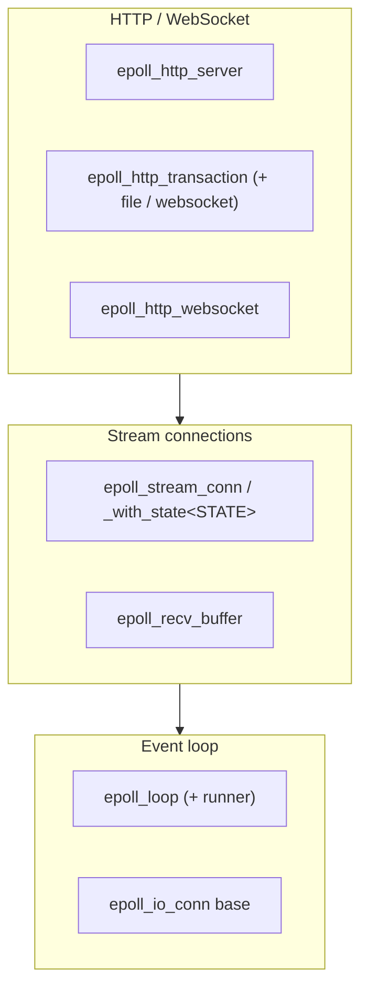
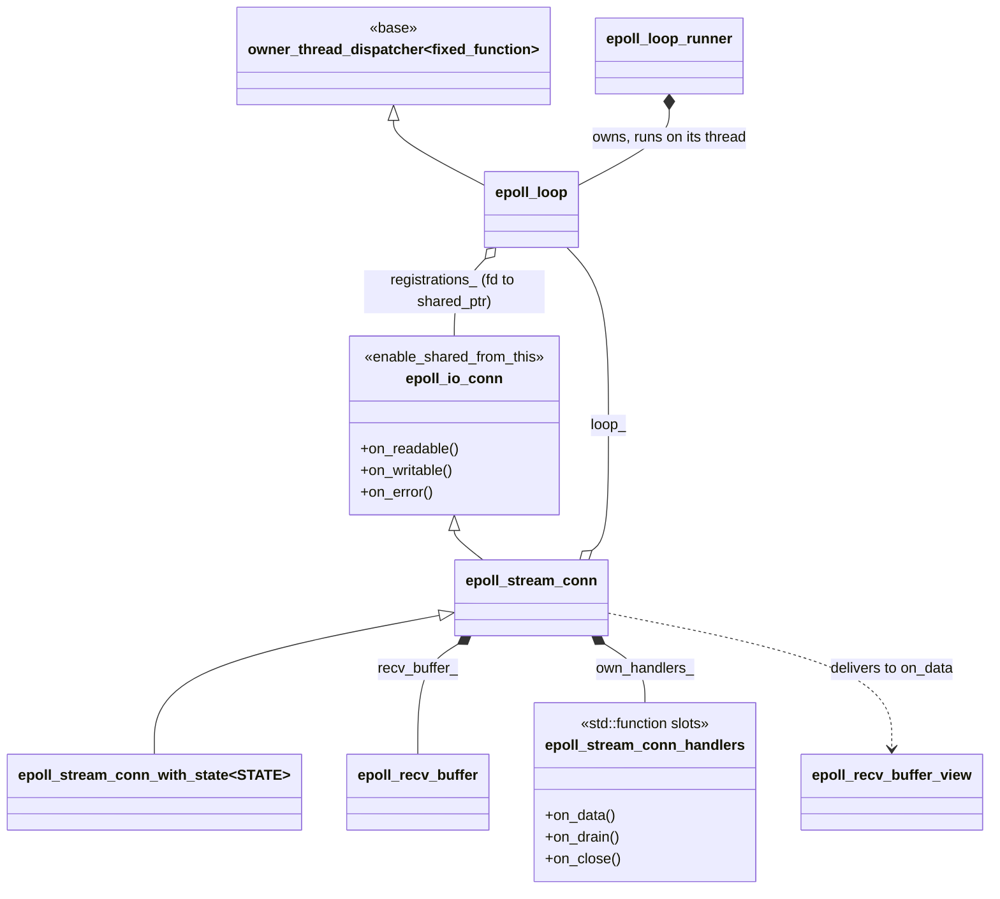
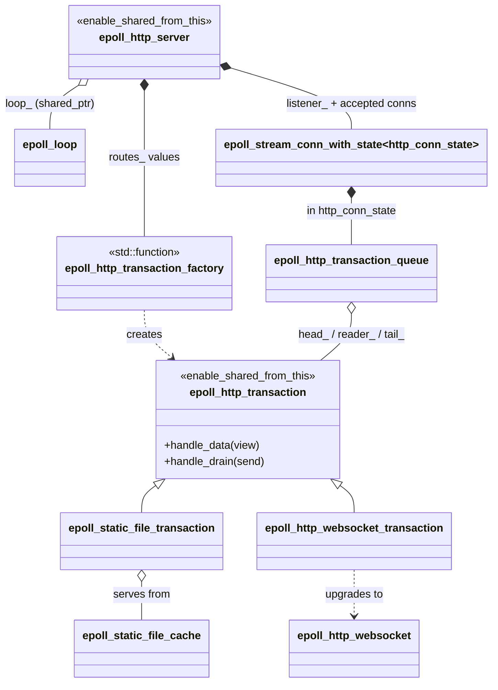
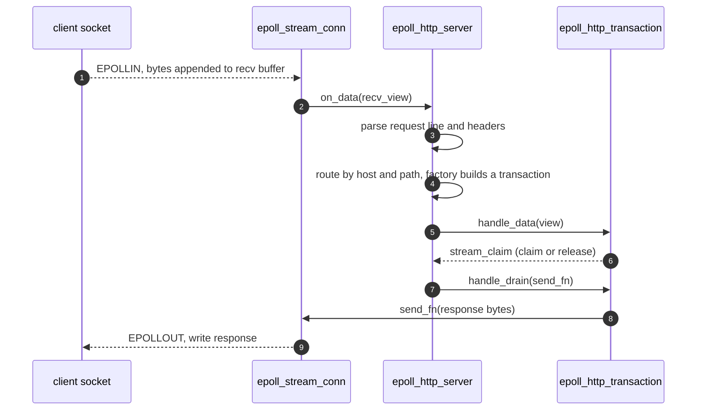

# epoll class relationships

A map of the classes in `corvid/proto/epoll/` and how they fit together: an
`epoll`-based event loop, a buffered stream-connection layer on top, and an
HTTP/1.1 + WebSocket server above that. This is the readiness-based sibling of
the completion-based [io_uring stack](../io_uring/classes.md); the two share the
same `owner_thread_dispatcher` threading model. This file is about the static
structure (who owns what, who inherits what, who runs where).

## The ideas that explain the layout

1. **One owner thread, readiness-driven.** An `epoll_loop` runs on a single
   thread and waits on an `epoll` fd. When a socket becomes readable / writable
   it calls the registered object's `on_readable` / `on_writable` / `on_error`;
   the object then does the actual `read` / `write`. (io_uring is the mirror
   image: there the kernel does the I/O and reports completion.) Cross-thread
   work is posted as a `fixed_function` and run on the loop thread, via the
   shared `owner_thread_dispatcher` base.
2. **Connections are registered by fd and pinned by `shared_ptr`.** Anything the
   loop drives is an `epoll_io_conn` (`enable_shared_from_this`); the loop holds
   a `shared_ptr` to it in `registrations_`, keyed by fd, so it stays alive for
   the duration of any in-progress dispatch.
3. **Two customization styles.** A bare `epoll_stream_conn` takes runtime
   `std::function` callbacks (`epoll_stream_conn_handlers`). For typed
   per-connection state, `epoll_stream_conn_with_state<STATE>` carries a `STATE`
   member. The HTTP server uses the typed form (`http_conn_state`) and adds a
   transaction pipeline plus host/path routing on top.

## Three layers

## The event loop and connections

The loop owns each registered connection by `shared_ptr`, keyed by fd. A
`epoll_stream_conn` is an `epoll_io_conn` that buffers reads into a persistent
`epoll_recv_buffer` and delivers an `epoll_recv_buffer_view` to its active
handler.

`epoll_stream_conn_ptr_with<T>` (not drawn) is the smart-pointer wrapper the
`listen` / `connect` / `accept` factories return.

## The HTTP / WebSocket layer

The server owns the loop and the listener; each accepted connection carries an
`http_conn_state`. Inbound bytes are parsed into requests, routed by host and
path to a factory, and turned into transactions driven through a per-connection
pipeline. A transaction writes its response through a `send_fn` callback, so it
never holds the connection directly.

## The classes

### Event loop

| Class | File | Relationships |
| ----- | ---- | ------------- |
| [epoll_io_conn](epoll_loop.h#L60) | epoll_loop.h | Inherits `enable_shared_from_this`. Abstract base for anything the loop drives: holds the socket, exposes `on_readable` / `on_writable` / `on_error` virtuals and the current epoll interest mask. |
| [epoll_loop](epoll_loop.h#L116) | epoll_loop.h | Inherits `owner_thread_dispatcher<fixed_function<...>>`. Owns the `epoll` fd and `registrations_` (fd to `shared_ptr<epoll_io_conn>`); the dispatcher base owns the wakeup `event_fd`. |
| [epoll_loop_runner](epoll_loop.h#L482) | epoll_loop.h | Owns an `epoll_loop` and pumps it on a dedicated thread. |

### Stream connections

| Class | File | Relationships |
| ----- | ---- | ------------- |
| [epoll_stream_conn](epoll_stream_conn.h#L154) | epoll_stream_conn.h | Inherits `epoll_io_conn`. A buffered TCP connection: holds `epoll_loop&` (plus a `weak_ptr`), an `epoll_recv_buffer`, the handler set, and a send queue. Appends inbound bytes to the recv buffer and delivers a view to the active `on_data`. |
| [epoll_stream_conn_handlers](epoll_stream_conn.h#L84) | epoll_stream_conn.h | Struct of optional `std::function` slots: `on_data`, `on_drain`, `on_close`. A null slot is skipped. |
| [epoll_stream_conn_with_state&lt;STATE&gt;](epoll_stream_conn.h#L1426) | epoll_stream_conn.h | Inherits `epoll_stream_conn`. Adds a typed `STATE` member for per-connection state (the HTTP server uses `STATE = http_conn_state`). |
| [epoll_stream_conn_ptr_with&lt;T&gt;](epoll_stream_conn.h#L1205) | epoll_stream_conn.h | Smart-pointer wrapper over a conn (`T = epoll_stream_conn` by default); returned by the `listen` / `connect` / `accept` factories. |
| [epoll_recv_buffer](epoll_recv_buffer.h#L50) | epoll_recv_buffer.h | Persistent flat receive buffer owned by a connection: the loop thread appends after `end`, a parser (possibly another thread) consumes from `begin`; both indexes are atomic. |
| [epoll_recv_buffer_view](epoll_recv_buffer.h#L277) | epoll_recv_buffer.h | Move-only `begin`/`end` view over an `epoll_recv_buffer`, delivered to `on_data`; convertible to `std::string_view`, with `consume(n)`. |

### HTTP / WebSocket

| Class | File | Relationships |
| ----- | ---- | ------------- |
| [epoll_http_server](epoll_http_server.h#L148) | epoll_http_server.h | Inherits `enable_shared_from_this`. Owns `loop_` (`shared_ptr`, optionally via an `epoll_loop_runner`), a `timing_wheel` for timeouts, the `listener_` connection, and `routes_` (host/path to factory). Drives the per-connection parse + transaction pipeline. |
| [epoll_http_transaction](epoll_http_transaction.h#L78) | epoll_http_transaction.h | Inherits `enable_shared_from_this`. One HTTP/1.x request-response; `handle_data(view)` and `handle_drain(send_fn)` return a `stream_claim` (`claim` to keep the pipeline slot, `release` to advance). Writes via the `send_fn`, never the connection directly. |
| [epoll_http_transaction_factory](epoll_http_transaction.h#L165) | epoll_http_transaction.h | `std::function<shared_ptr<epoll_http_transaction>(request_head&&)>`: a route's handler, builds a transaction for a parsed request. |
| [epoll_http_transaction_queue](epoll_http_transaction.h#L180) | epoll_http_transaction.h | Per-connection pipeline of transactions (`head_` / `reader_` / `tail_`), held inside `http_conn_state`. |
| [epoll_static_file_transaction](epoll_http_file_transaction.h#L128) | epoll_http_file_transaction.h | Inherits `epoll_http_transaction`. Serves a cached file from an `epoll_static_file_cache`. |
| [epoll_static_file_cache](epoll_http_file_transaction.h#L50) | epoll_http_file_transaction.h | In-memory cache of static files keyed by path; loaded once at construction. |
| [epoll_http_websocket_transaction](epoll_http_websocket_transaction.h#L62) | epoll_http_websocket_transaction.h | Inherits `epoll_http_transaction`. Performs the RFC 6455 upgrade handshake, then hands off to an `epoll_http_websocket`. |
| [epoll_http_websocket](epoll_http_websocket.h#L546) | epoll_http_websocket.h | The live WebSocket session after upgrade: holds the `send_fn`, message / control-frame buffers, and ping/pong state. |
| [ws_frame_header](epoll_http_websocket.h#L105) / [ws_frame_wrapper&lt;ACCESS&gt;](epoll_http_websocket.h#L117) | epoll_http_websocket.h | RFC 6455 frame-header byte encoding and a typed view (mutable or const) over a frame on the wire. |
| [host_path](epoll_http_server.h#L73) / [host_path_key](epoll_http_server.h#L83) | epoll_http_server.h | Route key: `hostname` (matched against `Host`, empty matches any) plus leading `base_path`. Transparent hashing keeps lookups allocation-free. |

## How an HTTP request flows

Inbound bytes land in the connection's recv buffer; the server parses them,
routes to a factory, and drives the resulting transaction. The transaction
writes back through a `send_fn`, which queues bytes on the connection for the
next writable event.

For a WebSocket, the route's transaction is an `epoll_http_websocket_transaction`:
it completes the upgrade handshake and then an `epoll_http_websocket` takes over
the connection, framing messages with `ws_frame_wrapper` and writing through the
same `send_fn` path.
