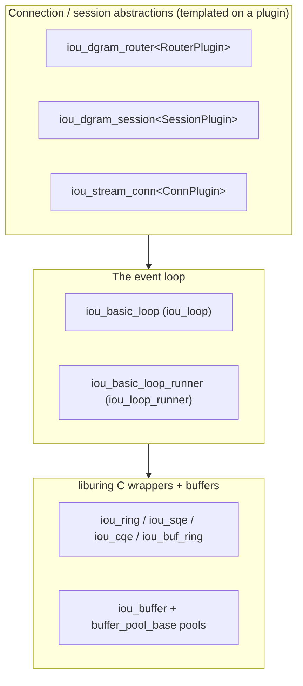
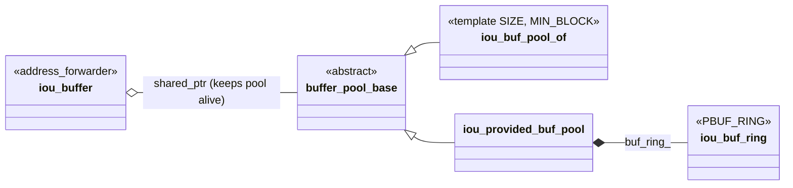
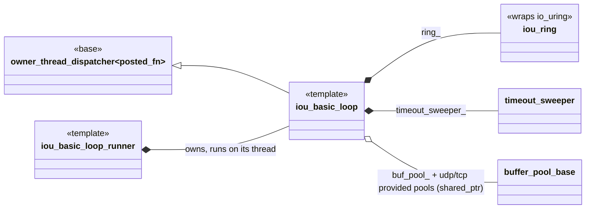
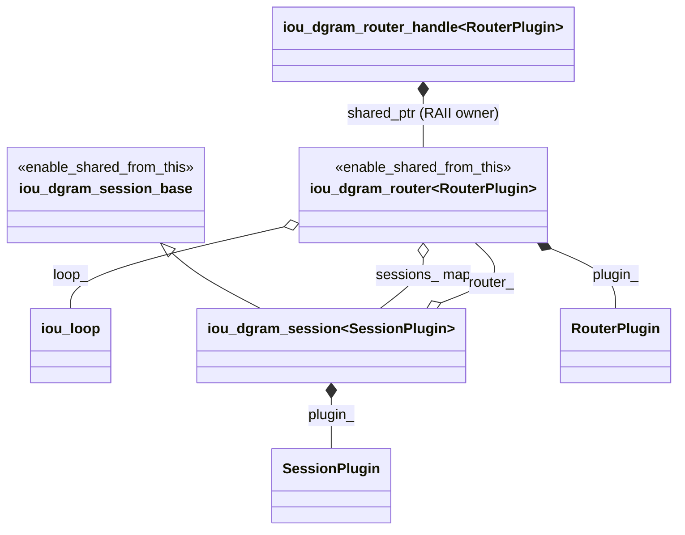
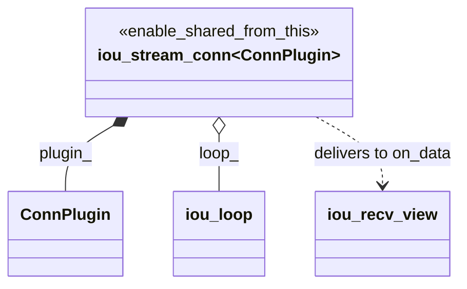
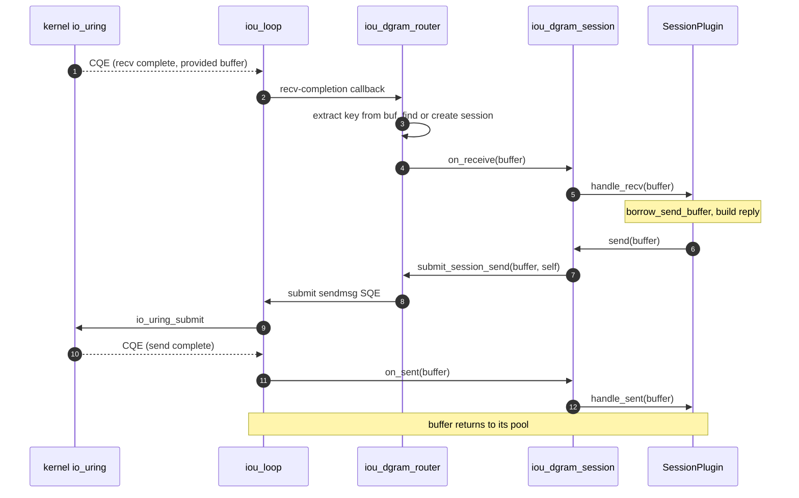

# io_uring class relationships

A map of the classes in `corvid/proto/io_uring/` and how they fit together.
This is the substrate the QUIC / HTTP/3 stack sits on; for that upper layer see
[../quic/classes.md](../quic/classes.md). This file is about the static
structure (who owns what, who inherits what, who runs where).

## The ideas that explain the layout

Three run through the whole subsystem:

1. **One owner thread.** An `iou_basic_loop` runs on a single thread and owns
   the `io_uring`. Everything touching the ring happens on that thread; work
   arriving from elsewhere is posted as a `posted_fn` and run on the loop
   thread. The base that provides this is `owner_thread_dispatcher`.
2. **Buffers are pool-owned, and outlive their pool's owner.** Each `iou_buffer`
   holds a `shared_ptr` to the `buffer_pool_base` it came from, so a pool's
   backing memory stays mapped as long as any borrowed buffer is alive. I/O
   completions hand buffers back to their pool.
3. **Plugin by value, loop by reference.** The higher-level objects (router,
   session, connection) are pinned by `shared_ptr` (`enable_shared_from_this`),
   own their typed plugin **by value** (a template parameter), and hold only a
   **reference** to the loop. This is the same template-by-value pattern the
   QUIC layer plugs into.

## Three layers

## Buffers and pools

A buffer borrowed from any pool keeps that pool alive through a back-reference,
so completions can always return the allocation.

- `iou_buf_pool_of` is the registered fixed-buffer pool (one huge page of
  send/write buffers). `iou_loop::buffer` is its `iou_buffer`.
- `iou_provided_buf_pool` is the kernel-managed Provided-Buffer pool (the recv
  side); it embeds an `iou_buf_ring`.

## The event loop

`iou_loop` is `iou_basic_loop<>` (default template parameters); `iou_loop_runner`
is `iou_basic_loop_runner<>`, which owns a loop and pumps it on its own thread.

The loop owns the `io_uring` (`ring_`), the send/write buffer pool and the two
provided-buffer pools (held by `shared_ptr` so buffers outlive the loop if
needed), a `timeout_sweeper` driving all timer expiry, and a completion-callback
pool. `bound_timeout` / `bound_endpoint` / `bound_msghdr` are small
`address_forwarder` helpers that bind extra parameters onto a submit call.

## Connection and session abstractions

Each of these is `shared_ptr`-pinned and owns its plugin by value, holding only a
reference to the loop. Two independent families: a datagram side (router +
sessions) and a stream side (one connection per socket). They are drawn
separately so the relationships stay legible.

### Datagram side

The datagram side splits a non-templated base (`iou_dgram_session_base`) from the
typed `iou_dgram_session<SessionPlugin>`, exactly the split the QUIC
`quic_session_io` relies on.

### Stream side

One `iou_stream_conn<ConnPlugin>` per TCP socket. Received bytes reach the plugin
as a move-only `iou_recv_view`.

## The classes

### liburing C wrappers ([iou_wrap.h](iou_wrap.h))

| Class | Role |
| ----- | ---- |
| [iou_ring](iou_wrap.h#L756) | Owns an `io_uring` instance (submission + completion rings). Held by `iou_basic_loop`. |
| [iou_sqe](iou_wrap.h#L417) | Submission Queue Entry builder: prep a recv / send / connect / timeout / etc. |
| [iou_cqe](iou_wrap.h#L666) / [iou_res](iou_wrap.h#L376) | Completion Queue Entry and its decoded result. |
| [iou_recvmsg_out](iou_wrap.h#L704) | Parses a `recvmsg` completion (payload + source address) out of a provided buffer. |
| [iou_buf_ring](iou_wrap.h#L873) | Wraps a `PBUF_RING` (kernel-managed provided-buffer ring). Embedded in `iou_provided_buf_pool`. |
| [iou_timespec](iou_wrap.h#L187) / [iou_itimerspec](iou_wrap.h#L311) | `timespec` / `itimerspec` conveniences for timeout SQEs. |

### Buffers and pools

| Class | File | Relationships |
| ----- | ---- | ------------- |
| [iou_buffer](iou_buffer.h#L99) | iou_buffer.h | Inherits `address_forwarder<iou_buffer>`. An owned I/O buffer; holds a `shared_ptr<buffer_pool_base>` back to its pool. Aliased as `iou_loop::buffer`. |
| [buffer_pool_base](iou_buffer_pool_base.h#L39) | iou_buffer_pool_base.h | Inherits `enable_shared_from_this`. Abstract pool base; concrete pools are made via `shared_ptr` factories. |
| [iou_buf_pool_of&lt;SIZE, MIN_BLOCK&gt;](iou_buf_pool.h#L74) | iou_buf_pool.h | Inherits `buffer_pool_base`. Pre-registered fixed buffers on one huge page (the send/write pool). |
| [iou_provided_buf_pool](iou_provided_buf_pool.h#L50) | iou_provided_buf_pool.h | Inherits `buffer_pool_base`. Kernel-managed provided buffers (the recv pool); embeds an `iou_buf_ring`. |

### The event loop

| Class | File | Relationships |
| ----- | ---- | ------------- |
| [iou_basic_loop&lt;...&gt;](iou_loop.h#L226) | iou_loop.h | Inherits `owner_thread_dispatcher<posted_fn>`. Owns `iou_ring`, the buffer pools (by `shared_ptr`), a `timeout_sweeper`, and a completion-callback pool. `iou_loop = iou_basic_loop<>` ([L1759](iou_loop.h#L1759)). |
| [iou_basic_loop_runner&lt;...&gt;](iou_loop.h#L1771) | iou_loop.h | Owns an `iou_basic_loop` and runs it on a dedicated thread. `iou_loop_runner = iou_basic_loop_runner<>` ([L1946](iou_loop.h#L1946)). |
| [bound_timeout / bound_endpoint / bound_msghdr](iou_loop.h#L77) | iou_loop.h | `address_forwarder` helpers binding extra parameters onto a submit call. |

### Connection and session abstractions

| Class | File | Relationships |
| ----- | ---- | ------------- |
| [iou_dgram_router&lt;RouterPlugin&gt;](iou_dgram_router.h#L185) | iou_dgram_router.h | Inherits `enable_shared_from_this`. Owns the UDP socket, `RouterPlugin plugin_` by value, and a `sessions_` map (key to `session_ptr`); holds `iou_loop&`. Demuxes datagrams via `plugin_.extract`. |
| [iou_dgram_router_handle&lt;RouterPlugin&gt;](iou_dgram_router.h#L493) | iou_dgram_router.h | RAII owner of the router `shared_ptr`; the `bind` factory creates the router and starts receiving. |
| [iou_dgram_session_base](iou_dgram_session.h#L44) | iou_dgram_session.h | Inherits `enable_shared_from_this`. Non-templated: holds `iou_loop&`, buffer size, open flag; exposes `borrow_send_buffer` / `send` / `send_to`; one virtual `do_send`. |
| [iou_dgram_session&lt;SessionPlugin&gt;](iou_dgram_session.h#L134) | iou_dgram_session.h | Inherits `iou_dgram_session_base`. Owns `SessionPlugin plugin_` by value, holds `router_t&`; its `do_send` routes through `router_.submit_session_send`. |
| [iou_stream_conn&lt;ConnPlugin&gt;](iou_stream_conn.h#L294) | iou_stream_conn.h | Inherits `enable_shared_from_this`. A TCP connection: owns the socket and `ConnPlugin plugin_` by value; holds `iou_loop&`, read/write `idle_timeout`s, a send queue, and recv state. |
| [iou_recv_view](iou_stream_conn.h#L63) | iou_stream_conn.h | Move-only view over a received buffer, delivered to a stream plugin's `on_data`. Supports consume / take / pause / close. |

### Plugin contracts (duck-typed concepts)

The router, session, and connection templates accept any type satisfying a
concept. The concepts document the shape but are NOT used as `template`
constraints (they are checked late, in a constructor-body `static_assert`, to
allow incomplete-type plugins during class definition).

| Concept | File | Requires (roughly) |
| ------- | ---- | ------------------ |
| `iou_dgram_router_plugin` | [iou_dgram_router.h#L81](iou_dgram_router.h#L81) | `key_t` / `session_t` types; `extract(buf) -> key_t`; `create_session(buf, router) -> bool`. |
| `iou_dgram_session_plugin` | [iou_dgram_router.h#L125](iou_dgram_router.h#L125) | `register_self(buf) -> bool`; `handle_recv(buffer) -> bool`; `handle_sent(buffer) -> bool`; `unregister_self() -> bool`. |
| `iou_stream_conn_plugin` | [iou_stream_conn.h#L183](iou_stream_conn.h#L183) | `on_data(iou_recv_view&&) -> bool`; `on_drain() -> bool`; `on_close() -> bool`; `make_child_plugin(conn) -> plugin` (for accepted children). |

### Example / demo

| Class | File | Role |
| ----- | ---- | ---- |
| [iou_dgram_echo_protocol](iou_dgram_echo_server.h#L29) | iou_dgram_echo_server.h | Bundle template: nests `router_plugin` (keyed by `net_endpoint`) and `session_plugin`. The shape `quic_dgram_protocol` mirrors. |
| [iou_dgram_echo_server](iou_dgram_echo_server.h#L98) | iou_dgram_echo_server.h | Owns an `iou_dgram_router_handle<router_plugin>`; the worked example of binding a router and echoing datagrams. |

## How a datagram round-trips

Receive runs the demux and hands the buffer to the session plugin; the reply is
submitted back through the loop, and the buffer returns to its pool when the
send completes. Everything below happens on the loop thread (off-loop callers
reach it through `execute_or_post`).

A failed `on_receive` / `on_sent` (plugin returned false or threw) closes just
that session; the router and its other sessions keep running.
