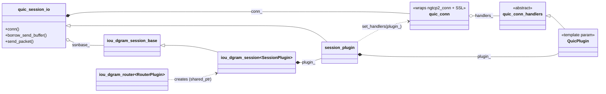
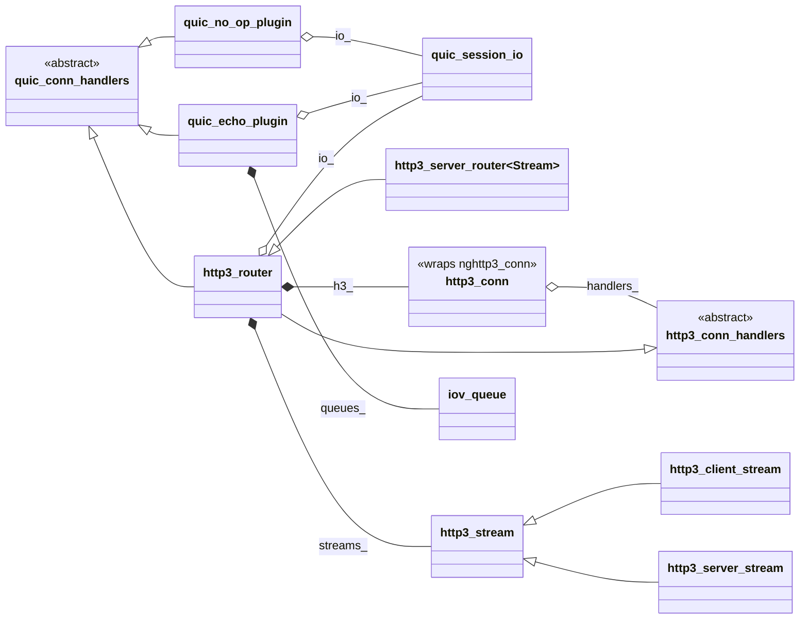
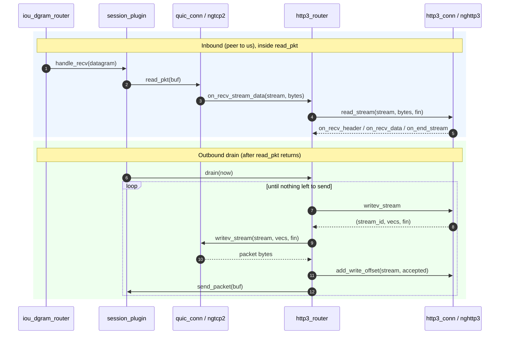

# QUIC / HTTP/3 class relationships

A map of the classes in `corvid/proto/quic/` and how they fit together. For the
sequencing and rationale behind each piece, see [roadmap.md](roadmap.md); this
file is purely about the static structure (who owns what, who inherits what,
who calls into whom).

## The one idea that explains the layout

The stack repeats a single pattern at two layers:

> A non-templated C-library **wrapper** owns a C handle and forwards its
> C callback table, through static trampolines, into an abstract
> **handlers** base. The upper layer inherits that base and is installed on
> the wrapper through a bare pointer.

It appears once for ngtcp2 (the QUIC transport) and once for nghttp3 (HTTP/3):

| Layer   | C handle       | Wrapper       | Handlers base          | Installed via       |
| ------- | -------------- | ------------- | ---------------------- | ------------------- |
| QUIC    | `ngtcp2_conn`  | `quic_conn`   | `quic_conn_handlers`   | `set_handlers`      |
| HTTP/3  | `nghttp3_conn` | `http3_conn`  | `http3_conn_handlers`  | `set_handlers`      |

- [quic_conn](quic_conn.h#L345) / [quic_conn_handlers](quic_conn.h#L161)
- [http3_conn](http3_conn.h#L406) / [http3_conn_handlers](http3_conn.h#L185)

Everything below the wrappers (the io_uring substrate) is templated and owns its
plugin **by value**. Everything at and above the wrappers reaches its peer
through **a single pointer or reference**, because the upper plugin must live
*next to* the wrapper (it captures a reference to the session that contains the
wrapper), not inside it. That one mandatory indirection is why the handlers
bases are virtual rather than template parameters; the trade-off is argued in
[roadmap.md](roadmap.md) under "Dispatch choice".

## Structure: ownership and inheritance

Two views. Arrow notation is standard Mermaid: `<|--` inheritance, `*--`
composition (owns by value), `o--` aggregation (holds a reference or pointer),
`..>` dependency (a call).

The first view follows the ownership spine from the io_uring substrate down to
`quic_conn`, plus the handler pointer that loops back to the upper plugin. The
key cycle: `session_plugin` owns `QuicPlugin plugin_` by value, and that same
`plugin_` (which is-a `quic_conn_handlers`) is wired into `quic_conn`'s
`handlers_` pointer via `set_handlers`.

The second view zooms in on the plugin family: the two abstract handler bases
and the concrete plugins. `http3_router` is the hinge: it inherits *both*
bases, so it takes transport upcalls from `quic_conn` and HTTP/3 upcalls from
`http3_conn` at the same time. Note the second handler pointer loop, identical
in shape to the first: `http3_router` owns `http3_conn`, which points back at
`http3_router` through its own `handlers_`. On top of the bridge, `http3_router`
demuxes the per-stream HTTP/3 events to `http3_stream` objects it owns, one per
active request/response stream. A server provides the stream type by overriding
`http3_router::create_inbound_stream` (the `http3_server_router<Stream>`
template does this for a fixed `Stream`, typically an `http3_server_stream`); a
client builds an outbound `http3_stream` (e.g. `http3_client_stream`) and hands
it to `http3_router::add_stream`.

The `QuicPlugin` template parameter on
[quic_dgram_protocol](quic_dgram_plugins.h#L108) is the upper plugin. It
defaults to `quic_no_op_plugin`; `quic_echo_plugin` and `http3_router` are the
other realizations.

## The classes

### Transport substrate (templated, plugin-by-value)

These live in `corvid/proto/io_uring/`, not here, but the QUIC plugins plug into
them.

| Class | Role |
| ----- | ---- |
| [iou_dgram_router&lt;RouterPlugin&gt;](../io_uring/iou_dgram_router.h#L185) | Owns the UDP socket and the demux table. Asks `RouterPlugin` for each datagram's routing key; creates sessions on a miss. Owns `RouterPlugin` by value. |
| [iou_dgram_session_base](../io_uring/iou_dgram_session.h#L44) | Non-templated session base: owns the loop ref and send-buffer machinery (`borrow_send_buffer`, `send`, `send_to`). `enable_shared_from_this`. |
| [iou_dgram_session&lt;SessionPlugin&gt;](../io_uring/iou_dgram_session.h#L134) | Adds the typed `SessionPlugin` (owned by value) on top of the base. |

### QUIC layer

| Class | File | Relationships |
| ----- | ---- | ------------- |
| [quic_dgram_protocol&lt;QuicPlugin&gt;](quic_dgram_plugins.h#L108) | quic_dgram_plugins.h | Bundle template. Nests `router_plugin` and `session_plugin`; parameterized on the upper plugin (default `quic_no_op_plugin`). |
| `router_plugin` | [quic_dgram_plugins.h#L124](quic_dgram_plugins.h#L124) | Extracts the DCID as the routing key via `quic_version_cid`; turns long-header Initials into new server sessions. |
| `session_plugin` | [quic_dgram_plugins.h#L216](quic_dgram_plugins.h#L216) | Inherits `quic_session_io`. Owns `QuicPlugin plugin_` by value; installs it via `conn().set_handlers(&plugin_)`. Drives the read/expiry cycle and calls `plugin_.drain(now)`. |
| [quic_session_io](quic_session_io.h#L42) | quic_session_io.h | Non-templated pairing: owns `quic_conn` by value, holds `iou_dgram_session_base&`. The surface the upper plugin sees (`conn()`, `borrow_send_buffer`, `send_packet`, `server_name`, `request_drain`). |
| [quic_conn](quic_conn.h#L345) | quic_conn.h | Wraps `ngtcp2_conn` + `SSL` + crypto ctx. Forwards ngtcp2's callback table into `quic_conn_handlers*`. Non-copyable, non-movable (ngtcp2 stores `this`). |
| [quic_conn_handlers](quic_conn.h#L161) | quic_conn.h | Abstract base: protocol-neutral transport upcalls (`on_recv_stream_data`, `on_acked_stream_data_offset`, `on_stream_close`, flow control, datagrams). |
| [quic_no_op_plugin](quic_dgram_plugins.h#L72) | quic_dgram_plugins.h | Inherits `quic_conn_handlers`. Holds `quic_session_io&`. The default/base upper plugin: its `drain` emits only non-stream frames (ACKs, MAX_DATA). |
| [quic_echo_plugin](quic_echo_plugin.h#L63) | quic_echo_plugin.h | Inherits `quic_conn_handlers`. Holds `quic_session_io&` and one `iov_queue` per stream; echoes inbound bytes back. |

### HTTP/3 layer

| Class | File | Relationships |
| ----- | ---- | ------------- |
| [http3_conn](http3_conn.h#L406) | http3_conn.h | Wraps `nghttp3_conn` (HTTP/3 framing + QPACK). Forwards nghttp3's callback table into `http3_conn_handlers*`. Non-copyable, non-movable (nghttp3 stores `this`). Owned **by the upper plugin**, not by `quic_session_io`. |
| [http3_conn_handlers](http3_conn.h#L185) | http3_conn.h | Abstract base: HTTP/3 upcalls (`on_begin_headers`, `on_recv_header`, `on_end_headers`, trailers, `on_recv_data`, `on_send_data_ready`, `on_end_stream`, `on_h3_stream_close`, `on_recv_settings`, ...). Each per-stream upcall carries nghttp3's `stream_user_data`. |
| [http3_router](http3_plugins.h#L343) | http3_plugins.h | The upper plugin for HTTP/3. Inherits **both** `quic_conn_handlers` (transport upcalls in) **and** `http3_conn_handlers` (HTTP/3 upcalls out), owns an `http3_conn` by value (`h3_`), and holds a `quic_session_io&` (`io_`). Bridges mechanically in both directions and demuxes the connection-level HTTP/3 events to per-stream `http3_stream` objects it owns in `streams_` (`unordered_map<quic_stream_id, unique_ptr<http3_stream>>`), keyed by stream id. A server overrides `create_inbound_stream`; a client calls `add_stream` / `submit_request`. |
| [http3_server_router&lt;Stream&gt;](http3_plugins.h#L793) | http3_plugins.h | Ready-made server subclass of `http3_router`: overrides `create_inbound_stream` to mint a fixed `Stream` (must derive from `http3_stream`, be default-constructible) per peer-initiated request, so a server needs no router subclass of its own. Plug in as `quic_dgram_protocol<http3_server_router<Stream>>`. |
| [http3_stream](http3_plugins.h#L57) | http3_plugins.h | Per-stream HTTP/3 transaction the `http3_router` associates with one request/response stream and routes that stream's HEADERS / trailers / DATA / end / close events to. Concrete (default hooks return no-op `true`); holds the request and response header/trailer pairs, a send and a receive `iov_queue`, and a `connection_role` (`set_role` orients which pair inbound fields land in). Its `submit_response` sends `response_headers()` (plus any `send_queue()` body) through the owning router exactly once, latching `responded()` so an early error and a normal reply never both go out. Subclasses override only the hooks they need. |
| [http3_client_stream](http3_client_stream.h#L53) | http3_client_stream.h | Concrete client `http3_stream`: built with a completion callback, configured by editing `request_headers()` (or the static `configure_request` helper), optional body appended to `send_queue()`; submits itself in `on_added` and fires the callback from `on_close`. The response lands in `response_headers()` / `receive_queue()`. |
| [http3_server_stream](http3_server_stream.h#L50) | http3_server_stream.h | Server counterpart to `http3_client_stream` (the `Stream` for `http3_server_router`). The request lands in `request_headers()` / `receive_queue()`. `on_end_headers` gates the request through the virtual `authority_reject_status` (default: `421` when the `:authority` does not match `router()->server_name()`, `500` when the server has no configured authority), answering a rejected request itself; on success `on_end_stream` calls the overridable `build_response` hook and submits via the guarded `http3_stream::submit_response`. The default `build_response` is a no-op, so an accepted request gets the seeded 500. |

### Supporting value types

| Class | File | Role |
| ----- | ---- | ---- |
| [quic_ssl_ctx](quic_ssl_ctx.h#L66) | quic_ssl_ctx.h | Wraps `SSL_CTX` (TLS 1.3, one ALPN). Carries the `connection_role` (server/client) that drives router mode and `quic_conn` construction. |
| [self_signed_cert](quic_self_signed_cert.h#L43) | quic_self_signed_cert.h | Inherits `ssl_identity`. Generates a fresh in-memory self-signed cert for tests. |
| [iov_queue&lt;Chunk, State&gt;](../iov_queue.h#L93) | ../iov_queue.h | Queue of owned byte buffers presented to a gather/scatter syscall as an `iovec` view; one queue serves either direction, carrying an optional per-queue `State`. Used by `quic_echo_plugin` as the send queue (with sticky `write_stream_flags`) and by `http3_stream` as both send and receive queues. |
| [quic_cid](quic_header.h#L141) / [quic_version_cid](quic_header.h#L203) | quic_header.h | Connection ID value type and the header decoder the `router_plugin` uses to recover the DCID. Also `quic_stream_id`, `quic_status`, and the stream/datagram flag enums. |
| [http3_headers](http3_header.h#L313) / [http3_field](http3_header.h#L297) | http3_header.h | Ordered collection of HTTP fields and its element (owned name / value plus `nv_flags` and `qpack_token`). Token-aware lookups (`find`, `find_next`, `count`, `set_value`), a `stream_chunk` FIN marker, an implicit `span<const http3_field>` for the submit path. |
| [qpack_token](http3_header.h#L53) / [header_name](http3_header.h#L268) | http3_header.h | HTTP/3 header vocabulary: the QPACK well-known field-name tokens plus the compile-time-checked name views `header_name` and `header_name_and_enum` (the latter also carries the token) and `method_name`, with the `_header` / `_method` UDLs. Also the `nv_flags`, `stream_chunk`, and `http_method` enums. |

## How a request flows (http3_router)

This is the path the two wrapper/handlers pairs are built to support. The two
phases are separated because no writes may happen inside a callback (ngtcp2
forbids it), so all emission is deferred to the per-turn drain that runs after
`read_pkt` returns.

The same `http3_router` instance wears two hats: as a `quic_conn_handlers` it
receives raw stream bytes from ngtcp2, and as an `http3_conn_handlers` it
receives decoded HTTP/3 events from nghttp3. It is the only object that touches
both wrappers; `quic_conn` never sees nghttp3 and `http3_conn` never sees
ngtcp2.
